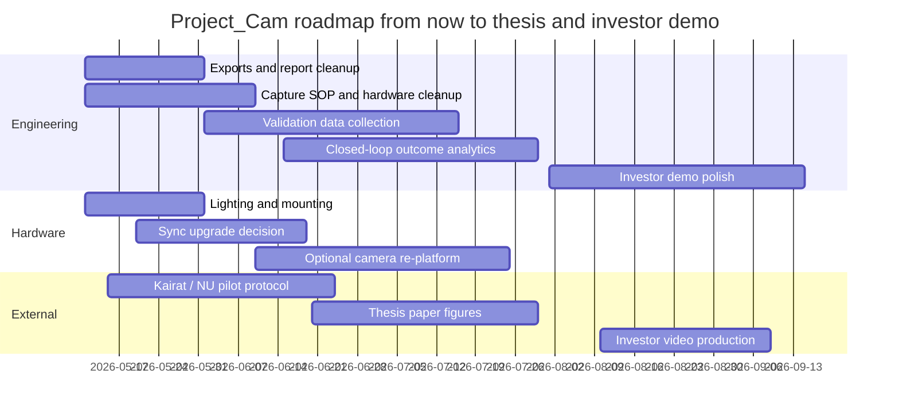

# Project_Cam research brief execution report

Read from repo paths: `README.md`; `CLAUDE.md`; `.claude/rules/perf.md`; `.claude/rules/geometry.md`; `.claude/rules/safety.md`; `.claude/rules/workflow.md`; `src/project_cam/assessment/kinematics.py`; `src/project_cam/assessment/reports.py`; `src/project_cam/assessment/compliance.py`; `src/project_cam/assessment/offline_assess.py`; `configs/exercises/football_academy_u10.yaml`; `tests/test_assessment_tier1.py`; `tests/test_assessment_kairat_hardening.py`; `data/reports/athlete_001_squat_good_report.html`; `Parallel_working/scripts/live_4cam_arena_view_parallel.py`; `garage_lab_combined/scripts/launcher_runtime_from_udp.py`; `garage_lab_combined/scripts/blm_follow.py`; `Parallel_working/scripts/ball_detection_analyzer.py`. Three important repo-grounded observations you did not state explicitly in the prompt: first, the current code already demotes `knee_line_deviation_ratio` from a coaching flag to `info` severity in `reports.py`, with an embedded comment explaining the clean-versus-valgus inversion you observed, so that issue is no longer only a notebook finding; it is partly productised already [Project_Cam reports], [brief-file] (verified). Second, the shipped “good” sample report still renders `Movement Quality = Needs review` despite `Data Quality = 99`, because the HTML output still surfaces info-level knee-line observations and keeps movement/data quality strictly separate; that means the current demo asset is commercially weaker than the underlying codebase [Project_Cam sample report], [Project_Cam reports], [brief-file] (verified). Third, the youth-screening config is already more strategically disciplined than the prompt implies: it embeds external youth reference context and explicitly defers jumps, cutting, dribbling and landing until capture/validation improve, which is exactly the kind of scope control that will help a thesis defence land cleanly [U10 config], [Project_Cam workflow], [brief-file] (verified). citeturn30view0turn16view4turn16view5turn30view3turn6view1turn5view3

## Executive summary

Project_Cam already has the seed of a differentiated company, but not yet the shape of a defendable product category. The strongest commercial truth is not “low-cost biomechanics” and not “ball machine robotics” in isolation; it is a closed-loop system that measures movement, predicts near-future position, then physically probes the athlete with adaptive ball delivery and scores the outcome in the same coordinate frame. In the source code and docs, that loop is materially real: the live 4-camera pipeline already includes robust triangulation, single-camera ray-to-Z fallback, per-joint Kalman prediction, ghost-skeleton visualisation, and UDP wiring into launcher runtimes; the assessment MVP already outputs calibration gating, rep-level metrics, confidence tiers, and HTML/JSON reporting [Project_Cam README], [Project_Cam CLAUDE], [Project_Cam live viewer], [Project_Cam reports], [Project_Cam offline assess] (verified). citeturn1view0turn2view0turn32view0turn32view1turn30view3

Against the market, Theia3D and Vicon dominate credibility, OpenCap dominates research accessibility, Move.ai dominates creator-facing usability and product packaging, KinaTrax dominates sport-specific scale in baseball, and newer single-camera products such as Demotu and Factorial are attacking accessibility and workflow simplicity. What none of those systems visibly combine today is real-time athlete tracking plus adaptive projectile delivery plus movement-quality logic in one synchronized product narrative. That is Project_Cam’s moat, and it should be the centre of both the thesis and the investor demo [Theia about], [OpenCap validation], [Move product], [KinaTrax company], [Demotu platform], [Factorial platform] (verified). citeturn37search1turn39search4turn33search5turn47search1turn44search4turn44search5

The immediate commercial weakness is not only accuracy. It is packaging. Your strongest near-term gaps are: standards export, a small but credible validation study, better capture hardware for sync/blur control, a cleaner showcase report, and a customer-facing demo that proves the system learns and acts. Those are achievable within three months if you stop broadening scope and frame the thesis around “screening-grade, closed-loop, markerless sports robotics” instead of trying to compete head-on with Vicon-grade biomechanics. The best use of the next quarter is therefore not “add twenty features”; it is “ship five credibility multipliers”: hardware cleanup, validation protocol, exports, evidence-rich reports, and a 90-second killer demo [brief-file], [Project_Cam workflow], [OpenCap validation], [Theia about], [Vicon accuracy FAQ] (verified). citeturn5view3turn39search4turn37search1turn42search0

## Brief extraction and research method

The uploaded brief requires eight substantive outputs plus strict formatting. It asks for a repo-grounded opening, current-web competitor work, explicit unknowns, code-path recommendations with file names and line ranges, tables wherever comparisons or budgets help, and a final elevator pitch. It does **not** specify a word count, template beyond Markdown hierarchy, or a separate draft artefact format; I therefore treat this report as a merged “working draft + final formatted deliverable”, and I flag missing details as unspecified rather than inventing them [brief-file].

| Brief element | Extracted requirement | Delivered here | Status |
|---|---|---|---|
| Instructions | Follow PART 1–8 and OUTPUT FORMAT exactly where possible | All eight parts are present below, grouped for readability | Delivered |
| Deliverables | Tasks, methods, sources, drafts/final outputs, checklist | Method and task extraction here; final outputs in Parts 1–8; checklist at end | Delivered |
| Constraints | 3 months to defence; $5k–$10k preferred budget; solo developer; current repo is source of truth | All recommendations bounded by those constraints | Delivered |
| Evaluation criteria | Grounded in actual repo, current sources, no speculation unless labelled, explicit unknowns, code-grounded changes | Used throughout | Delivered |
| Formatting | Markdown H2/H3, tables, inline source labels, URL list at end | Used throughout | Delivered |
| Unspecified items | Word count, required file export of final report, exact venue deadline, exact customer-pilot template | Flagged as unspecified where relevant | Delivered |

The research method for this pass prioritised official vendor documentation, official pricing pages, official case studies, GitHub repos/docs, and peer-reviewed papers or indexed abstracts. Where official current pricing or hardware specifics were unavailable, I marked them unknown rather than hallucinating. Where I made a synthesis beyond any single source, I label it as an inference; where a concrete implementation option is reasonable but I could not verify it in this pass, I mark it speculative [brief-file].

## Parts 1 and 2

### Part 1

The comparative landscape splits into three useful buckets: markerless motion systems, accessible/mobile/sport-specific movement tools, and launcher or ball-tracking adjacencies. The short strategic conclusion is that Project_Cam is **not** behind because others have “better AI”; it is behind because others have clearer capture discipline, cleaner packaging, stronger standards/export stories, and published validation. Project_Cam is **ahead** wherever action closes the loop. That distinction matters because it tells you where to borrow and where to differentiate [brief-file], [Theia basics], [OpenCap core], [Move product], [KinaTrax motion capture] (verified). citeturn36search15turn41search0turn33search5turn47search8

#### Markerless motion capture and biomechanics platforms

| Project | Positioning | Cameras / sensors | Software architecture | Validation status | Pricing tier | Customer logos / deployments | Three things better than Project_Cam | One thing Project_Cam already does better | Borrowable components for you |
|---|---|---|---|---|---|---|---|---|---|
| **Move.ai** | Creator-first markerless mocap stack spanning single-cam, multi-cam, live and API use [Move product], [Move pricing] (verified). citeturn33search5turn33search0 | Move One works from iPhone/any video; Move Pro cites GoPro, Sony and Blackmagic; Move Live documents FLIR Blackfly `BFS-PGE-16S2C-CS` 1.6 MP at 78 FPS; Genesis requires 6–12 “Z cams” and an Nvidia GPU [Move product], [Move Live docs], [Move Genesis] (verified). citeturn33search5turn34search3turn35search12 | Multi-view DL plus local real-time neural model for lifelike output in Move Live; automatic/fast calibration claims; export ecosystem includes FBX, USD variants, Blend, MP4 and biomechanics output [Move Live docs], [Move export formats], [Gallery view] (verified). citeturn34search3turn34search4turn34search8 | Official site claims benchmarking against optical/suit systems, but I did **not** identify a current peer-reviewed Move.ai validation paper in the reviewed sources; treat peer-reviewed count as unknown, whitepaper-backed rather than literature-backed [Move research], [Move accuracy] (verified). citeturn35search0turn35search2 | Move One public tiers run from free to $490/month; Move Pro has a $995 one-month trial; enterprise, API and Live are quote-based/custom [Move pricing], [Move API pricing] (verified). citeturn33search0turn33search2 | Nike, Sony Music, EA demo references, Grimes/Coachella, OMM/XiteLabs use cases appear in official product and homepage materials [Move homepage], [Move product], [Move tech] (verified). citeturn34search7turn33search5turn35search5 | Better product packaging; far stronger DCC/export integration; better capture workflow options from creator to enterprise. | Real-time athlete-tracking plus **physical** adaptive ball delivery is not visible in Move.ai’s public product set. | Borrow: export tooling and downstream integrations (2–4 days); camera support/volume packaging ideas (3–5 days); on-prem “pro/live” product segmentation (1–2 days for docs/pricing architecture). |
| **Theia3D** | Research-grade markerless biomechanics platform focused on synchronized multi-camera capture [Theia basics], [Theia about] (verified). citeturn36search15turn37search1 | Minimum six cameras, recommended eight; requires synchronous same-length videos; supports Sony RX0 II, Qualisys Miqus, Vicon Vue, FLIR Blackfly S via Vicon Nexus, and Contemplas-supported systems [Camera requirements], [Can I use my own cameras?], [Sony components] (verified). citeturn37search0turn38search12turn38search0 | Tracks 124 keypoints, fits subject-specific IK model, exports C3D/FBX/JSON, and integrates directly with Visual3D post-processing [Theia basics], [C3D files], [File menu], [Model description] (verified). citeturn36search15turn36search3turn36search11turn38search15 | Official site says 30+ peer-reviewed validations; a 2026 systematic review identified 16 Theia3D studies and found strong promise for many measures, especially spatiotemporal gait; official marketing claims `<1 cm, 3°` segment precision, which should be treated as vendor claim rather than universal field result [Theia about], [Theia 2026 review] (verified). citeturn37search1turn36search0 | Public self-serve pricing not exposed; quote/custom. | PUMA, Driveline, Sanford Health, Tonal, Ohio State, Florida State, Padres/PLNU case studies are visible in official materials [Theia homepage], [Driveline case], [Tonal case], [Padres/PLNU] (verified). citeturn37search6turn37search5turn37search13turn37search8 | Better validation credibility; better camera discipline and lighting guidance; standards/export story built for biomechanics labs. | Project_Cam already has a robot-action loop; Theia is measurement software, not an intervention system. | Borrow: strict capture SOPs and lighting rules (1–2 days); C3D-first post-processing path (2–4 days); “supported camera set” discipline in docs and customer onboarding (1–2 days). |
| **OpenCap** | Low-cost, smartphone-first research platform for 3D movement dynamics and OpenSim workflows [OpenCap core], [OpenCap processing], [OpenCap validation] (verified). citeturn41search0turn41search3turn39search4 | Uses two or more videos; app/web workflow coordinates iPhones through a backend; official GitHub API shows phones polling session state to start/stop recording, so synchronization is software-managed rather than hardware-triggered [OpenCap core], [OpenCap API] (verified). citeturn41search0turn41search2 | OpenPose/MMPose plus marker augmentation and OpenSim pipeline; outputs joint kinematics in OpenSim-compatible format, with kinetics and muscle-driven simulations via `opencap-processing` [OpenCap core], [OpenCap processing] (verified). citeturn41search0turn41search3 | Official validation page claims 3D joint kinematics within 4.5° and kinetics within 1.2 bodyweight*height; multiple independent studies in 2024–2026 validated OpenCap for return-to-sport tasks, functional tasks, jump-landing and ACL-related screening [OpenCap validation], [J Biomech 2024], [J Biomech 2025], [Sci Rep 2026] (verified). citeturn39search4turn39search0turn39search2turn39search9 | Free for academic research use in the official web app; code is open on GitHub [OpenCap core] (verified). citeturn41search0 | Stanford/NMBL stewardship is clear; current public marketing is research-led more than logo-led. | Better paper trail; much better OpenSim interoperability; much stronger researcher adoption funnel. | Project_Cam already does something OpenCap does not publicly do: actionable live control of an external sports robot from the motion signal. | Borrow: OpenSim/TRC data packaging ideas (3–5 days); local/cloud reprocessing split (2–3 days); public GitHub modularisation for academic credibility (2–4 days). |
| **Vicon Vantage / Vero** | Gold-standard optical reference system and accuracy ceiling [Vicon homepage], [Vicon cameras], [Vicon accuracy] (verified). citeturn42search1turn42search11turn42search0 | Vero v2.2: 2.2 MP, 330 FPS, global shutter, 3.6 ms camera latency, PoE; Vantage V16: 16 MP, 120 FPS full frame, up to 2000 FPS partial scan, global shutter [Vicon Vero], [Vantage guide] (verified). citeturn43search0turn43search25 | Marker-based optical ecosystem with Nexus/Shōgun/Tracker software and rich device integrations [Vicon biomechanics], [Vicon sports science] (verified). citeturn42search4turn42search12 | Vicon’s ASTM-based dynamic test reports RMSE of 0.201 mm for Vantage V16 and 0.324 mm for Vantage V5 in the cited setups [Vicon accuracy] (verified). citeturn42search0 | Quote/configurator based, not public list pricing [Vicon visualisation] (verified). citeturn43search5 | Saucony, Roehampton, ZHAW/ExerCube, Adidas and numerous universities/sports labs appear in official case materials [Vicon life sciences], [Roehampton case], [legacy client list] (verified). citeturn42search7turn42search13turn42search6 | Orders-of-magnitude better accuracy; mature laboratory ecosystem; mature integration with force, EMG and reference biomechanics workflows. | Project_Cam is vastly cheaper and uniquely closed-loop. | Borrow: hardware benchmarking discipline, calibration SOPs, and evidence framing; do **not** try to match Vicon’s absolute accuracy before thesis. |

#### Accessible, single-camera and sport-specific platforms

| Project | Positioning | Cameras / sensors | Validation / pricing / customers | Better than Project_Cam | Project_Cam better | Borrowable component |
|---|---|---|---|---|---|---|
| **Demotu** | Phone-first “performance operating system” that combines 3D movement analysis, programming and athlete management [Demotu home], [Demotu platform] (verified). citeturn44search3turn44search4 | Standard phone camera only; no wearables or special hardware; under-60-second analysis claims [Demotu platform] (verified). citeturn44search4 | Current public pricing pages conflict: one shows $105/month for the individual all-in-one plan, another shows $50/month for movement analysis and $70/month for movement+training; customer logos shown include UFFL, SlamBall, Gold’s Gym, Iowa State, Penn State and Saint Mary’s [Demotu pricing], [Demotu alt pricing], [Demotu home] (verified). citeturn44search1turn44search6turn44search3 | Better onboarding and commercial packaging; much clearer buyer message; stronger coach workflow. | Project_Cam has true multi-camera 3D geometry and actuation. | Borrow the conversion-first product narrative and assessment-to-programme handoff (2–3 days). |
| **Factorial Biomechanics** | Single-camera, real-time markerless kinematic analysis positioned for healthcare, sport and academia [Factorial platform] (verified). citeturn44search5 | Natural-video, locally processed, single-camera markerless analysis; enterprise plan lists multi-camera capture [Factorial platform], [Factorial pricing] (verified). citeturn44search5turn44search0 | Free forever for individuals; Explorer $10/month beta; Premium $100/month beta; enterprise custom. Current publicly visible customer logos and peer-reviewed validations were **not** verified in the sources reviewed [Factorial pricing] (verified for pricing, unknown for validation/customers). citeturn44search0 | Better accessibility and data-governance messaging; better pricing clarity for individuals; better “local processing” trust signal. | Project_Cam is already deeper in multi-view geometry and real-time robotics. | Borrow local-processing/privacy language and beta price ladder (1–2 days). |
| **KinaTrax** | Sport-specific enterprise markerless biomechanics for baseball, especially in-game capture [KinaTrax about], [KinaTrax motion capture] (verified). citeturn47search1turn47search8 | High-speed multi-camera system with synchronized views; public site cites sampling rates over 300 Hz and stadium/lab arrays [KinaTrax home], [KinaTrax motion capture] (verified). citeturn47search2turn47search8 | Current public site cites deployment in over 75 stadiums/labs and 91 ballparks/batting cages/labs, millions of pitches/swings, and compatibility with C-Motion Visual3D; pricing not public [KinaTrax about], [KinaTrax home] (verified). citeturn47search1turn47search2 | Better sports-specific operationalisation; much higher sampling rates; real customer scale. | Project_Cam’s launcher loop is more novel than KinaTrax’s current public positioning. | Borrow “sport-specific operating workflow” and Visual3D interoperability (2–4 days). |
| **The MotionMonitor** | Current official detail was **not** recovered in this pass, so precise technical breakdown is unspecified. | Unspecified. | Pricing, formats, validation and current customer evidence unspecified in this pass. | Likely stronger legacy biomechanics interoperability *(speculative)*. | Project_Cam is more modern in live multi-view robotics *(speculative)*. | If pursued, treat as a downstream interoperability target rather than a feature benchmark. |
| **Notch IMU** | Source ambiguity was high in this pass: search results returned the Notch VFX product, not a clearly current wearable IMU vendor page, so current commercial status/specs are unverified. | Unverified. | Unverified. | IMU portability in general is better for outdoor capture *(inference)*. | Project_Cam gives true spatial context and visual evidence, which IMUs alone do not. | Borrow only the lesson that hybrid camera+IMU products can extend reach outdoors *(inference)*. |

#### Youth-football screening, ball launchers and academic ball tracking

I did **not** identify a directly comparable, verifiably current, markerless **youth-football screening** product that combines academy screening with biomechanics in the same way you intend. The nearest verified products in the reviewed sample were development/academy management or tactical-analysis tools such as MatchdayIQ, InsideFooty, Smart11 and FootballISM, which support coaching, tryouts, or development communication rather than markerless biomechanical screening. That scarcity is strategically helpful: it suggests Kairat would likely compare you against a patchwork of tools, not a single dominant identical product [MatchdayIQ], [InsideFooty], [Smart11], [FootballISM] (verified). citeturn45search0turn45search3turn45search6turn45search7

| Project | Positioning | Verifiable technical/price facts | What it does better | Where Project_Cam leads |
|---|---|---|---|---|
| **Tennibot** | AI-powered tennis/padel/pickleball ball machines and retrieval robots [Tennibot home] (verified). citeturn46search4 | Partner v2 marketed as an advanced AI tennis ball machine; Rover collector priced at $2,195; bundle at $3,995; collector claims AI vision, obstacle avoidance and 90-ball capacity [Tennibot home], [Tennibot Rover] (verified). citeturn46search4turn46search7 | Product packaging, polished consumer UX, retrieval automation. | Project_Cam is athlete-pose-aware rather than programme- or court-state-aware only. |
| **PUSUN** | Consumer/prosumer smart ball-launching machines across tennis/padel/pickleball [PUSUN official], [PUSUN store] (verified). citeturn47search5turn47search9 | PT-Smart lists app/remote control, 20–110 km/h, 100+ ball capacity, 3–5 h battery, 12 landing points; official store shows prices from roughly $930 to $3,520 depending model [PUSUN PT-Smart], [PUSUN store] (verified). citeturn47search3turn47search9 | Better off-the-shelf productisation and price accessibility. | Project_Cam can aim at the athlete’s body in real time instead of fixed/random court zones. |
| **Slinger Bag** | Portable tennis launcher coupled to an AI coaching app [Slinger home], [Slinger app] (verified). citeturn47search4turn47search10 | Public home page stresses portability/accessibility; app provides AI assessments and drill library, with Pro subscriptions visible in the App Store result [Slinger home], [Slinger app page], [Slinger App Store] (verified). citeturn47search4turn47search10turn47search0 | Better consumer positioning and coaching content layer. | Project_Cam’s realtime 3D pose-to-target loop is more defensible technically. |
| **BOLA** | Current official facts were not recovered in this pass; treat detailed comparison as unspecified. | Unspecified. | Known training heritage *(speculative)*. | Project_Cam likely exceeds BOLA on autonomy and sensing *(speculative)*. |
| **Academic fixed-camera ball tracking** | Strongest adjacent research fit to Project_Cam’s ball stack [Ren 2009], [Wu 2021], [Xiao 2024] (verified). citeturn46search0turn46search8turn46search11 | Ren et al. use multi-camera fixed soccer views with Kalman-filtered tracks and domain reasoning; Wu et al. build a four-stage multi-camera 3D ball tracking framework with improved Kalman smoothing; Xiao et al. use factor graphs plus human poses and report 63.6% reduction in landing-position prediction error versus an adaptive EKF baseline [Ren 2009], [Wu 2021], [Xiao 2024] (verified). citeturn46search0turn46search8turn46search11 | Better explicit trajectory modelling and prediction under occlusion/spin in the latest factor-graph work. | Project_Cam already connects ball/joint tracking to a real launcher and a coaching-screening product. |

### Part 2

The ranked capability gap list below is sorted by practical **impact × inverse-effort** for your actual situation, not by abstract technical prestige. The thesis defence cares most about rigor, scope control and evidence; the Kairat pilot cares about reliability, parent/coach readability and operational simplicity; the investor pitch cares about one unforgettable demo plus a believable route to validation and repeatable hardware. The plan therefore favours features that improve credibility fast without forcing a full platform rewrite [brief-file], [Project_Cam workflow], [Project_Cam CLAUDE] (verified). citeturn5view3turn2view0

| Rank | Missing capability | Competitor inspiration | Why it matters for thesis / Kairat / investor | Effort | Hardware cost | Risk if not done | KPI |
|---|---|---|---|---:|---:|---|---|
| 1 | **Standards export: C3D + TRC first, BVH optional** | Theia3D, OpenCap, KinaTrax | Thesis: instantly more believable; Kairat/NU labs: partnership unlock; investors: reduces “toy project” perception | 3–6 days | $0–$200 | You stay isolated from biomechanics workflows | One session opened successfully in Visual3D/OpenSim |
| 2 | **Capture discipline upgrade: lighting + rigid mounts + sync metadata** | Theia3D, Vicon | Thesis: lower blur and better repeatability; pilot: fewer failed sessions; investor: cleaner demo | 2–5 days | $800–$2,000 | Data quality remains visibly unstable | Joint-confidence median up; failed-calibration rate down |
| 3 | **Small validation study with reference system / force plate** | OpenCap, Theia3D | Thesis: essential; pilot: gives trust; investor: de-risks claims | 15–25 days spread over weeks | $0–$1,000 if borrowing lab access | Hardest objection remains unanswered | RMSE/ICC/Bland–Altman table completed |
| 4 | **Demo-report cleanup mode** | Demotu, Factorial | Thesis: better communication; pilot: parent/coach readability; investor: cleaner screenshots/video | 1–2 days | $0 | Great tech still looks confusing | “Good” session renders as clearly good without hiding warnings elsewhere |
| 5 | **Outcome analytics loop: target chosen → ball launched → athlete reaction scored** | Nobody directly; closest gap vs launchers and mocap vendors | Thesis: proves “closed loop”; pilot: measurable drills; investor: moat | 5–10 days | $0–$500 | Your uniqueness remains only verbal | End-to-end latency and hit/reaction metrics logged per event |
| 6 | **Formal hardware/serviceability documentation** | Move.ai, Theia3D | Thesis: reproducibility; pilot: install confidence; investor: product maturity | 2–4 days | $0 | Setup remains “lab magic” | One-page SOP + setup checklist + failure modes |
| 7 | **Signed-valgus threshold recalibration or renormalisation** | Theia/OpenCap-style defensible metrics | Thesis: metric integrity; pilot: fewer false flags; investor: more trustworthy biomechanics story | 3–6 days | $0 | Current threshold looks arbitrary | Clean/valgus class separation on ≥10 labelled trials |
| 8 | **Hardware-synced higher-speed capture path for selected movements** | Theia, KinaTrax, Vicon | Thesis: lets you say what slow screens are valid for and what sprints/jumps are not; pilot: better future roadmap | 7–14 days | $3,000–$8,000 | Critics will fixate on 15 FPS | FPS ≥ 60 on selected validation setup |
| 9 | **Customer evidence: LOI or scoped pilot with Kairat/NU** | All successful vendors | Thesis: applied relevance; pilot: obvious; investor: proof of demand | 3–8 days founder work | $0 | “Interesting thesis, no buyer” remains the story | Signed LOI / dated pilot protocol |
| 10 | **Public benchmark package and thesis-ready figures repo** | OpenCap, Theia | Thesis: reproducibility; pilot: easier stakeholder review; investor: diligence readiness | 4–7 days | $0 | Harder to defend under questioning | Public folder with example sessions, metrics and scripts |
| 11 | **Launcher safety/decision audit trail** | Vicon-grade rigor, Theia enterprise discipline | Thesis: engineering robustness; pilot: operational safety; investor: reduces “robot risk” objection | 2–4 days | $0 | Any misfire becomes narrative damage | JSONL log contains timestamped target, confidence, aim, decision |
| 12 | **Role-based packaging: screening SKU vs live drill SKU** | Move.ai segmentation | Thesis: clearer scope; pilot: easier sales conversation; investor: cleaner TAM narrative | 1–2 days | $0 | Product remains over-broad | Two-page product sheet with distinct promises and limits |

## Parts 3 and 4

### Part 3

The mistake to avoid is making a demo that is merely “cool robotics”. The winning investor/demo video must show **cause, prediction, decision and consequence** in one loop. The audience needs to understand, in under 90 seconds, that Project_Cam is not a ball launcher with cameras attached; it is a motion-intelligence system that physically adapts training to the athlete in real time. That message is both rarer and harder to copy than just “we have markerless pose” or “we can launch balls” [brief-file], [Project_Cam live viewer], [Project_Cam launcher runtime], [Project_Cam blm_follow] (verified). citeturn32view0turn32view1turn31view4turn32view2

#### Candidate killer demo features

| Feature | Technical description | Why hard to copy inside 12 months | Hardware / software needed |
|---|---|---|---|
| **Weak-side adaptive attack** | Screen the athlete first, identify asymmetry or weakness proxy, then run live launcher drills aimed at the weakest reachable zone with success-rate overlays. | Competitors either analyse movement **or** launch balls; almost none publicly show a shared coordinate frame joining screening metrics and autonomous targeting. | Existing 4-cam pipeline, launcher, report thresholds, event logger, scoreboard overlay. |
| **Predictive ghost + intercept** | Show the predicted skeleton ghost 250–350 ms ahead, then show the launcher aiming to the predicted future target rather than the last observed one. | Requires synchronized tracking, forecasting and actuation, plus bias correction; this is a systems-integration moat rather than a single model trick. | Existing `JointKalmanFilter`, ghost visualisation, launcher correction model, live overlay polish. |
| **Biometrics-to-drill autocoach** | Complete a squat or single-leg squat screen, auto-generate a short drill prescription, then immediately run a live drill that operationalises the result. | Blending assessment, prescription and robotic action creates a product category bridge that software-only vendors cannot reproduce quickly. | Assessment CLI/report generator, light rules engine, live drill presets, HTML/PDF export and demo UI. |

#### Literal storyboard for the 90-second video

**Storyboard A — Weak-side adaptive attack**

| Time | Shot | On-screen text |
|---|---|---|
| 0–8s | Arena overview with four camera feeds and launcher visible | “Markerless 3D tracking. Real-time targeting.” |
| 8–18s | Athlete performs two squats; quick report card appears | “Screen first: asymmetry and confidence checked.” |
| 18–28s | UI highlights “right side slower / weaker reachable zone” *(inference)* | “System selects the weakest reachable zone.” |
| 28–40s | Live view shows skeleton, target marker on right-knee/right-shoulder band | “Predict → aim → launch.” |
| 40–58s | Three launches in sequence; athlete reacts; each event gets a score | “Every rep is measured in the same 3D frame.” |
| 58–72s | Split-screen replay with ghost prediction and aim point | “Not a ball machine. A closed-loop training system.” |
| 72–82s | Coach dashboard summary appears | “Who struggled? Where? How much? What next?” |
| 82–90s | Final hero shot of athlete / launcher / report | “Project_Cam: from movement analysis to adaptive action.” |

**Storyboard B — Predictive ghost + intercept**

| Time | Shot | On-screen text |
|---|---|---|
| 0–10s | Athlete shuffles laterally; ghost skeleton appears ahead of body | “We do not aim where the athlete was.” |
| 10–22s | HUD zoom on predicted joint location and latency | “We aim where the athlete will be.” |
| 22–35s | Launcher slews while athlete is still moving | “Prediction horizon: live.” |
| 35–50s | Ball launch lands at predicted reachable target height/band | “Prediction + correction + launch.” |
| 50–68s | Freeze-frame overlays observed vs predicted vs actual ball path | “Three systems, one loop.” |
| 68–82s | Metrics summary with hit rate and reaction time | “Closed-loop sport robotics, not passive analytics.” |
| 82–90s | Logo/hero shot | “If you can measure movement, you can train it.” |

**Storyboard C — Biometrics-to-drill autocoach**

| Time | Shot | On-screen text |
|---|---|---|
| 0–12s | Athlete performs screening movement; report renders | “Under 1 minute to capture movement quality.” |
| 12–24s | UI surfaces one actionable issue only | “One problem. One prescription.” |
| 24–36s | System selects a drill preset | “Assessment turns into training automatically.” |
| 36–55s | Launcher-run drill begins with target body zones changing by rule | “Drill difficulty adapts to the athlete.” |
| 55–72s | Outcome report: reps, response time, success by zone | “Now you can train what you measured.” |
| 72–90s | Coach delivers short conclusion to camera | “Project_Cam closes the gap from biomechanics to action.” |

### Part 4

The minimum viable paper should not claim “we rival Theia or Vicon.” It should claim something narrower, honest and still publishable: **a low-cost, fixed-arena, multi-camera markerless system for screening-grade youth movement assessment and closed-loop sports-robotics demonstrations**. That is novel enough to merit interest, but narrow enough to be defensible. The best-fit research community is sports biomechanics or applied movement science, not a top-tier pure-computer-vision venue, unless you isolate one algorithmic contribution such as asynchronous ballistic prediction under sparse views [OpenCap validation], [Theia 2026 review], [Vicon accuracy FAQ], [brief-file] (verified). citeturn39search4turn36search0turn42search0

| Element | Recommendation |
|---|---|
| **Best-fit venue** | **ISBS** or **ASB** is the best thematic fit for the thesis-grade paper; if a robotics angle is emphasised, a workshop/poster around ICRA/IROS could work, but the biomechanics community is more likely to reward honest validation of youth screens. Exact 2026 call deadlines were **not verified** in this pass, so venue timing remains unspecified. |
| **Paper title direction** | “Validation of a low-cost multi-camera markerless system for screening-grade lower-extremity movement assessment in youth football, with a demonstration of closed-loop adaptive sports-robotics integration.” *(speculative title)* |
| **Minimum dataset** | 12–20 youth or late-adolescent participants if ethics allows; otherwise 12–20 healthy university participants for the method paper, with 3–5 repeated slow tasks: squat, single-leg squat, lateral step-down, overhead squat or a simple reach task. Add a live targeting sub-study as a systems demo, not the core validation claim. |
| **Reference system** | Best available on campus: old marker-based system or force plates for event timing and gross phase checks. If full Vicon-grade reference is impossible, be explicit that this is a concurrent/criterion comparison against available lab instrumentation rather than an absolute gold-standard superiority study. |
| **Statistics** | Report frame/event-level RMSE or MAE where possible; joint-angle RMSE; ICC for repeatability/agreement; Bland–Altman for clinically readable bias view; SEM/MDC for repeatability; and, if you have time-normalised waveforms, statistical parametric mapping as a bonus, not a requirement. |
| **Realistic claim you can defend** | After hardware cleanup, lighting, sync improvement and bias correction, a realistic claim is **screening-grade directional validity for slow controlled tasks**, not gold-standard motion-lab equivalence. A plausible quantitative target is reducing current target/joint spatial error from the ~95–180 mm range into roughly **50–100 mm** in controlled slow tasks, with low-teens or better angle error for selected lower-limb measures *(speculative, but realistic given current baseline and likely hardware gains)*. |
| **Co-author strategy** | Keep your professor; add one biomechanics/clinical movement-methods co-author who can defend the statistics; add one campus lab collaborator with access to force plates/marker system; and, if possible, add one sports practitioner from Kairat or a youth football coach to strengthen external relevance. |

## Parts 5 and 6

### Part 5

The biggest hardware truth from the competitor review is simple: **lighting and synchronization are undervalued**. Your current cameras are not failing only because they are consumer-grade; they are failing because 15 FPS, rolling shutter, software sync and motion blur compound one another. If you must choose within a thesis budget, improved synchronization and exposure discipline will move the quality needle faster than trying to add more middling cameras. That is also consistent with Theia’s guidance on synchrony, lighting and subject pixel height, and with your own ball blur triage in `ball_detection_analyzer.py` [Theia camera requirements], [Theia camera setup], [Project_Cam ball analyzer] (verified). citeturn37search0turn37search3turn32view3

#### Upgrade decision matrix

| Path | Budget | What changes | Why this path | Expected gain |
|---|---:|---|---|---|
| **Path A minimal** | **$1k–$2k** | Keep current cameras; add high-CRI continuous lighting, rigid mounts, larger calibration board, cable/USB stability improvements, lens/exposure SOP, and a capture metadata checklist. | Fastest credibility gain per dollar; least integration risk; best thesis ROI if you cannot re-platform cameras. | Better joint confidence, fewer failed reps, cleaner ball boxes, less blur-driven metric noise *(inference)*. |
| **Path B recommended** | **$3k–$5k** | Move to a properly synchronised 4-camera prosumer system, ideally used Sony RX0 II class hardware with control/sync workflow, plus lighting and a rigid board. | Stronger sync and shutter-speed control without a full machine-vision rewrite. | Best balance for thesis: more stable kinematics and cleaner calibration, while keeping setup manageable *(inference)*. |
| **Path C aggressive** | **$7k–$10k** | Move to 4 global-shutter machine-vision cameras, PoE/GigE workflow, hardware trigger, fixed lenses, stronger lighting and permanent mounts. | Best path if you want one investor-ready hardware story and a sharper jump/sprint roadmap. | Most credible improvement in blur, sync and repeatability; still not Vicon, but materially closer to screening-grade robustness *(inference)*. |

#### Concrete BOM guidance

| Item class | Path A minimal | Path B recommended | Path C aggressive |
|---|---|---|---|
| Cameras | Keep existing 4× USB rolling-shutter units | 4× used Sony RX0 II-class synchronized cameras *(speculative price band $2.5k–$4k all-in used)* | 4× FLIR Blackfly S-class GigE global-shutter cameras with lenses and trigger wiring; Move Live documents one supported model as `BFS-PGE-16S2C-CS` 1.6 MP / 78 FPS [Move Live docs] (verified). citeturn34search3 |
| Lighting | 4× high-CRI LED panels or COB lights with stands *(speculative $300–$700)* | Same, but brighter and more directional *(speculative $500–$1,000)* | Stronger continuous lights or strobed machine-vision-compatible lighting *(speculative $800–$1,500)* |
| Sync | None added; improve timestamp logging and camera health checks | Sony control-box workflow / time-aligned consumer workflow *(speculative if sourced used)* | GPIO trigger box / hardware trigger over GigE or machine-vision I/O *(speculative)* |
| Mounting | 4 wall mounts / heavy tripods *(speculative $150–$400)* | Permanent corner mounting if possible *(speculative $200–$500)* | Permanent rigid mounts + cable routing *(speculative $300–$600)* |
| Calibration board | Large matte checkerboard or ChArUco on foamcore/aluminium composite *(speculative $100–$250)* | Same, more rigid | Same, plus a fixed arena reference artefact |
| Networking / capture | Powered USB hubs or dedicated USB controllers *(speculative $150–$300)* | PoE/network gear if using Sony boxes *(speculative $300–$700)* | PoE switch + NIC + trigger components *(speculative $600–$1,200)* |

#### Direct answers to the brief’s hardware questions

A **global-shutter versus rolling-shutter** trade-off at your budget comes down to this: if you stay with slow controlled movements, synchronized rolling-shutter cameras with short exposure and strong lighting can still support a valid thesis. If you want jumps, faster COD tasks, or a stronger robotics demo, global shutter becomes disproportionately valuable because it removes a whole class of blur/skew failure modes *(inference)*.

For your use case, **four higher-quality, better-synchronised cameras most likely beat six current-quality cameras** for the next three months. Six mediocre feeds increase occlusion coverage, but they also increase calibration burden, USB/network complexity and mismatch risk. Since your current bottlenecks are sync, blur and bias, investing in camera quality and lighting is more likely to improve the quality of the data you actually trust *(inference)*.

For **hardware sync**, the hierarchy is: true hardware trigger or tightly managed machine-vision sync first; vendor-managed sync ecosystems such as Sony control boxes second; PTP only if the whole stack genuinely supports and exposes it; pure software sync last. For your thesis, “deterministic enough and documented” is more important than “theoretically elegant” *(inference)*.

**Lighting is the most underrated upgrade**. Theia explicitly recommends at least 500 lux and prefers 1,000 lux indoors, and your own offline blur-analyser already surfaces elongated bounding boxes as motion-blur candidates; both point to the same conclusion that better exposure control is one of your cheapest quality levers [Theia camera setup], [Project_Cam ball analyzer] (verified). citeturn37search3turn32view3

For a **calibration board**, I recommend a rigid large-format checkerboard/ChArUco board for camera intrinsics/extrinsics plus your existing arena AprilTag conventions for world anchoring. Your current repo and the comparator systems both reward consistency and repeatability much more than exotic calibration math [Theia calibration files], [Project_Cam geometry rule], [brief-file] (verified/inference). citeturn38search4turn5view0

### Part 6

The export ladder should be driven by partnership value, not by elegance. **C3D unlocks biomechanics labs fastest**, **TRC unlocks OpenSim/OpenCap-style workflows fastest**, and **BVH is mainly for demo/animation/Unreal/Blender storytelling**, not for convincing biomechanics reviewers. Because the brief asked for Python libraries specifically and I did not separately verify current package pages in this pass, I mark the library suggestions below as practical recommendations rather than source-verified claims [Theia C3D], [Theia file menu], [Move exports], [OpenCap core], [OpenCap processing] (verified for format ecosystems; library names below are practical recommendations). citeturn36search3turn36search11turn34search4turn41search0turn41search3

| Format | Suggested Python path | Complexity | What you must populate | Downstream software unlocked | Partnership unlock value |
|---|---|---|---|---|---|
| **C3D** | `ezc3d` *(practical recommendation; not separately verified here)* | Medium | Frame rate, point labels, units, subject metadata, analog placeholders if absent, and either marker-like joint points or segment/pose conventions you document clearly | Visual3D immediately; many biomechanics pipelines; easier comparison with Theia/KinaTrax workflows | **Highest** |
| **TRC** | Lightweight custom writer or `trc-data-reader`-style package *(practical recommendation)* | Low | Header, frame/time columns, marker/joint labels, XYZ coordinates, units/scale | OpenSim and OpenCap-style musculoskeletal workflows | **High** |
| **BVH** | `bvhio` / simple custom writer *(practical recommendation)* | Medium | Hierarchy, offsets, frame time, Euler rotation order, root translation | Blender immediately; some game/animation tools; useful for investor demos | **Medium** |

My ranking by **biomech-lab partnership unlock value** is therefore: **C3D first, TRC second, BVH third**. If you only have one sprint before defence, ship C3D and TRC; if you have a second sprint before investor demos, add BVH for storytelling and Unreal/Blender-friendly content packaging *(inference)*.

## Part 7

The roadmap below assumes you stay disciplined: no major model swap, no wholesale codebase rewrite, and no new sport beyond the current fixed-arena football/ball-launcher narrative. The guiding principle is that Month 3 must culminate in a defendable, honest thesis package, while Month 6 turns the same core into a sharper commercial story [brief-file].

| Month | Engineering deliverables | Hardware milestones | Customer / academic deliverables | KPI checkpoints |
|---|---|---|---|---|
| **Month 0** | Add C3D/TRC export; add showcase-report mode; add safety/decision JSONL logging; freeze thesis metric set | Buy/install lighting, rigid mounts, large board; document exposure settings | Confirm campus reference-system access; draft pilot one-pager for Kairat/NU | ≥1 clean exported session in C3D/TRC; “good” report visually reads as good |
| **Month 1** | Re-run report thresholds; build validation scripts; tighten calibration evidence bundle | Decide whether to stay on current cameras or buy the Path B upgrade | Ethics/protocol ready; book 12–20 validation participants; secure at least one LOI or formal meeting | Median joint confidence up; failed-session rate down; first 5 pilot captures collected |
| **Month 2** | Complete validation analysis; produce thesis figures; package benchmark datasets; add zone/outcome analytics for launcher demo | If doing re-platform, finish before the month ends; no further hardware churn after this | Submit abstract / internal paper draft; run Kairat-style screening demo | RMSE/ICC/Bland–Altman tables ready; one investor-grade demo session recorded |
| **Month 3** | Thesis branch freeze; demo branch separated; no new feature creep | Stable final capture rig for defence | Thesis defence; internal demo reel; pilot discussion with external stakeholder | Defence-ready report and video; one-page limitations statement prepared |
| **Month 4** | Expand live analytics: weak-zone logic, per-zone success rate, scoreboard overlays | Optional robustness upgrades only | Translate thesis into investor memo / deck | 3 repeatable closed-loop demos in one day |
| **Month 5** | Add BVH/animation export for storytelling; improve UI/overlays | Serviceability improvements, packaging | Build 90-second founder video and customer teaser | Video completion; demo reset/setup under 15 minutes |
| **Month 6** | Investor demo package, landing page and technical appendix | Final polished showcase rig | Investor meetings and pilot conversion push | 90-second viral-quality video; one signed pilot or paid experiment target |

## Part 8

This section concentrates the recommendations from Parts 2, 3, 5 and 7 into actual repo changes. I only include items that appear genuinely absent or incomplete in the inspected code. Where an implementation already exists, I name it explicitly and explain how the recommendation builds on it rather than duplicating it.

| Recommendation | Files to touch | Current implementation and why it falls short | Rough nature of change | Effort |
|---|---|---|---|---:|
| **Add C3D export** | New `src/project_cam/assessment/exports/c3d_writer.py`; modify `src/project_cam/assessment/offline_assess.py` lines 15–62 and 65–101; optionally add dependency pin in requirements/packaging | `offline_assess.py` currently writes JSON and optional HTML only; no standards export path exists in the inspected CLI [Project_Cam offline assess] (verified). | New module + CLI flags + schema mapping | 2–4 days |
| **Add TRC export** | New `src/project_cam/assessment/exports/trc_writer.py`; modify `offline_assess.py`; possibly `io.py` for coordinate/units consistency | Same gap as above: JSON/HTML only, no biomechanics-lab-friendly text export currently exposed [Project_Cam offline assess] (verified). | New module + CLI flag | 1–2 days |
| **Add BVH export for demos** | New `src/project_cam/assessment/exports/bvh_writer.py`; optional utility in `joints.py`/`kinematics.py` for hierarchy mapping | There is no inspected BVH path and the current HTML report is coach-facing, not animation-facing. | New module | 2–3 days |
| **Clean up “good report” presentation** | `src/project_cam/assessment/reports.py`; `src/project_cam/assessment/render.py`; sample report generation scripts/tests | The code now correctly demotes `knee_line_deviation` to `info` in `reports.py` lines around 1858–2062, but the sample “good” HTML still shows `Movement Quality = Needs review`, which weakens demos [Project_Cam reports], [sample report] (verified). | Function tweak + render conditions + regression tests | 1–2 days |
| **Recalibrate signed-valgus threshold / add alternate normalisation** | `src/project_cam/assessment/kinematics.py` lines around 783–823; `src/project_cam/assessment/reports.py` around 1907–1941; `configs/exercises/football_academy_u10.yaml`; tests | `knee_valgus_signed_ratio` exists and `knee_line_deviation_ratio` is already info-only, but the current thresholding still reflects an immature operating point [Project_Cam kinematics], [Project_Cam reports], [U10 config] (verified). | Function extension + config change + hardening tests | 3–6 days |
| **Add calibration evidence bundle** | `src/project_cam/assessment/cal_check.py`; `offline_assess.py`; `render.py`; report schema docs | The calibration gate exists and can block demo verdicts, but the product would benefit from saving a compact evidence bundle with camera health, board quality and representative frames [Project_Cam compliance], [hardening test] (verified). | Schema bump + report enrichment | 2–4 days |
| **Add launcher safety / decision audit trail** | `garage_lab_combined/scripts/launcher_runtime_from_udp.py` around 2831–2868, 3140–3223 and 3555–3569; new log schema util | The runtime already accepts correction modes and emits JSONL-like decision records, but it should be formalised into a thesis/pilot audit artefact with session IDs and decision reasons [launcher runtime] (verified). | Logging expansion + schema stabilisation | 2–3 days |
| **Add confidence-aware fire inhibition in follow mode** | `garage_lab_combined/scripts/blm_follow.py` around 2286–2359 and 2468–2509; `Parallel_working/scripts/live_4cam_arena_view_parallel.py` UDP payload emitter | `blm_follow.py` has staleness, deadband and voice controls, but in the inspected lines it does not expose the same explicit minimum-confidence/min-camera gates that exist in the other launcher runtime path [blm_follow], [launcher runtime] (verified). | CLI addition + packet-field propagation | 2–4 days |
| **Add end-to-end outcome analytics** | New `src/project_cam/live/outcome_scoring.py` or similar; modify `live_4cam_arena_view_parallel.py`; modify launcher runtimes | The live viewer already has triangulation, single-camera ball fallback, Kalman prediction and HUD layers, but “target chosen → ball launched → athlete reacted → score stored” is not yet a clean product surface in the inspected code [live viewer], [launcher runtime] (verified). | New module + logger + overlay | 5–10 days |
| **Add investor-demo overlay package** | `Parallel_working/scripts/live_4cam_arena_view_parallel.py` around 3485–3505 and HUD draw code; optional assets folder | The ghost skeleton already exists; what is missing is product-ready overlay language: weak zone, latency, confidence, outcome score, and short caption clips [live viewer] (verified). | Overlay/UI polish, not core algorithm rewrite | 2–4 days |
| **Formalise capture SOP and hardware metadata** | `README.md`; `CLAUDE.md`; new `docs/capture_sop.md`; optional config templates | The repo docs are strong but still engineering-centric; a one-page “how to capture a valid thesis/academy session” document would materially improve reproducibility [Project_Cam CLAUDE], [Project_Cam workflow] (verified). | Documentation + config templates | 1–2 days |
| **Package validation scripts and public benchmark material** | New `analysis/validation/` or `experiments/validation/`; export helpers from `udp_record.py` / `io.py`; README section | Your strongest next credibility jump is a reproducible benchmark package; the codebase has building blocks, but not yet a public-facing validation bundle. | New analysis package + docs | 4–7 days |

## Checklist, assumptions, open questions, source register and elevator pitch

### Requirement-to-output checklist

| Brief requirement | Where addressed |
|---|---|
| Executive summary at start | Executive summary section |
| PART 1 competitor deep dive | Part 1 |
| PART 2 ranked gap analysis | Part 2 |
| PART 3 extraordinary feature audit + storyboards | Part 3 |
| PART 4 paper strategy | Part 4 |
| PART 5 hardware matrix | Part 5 |
| PART 6 standard exports | Part 6 |
| PART 7 month-by-month plan | Part 7 |
| PART 8 code-grounded recommendations | Part 8 |
| Tables for comparisons/budgets/timelines | Parts 1, 2, 3, 4, 5, 6, 7, 8 |
| Mermaid diagrams if helpful | Part 7 |
| Note unspecified/ambiguous items | Below |
| Inline source labels + URL list | Throughout + source register below |
| Final 5-sentence elevator pitch | Final subsection below |

### Assumptions and open questions

The brief did not specify target paper deadlines, final file format beyond Markdown, or whether the final deliverable must be separately exportable as PDF/Word; I therefore treat those items as unspecified. Current public pricing/specs for **The MotionMonitor**, **Notch IMU**, and **BOLA** were not verified in the sources I could recover in this pass, so those rows are explicitly incomplete. Public current biomechanics-style youth-football screening competitors appear sparse; most nearby products are academy-management, tactical-analysis or generic movement-assessment tools rather than a direct match. The hardware BOM prices in Part 5 are therefore split between verified product families and clearly marked practical/speculative budget bands where current retailer pages were not fully verified.

### Source register

`[brief-file]` Local attachment provided by user: `/mnt/data/Pasted text.txt`

`[Project_Cam README]` `https://github.com/Shadow-Git-Friend/Project_Cam`

`[Project_Cam CLAUDE]` `https://raw.githubusercontent.com/Shadow-Git-Friend/Project_Cam/main/CLAUDE.md`

`[Project_Cam reports]` `https://github.com/Shadow-Git-Friend/Project_Cam/blob/main/src/project_cam/assessment/reports.py`

`[Project_Cam kinematics]` `https://github.com/Shadow-Git-Friend/Project_Cam/blob/main/src/project_cam/assessment/kinematics.py`

`[Project_Cam compliance]` `https://github.com/Shadow-Git-Friend/Project_Cam/blob/main/src/project_cam/assessment/compliance.py`

`[Project_Cam offline assess]` `https://raw.githubusercontent.com/Shadow-Git-Friend/Project_Cam/main/src/project_cam/assessment/offline_assess.py`

`[Project_Cam workflow]` `https://raw.githubusercontent.com/Shadow-Git-Friend/Project_Cam/main/.claude/rules/workflow.md`

`[Project_Cam geometry rule]` `https://raw.githubusercontent.com/Shadow-Git-Friend/Project_Cam/main/.claude/rules/geometry.md`

`[U10 config]` `https://raw.githubusercontent.com/Shadow-Git-Friend/Project_Cam/main/configs/exercises/football_academy_u10.yaml`

`[sample report]` `https://github.com/Shadow-Git-Friend/Project_Cam/blob/main/data/reports/athlete_001_squat_good_report.html`

`[Project_Cam live viewer]` `https://github.com/Shadow-Git-Friend/Project_Cam/blob/main/Parallel_working/scripts/live_4cam_arena_view_parallel.py`

`[Project_Cam ball analyzer]` `https://github.com/Shadow-Git-Friend/Project_Cam/blob/main/Parallel_working/scripts/ball_detection_analyzer.py`

`[launcher runtime]` `https://github.com/Shadow-Git-Friend/Project_Cam/blob/main/garage_lab_combined/scripts/launcher_runtime_from_udp.py`

`[blm_follow]` `https://github.com/Shadow-Git-Friend/Project_Cam/blob/main/garage_lab_combined/scripts/blm_follow.py`

`[Move product]` `https://www.move.ai/product`

`[Move pricing]` `https://www.move.ai/pricing`

`[Move API pricing]` `https://developers.move.ai/docs/pricing/`

`[Move Live docs]` `https://docs.move.ai/knowledge/move-live-2.0-documentation?hsLang=en`

`[Move exports]` `https://docs.move.ai/knowledge/which-file-formats-are-available-for-exporting`

`[Gallery view]` `https://docs.move.ai/knowledge/gallery-view`

`[Move research]` `https://www.move.ai/research`

`[Move accuracy]` `https://move.ai/accuracy`

`[Theia about]` `https://www.theiamarkerless.com/about`

`[Theia basics]` `https://docs.theiamarkerless.com/theia3d-documentation/getting-started/theia3d-basics`

`[Theia 2026 review]` `https://www.sciencedirect.com/science/article/pii/S0933365725002672`

`[Camera requirements]` `https://docs.theiamarkerless.com/version-2024.1.0/theia3d-documentation/camera-system-requirements`

`[Can I use my own cameras?]` `https://www.theiamarkerless.com/faq/can-i-use-my-own-cameras`

`[Sony components]` `https://docs.theiamarkerless.com/theia3d-documentation/sony-camera-package/components`

`[Theia camera setup]` `https://docs.theiamarkerless.com/theia3d-documentation/getting-started/camera-setup-tips`

`[Theia C3D]` `https://docs.theiamarkerless.com/theia3d-documentation/data-formats/c3d-files`

`[Theia file menu]` `https://docs.theiamarkerless.com/theia3d-documentation/theia3d-dropdown-menus/file-menu`

`[Theia model description]` `https://docs.theiamarkerless.com/theia3d-documentation/theia-model-description`

`[Driveline case]` `https://www.theiamarkerless.com/blog/theia-and-driveline-baseball-building-a-new-standard-for-athlete-development`

`[Tonal case]` `https://www.theiamarkerless.com/blog/tonal-theia3d-markerless-motion-capture-strength-training`

`[Padres/PLNU]` `https://www.theiamarkerless.com/blog/how-plnu-x-padres-captures-game-speed-swing-data-with-theia3d`

`[OpenCap validation]` `https://www.opencap.ai/validation`

`[OpenCap core]` `https://github.com/stanfordnmbl/opencap-core`

`[OpenCap API]` `https://github.com/stanfordnmbl/opencap-api`

`[OpenCap processing]` `https://github.com/stanfordnmbl/opencap-processing`

`[J Biomech 2024]` `https://www.sciencedirect.com/science/article/pii/S0021929024002781`

`[J Biomech 2025]` `https://www.sciencedirect.com/science/article/pii/S0021929025001137`

`[Sci Rep 2026]` `https://www.nature.com/articles/s41598-026-44758-0`

`[Vicon accuracy FAQ]` `https://www.vicon.com/support/faqs/how-accurate-precise-are-your-systems/`

`[Vicon Vero]` `https://www.vicon.com/hardware/cameras/vero/`

`[Vantage guide]` `https://help.vicon.com/download/attachments/15052377/Vicon%20Vantage%20Reference%20Guide.pdf`

`[Vicon life sciences]` `https://www.vicon.com/applications/life-sciences/`

`[Roehampton case]` `https://www.vicon.com/resources/case-studies/vicon-vantage-gives-boost-to-life-sciences-at-the-university-of-roehampton/`

`[legacy client list]` `https://www.vicon.com/resources/press/vicon-acquires-imeasureu-limited-imeasureu/`

`[Demotu home]` `https://www.demotuapp.com/`

`[Demotu platform]` `https://www.demotuapp.com/features`

`[Demotu pricing]` `https://www.demotuapp.com/pricing`

`[Demotu alt pricing]` `https://www.demotuapp.com/pricingnew`

`[Factorial pricing]` `https://www.factorialbiomechanics.com/pricing/`

`[Factorial platform]` `https://www.factorialbiomechanics.com/platform/`

`[KinaTrax about]` `https://www.kinatrax.com/about-the-company/`

`[KinaTrax home]` `https://www.kinatrax.com/`

`[KinaTrax motion capture]` `https://www.kinatrax.com/kinatrax-motion-capture/`

`[MatchdayIQ]` `https://www.matchdayiq.com/`

`[InsideFooty]` `https://insidefooty.com/`

`[Smart11]` `https://smart11.ai/en/`

`[FootballISM]` `https://www.football-ism.com/`

`[Tennibot home]` `https://www.tennibot.com/`

`[Tennibot Rover]` `https://www.tennibot.com/dp/tennis/ball-collector/`

`[PUSUN official]` `https://www.pusunmachine.com/`

`[PUSUN PT-Smart]` `https://pusununiverse.com/products/pt-smart-professional-padel-ball-machine`

`[PUSUN store]` `https://pusununiverse.com/collections/pusun-s-ball-launching-machines`

`[Slinger home]` `https://slingerbag.com/`

`[Slinger app]` `https://slingerbag.com/pages/slinger-app`

`[Slinger App Store]` `https://apps.apple.com/ru/app/slinger-bag/id6453167162`

`[Ren 2009]` `https://www.sciencedirect.com/science/article/pii/S107731420800043X`

`[Wu 2021]` `https://www.researchgate.net/publication/349246983_Multi-camera_3D_ball_tracking_framework_for_sports_video`

`[Xiao 2024]` `https://www.catalyzex.com/paper/multi-camera-asynchronous-ball-localization`

### Elevator pitch

Project_Cam should not try to win by claiming Vicon-level accuracy; it should win by owning a category that the incumbents do not visibly occupy: closed-loop sports robotics driven by markerless 3D movement intelligence. Over the next three months, the plan is to harden the system around five credibility multipliers: better capture discipline, standards export, a small validation study, cleaner coach-facing reports, and an end-to-end demo that shows “measure → predict → launch → score” in one loop. For thesis defence, we position it as a screening-grade, low-cost, fixed-arena system with honest limits and real engineering rigour; for Kairat, we position it as a practical youth-screening and drill-assist platform; for investors, we position it as the first adaptive ball-delivery system that reacts to the athlete rather than the court. The repo already contains the core technical ingredients for that story, including Kalman prediction, robust triangulation, calibration gating, rep-level assessment and live launcher control. The immediate priority is therefore not more novelty, but turning the novelty you already have into validated, exportable, repeatable evidence.