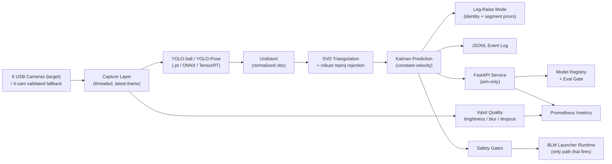

# Architecture

Project_Cam is a multi-camera, real-time 3D tracking system. Cameras observe a
garage arena; the system detects a ball and human pose per view, triangulates to
3D (mm), predicts short-horizon motion, and — in the safety-gated launcher
runtime only — aims a ball launcher. A separate aim-only API/monitoring layer
makes the same core observable and integrable.

## Layers

### 1. Capture
Threaded per-camera capture with a latest-frame discipline and a staleness gate
(`--max-frame-age-ms`). The displayed FPS is the real aggregate skeleton-update
rate. Intrinsics are calibrated at the runtime resolution; running at another
resolution requires scaling `K` (auto-scaled and verified).

### 2. Detection
- **Ball**: YOLO26m (TensorRT FP16, dynamic batch). Robust selection gates reject
  oversized blobs and KF-gate candidates against the predicted reprojection.
- **Pose**: YOLO11m-Pose (≈6× faster than MMPose with TensorRT) or MMPose
  (RTMDet-m + RTMPose-m). COCO-17 joints.

TensorRT engines are always exported with `dynamic=True, batch=N`; static batch=1
engines fail on batched multi-cam inference.

### 3. Undistortion + Triangulation
Observations are **normalized undistorted** image coordinates
(`cv2.undistortPoints`), paired with the **bare extrinsic** projection `P = [R|t]`
(no `K`). [`triangulate_multi`](../src/project_cam/geometry/triangulation.py) solves
the DLT system; `robust_triangulate_ball` / `robust_triangulate_joint` iteratively
drop the worst-reprojection camera so one bad pose can't fling a point. A
single-camera ray→Z-plane fallback exists for the ball only (it has a floor
prior; joints do not).

> Pairing rule (do not mix): normalized obs ↔ `[R|t]`. Pixel obs ↔ `K @ [R|t]`.

### 4. Prediction
[`JointKalmanFilter`](../src/project_cam/geometry/kalman.py) — a constant-velocity
3D filter operating purely on post-triangulation points. It smooths the track and
lead-predicts 200–400 ms ahead so the launcher aims where the target *will be*.

### 5. Exercise modes (assessment)
Squat / push-up rep counters and a movement-quality report run off the same
joints. The new **supine leg-raise mode**
([`leg_raise_mode.py`](../src/project_cam/assessment/live_trainer/leg_raise_mode.py))
adds left/right identity lock and anatomical segment-length priors so lying leg
elevation is readable — without changing squat/push-up behaviour.

### 6. Event logging
A non-blocking JSONL writer records a curated target→aim→fire→outcome narrative,
joined across viewer and launcher by `session_id`. Never affects render FPS.

### 7. API (aim-only)
[`services/api/app/main.py`](../services/api/app/main.py) exposes health, system
info, cameras, triangulation, prediction, session-report, model registry,
evaluation gate, and `/metrics`. It reuses the geometry core (no copied math)
and **can never fire** the launcher.

### 8. MLOps quality layer
[`configs/models.yaml`](../configs/models.yaml) records model provenance and
deployment status; [`project_cam.evaluation`](../src/project_cam/evaluation/)
computes 3D accuracy and fails CI on threshold regressions; and
[`project_cam.quality`](../src/project_cam/quality/) tracks brightness, blur, and
dropout drift before model predictions degrade. See [mlops.md](mlops.md).

### 9. Monitoring
Prometheus metrics (FPS, latency, dropped frames, camera count, reprojection
error, input quality, safety-gate blocks). See [monitoring.md](monitoring.md).

### 10. Safety boundary
BLM firing happens only in the safety-gated launcher runtime, behind zone /
confidence / camera-count / stability / angle-clamp / RPM gates. The API and the
edge demo are physically incapable of firing. See
[safety_boundaries.md](safety_boundaries.md).

## 4-camera fallback vs 6-camera target
The 4-camera `arena_fixed` calibration is the **validated** baseline (static +
joint-touch GT documented). The 6-camera USB rig is the **target** direction and
is treated as prototype until the Phase 0 promotion gates pass
(`configs/calibration/usb6_manifest.yaml`). Camera count is never hardcoded in the
service or configs.
