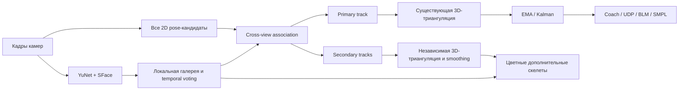

# Технический отчёт: Multi-Person Tracking, локальный Face ID и desktop-приложение Project Cam

**Проект:** Project Cam  
**Дата:** 12 июля 2026 года  
**Тип документа:** внутренняя техническая документация  
**Статус:** программная реализация завершена; требуется итоговая проверка на реальном многокамерном стенде

## 1. Краткое резюме

В рамках работы существующая система Project Cam была расширена тремя связанными возможностями:

1. Одновременное обнаружение и трекинг нескольких людей в многокамерной 3D-сцене.
2. Локальное распознавание зарегистрированных людей с помощью YuNet и SFace.
3. Отдельное desktop-приложение с ярлыком, через которое можно запускать основные режимы системы, управлять Face ID и просматривать журнал работы.

Реализация встроена в актуальную версию live viewer без замены существующей геометрии, калибровки камер, UDP-формата и safety-ограничений. По умолчанию сохраняется старый однопользовательский режим. Новые возможности активируются отдельными параметрами командной строки или через графический Control Center.

Основной результат:

- система поддерживает от 1 до 8 одновременно отслеживаемых людей;
- каждому 3D-треку присваивается стабильный числовой ID, который не переиспользуется в течение сессии;
- известному человеку может быть присвоено локальное имя из приватной Face ID-галереи;
- основной человек продолжает использовать существующие EMA, Kalman, coach, BLM и UDP-механизмы;
- дополнительные люди отображаются отдельными цветными скелетами и не влияют на управляющий контур;
- на рабочем столе установлен ярлык `Project Cam Arena Control Center`;
- 71 целевой тест новой функциональности и 356 не-API тестов проекта проходят успешно.

## 2. Исходная проблема

До выполнения работы live viewer выбирал только одного наиболее уверенно обнаруженного человека в каждой камере. При появлении двух или более людей это создавало несколько проблем:

- разные камеры могли выбрать разных людей;
- суставы разных людей могли попасть в одну 3D-триангуляцию;
- возникал «смешанный» или химерный скелет;
- при пересечении людей основной объект мог неожиданно переключаться;
- отсутствовал постоянный ID человека;
- система не могла отличить зарегистрированного пользователя от неизвестного;
- запуск требовал работы с терминалом и отдельными shell-скриптами.

Требовалось добавить multi-person association, локальную идентификацию и удобную точку запуска, не нарушив уже работающий single-person pipeline.

## 3. Требования к реализации

### 3.1. Функциональные требования

- Одновременный трекинг нескольких людей в 2D и 3D.
- Один кандидат одной камеры не должен назначаться двум трекам.
- Новый человек должен создаваться только при подтверждении минимум двумя камерами.
- ID трека должен оставаться стабильным при движении и изменении порядка detections.
- После длительной потери человека старый ID должен удаляться и не переиспользоваться.
- Известные люди должны получать имя из локальной галереи.
- Случайный одиночный face match не должен немедленно переименовывать трек.
- Основной человек должен быть отделён от дополнительных людей.
- Desktop-приложение должно запускать существующие рабочие режимы и корректно останавливать дочерний процесс.

### 3.2. Нефункциональные требования

- Новые функции должны быть opt-in и не изменять стандартный режим `--multi-person 1 --no-face-id`.
- Face ID не должен отправлять изображения или embeddings во внешние сервисы.
- Галерея биометрических признаков не должна попадать в Git.
- Ошибка Face ID не должна останавливать pose tracking.
- Secondary-треки не должны изменять UDP, BLM, coach или safety-контур.
- Алгоритмы ассоциации должны укладываться в бюджет live-кадра для небольшого гаражного пространства.

## 4. Общая архитектура



Реализация разделена на независимые уровни:

- `multi_person.py` отвечает за стабильные треки и cross-camera association;
- `face_id.py` отвечает за embeddings, локальную галерею, voting и face-to-track assignment;
- live viewer сохраняет всю калиброванную геометрию и выполняет 3D-триангуляцию;
- отдельные CLI-скрипты загружают модели и регистрируют людей;
- desktop Control Center формирует безопасные argv-команды и запускает один рабочий процесс.

Такое разделение позволяет тестировать решения без камер, GPU и ONNX-моделей.

## 5. Multi-Person Tracking

### 5.1. Формирование 2D-якоря человека

Для каждого pose-кандидата рассчитывается устойчивый 2D-якорь:

1. Если оба бедра имеют достаточную confidence, используется их середина.
2. Если бедра видны частично, используется среднее минимум двух точек торса: плечи и бедра.
3. Если торс недоступен, допускается среднее минимум трёх надёжных keypoints.
4. NaN, infinity, некорректные размеры массивов и низкая confidence отбрасываются.

Pelvis/torso был выбран вместо центра bounding box, поскольку он меньше зависит от положения рук и ног.

### 5.2. Сопоставление существующих треков

Каждый активный трек хранит последнюю подтверждённую 3D-позицию pelvis. Для новой pose-итерации выполняются следующие шаги:

1. Последний 3D pelvis проецируется в каждую камеру с использованием её калибровки.
2. Рассчитывается пиксельное расстояние до всех допустимых 2D-якорей.
3. Рёбра, превышающие `--mp-gate-px`, удаляются.
4. Для каждой камеры решается задача one-to-one assignment.

Используется bitmask dynamic programming со следующим приоритетом:

1. максимизировать количество назначенных треков;
2. минимизировать суммарное пиксельное расстояние;
3. при равенстве получить детерминированный результат по ID и индексу кандидата.

Это устраняет ошибку обычного greedy nearest-neighbour, при которой ближайший кандидат мог занять единственную detection другого трека.

### 5.3. Проверка межкамерной согласованности

Независимо выбранные 2D-кандидаты дополнительно проверяются геометрически:

- каждая пара камер триангулирует pelvis;
- reprojection error должен быть не выше `--mp-spawn-reproj-px`;
- полученные 3D-точки должны образовывать компактную пространственную гипотезу;
- конфликтующие камеры исключаются из комбинации;
- в вызывающий код не передаётся набор, способный создать скелет из разных людей.

Результат каждой пары кандидатов кэшируется в пределах одного кадра. В тестовом сценарии с двумя людьми и тремя камерами это уменьшило число одинаковых вызовов триангуляции с 30 до 12.

### 5.4. Создание новых треков

Новый трек создаётся только из свободных, ещё не назначенных detections:

- требуется минимум две разные камеры;
- pairwise reprojection error должен пройти порог;
- в одной гипотезе допускается не более одного кандидата от камеры;
- новая 3D-точка должна находиться не ближе `--mp-min-separation-mm` к существующему треку;
- количество активных людей ограничено диапазоном 1–8.

Числовые ID монотонно увеличиваются и не переиспользуются до перезапуска viewer.

### 5.5. Обновление и удаление треков

Трек считается подтверждённым только после получения пригодного 3D torso/pelvis. Периферийные суставы, например кисти, не используются как pelvis-якорь и не могут сдвинуть весь трек.

Если трек не подтверждался более `--mp-max-missed-frames`, он удаляется. Одновременно удаляются:

- secondary display state;
- Face ID voter;
- временные данные этого track ID.

Вернувшийся после expiry человек получает новый ID.

### 5.6. Выбор primary-человека

Primary track используется существующими downstream-компонентами. Правила выбора:

1. Если задан `--primary-person NAME` и это имя надёжно закреплено за видимым треком, выбирается этот трек.
2. Иначе сохраняется текущий primary, пока его track ID существует.
3. При удалении primary выбирается наиболее долго подтверждаемый доступный трек.
4. Новый primary должен иметь назначение минимум от двух камер.

Краткая окклюзия не переключает управление на другого человека. Это защищает UDP, coach и BLM от случайной передачи управления соседнему треку.

### 5.7. Изоляция состояния людей

Для primary и secondary используются отдельные 3D-массивы и smoothing state. При реальной смене primary сбрасываются персональные компоненты:

- EMA и display smoothing;
- Kalman filters и prediction state;
- motion trails и speed estimates;
- coach counter, ROI и keypoint stabilizer;
- bone-length priors и ankle fallback streak;
- squat/push-up rep counters;
- leg-raise tracker, limb identity и contact interpreter;
- SMPL shape calibration и последний mesh result;
- BLM target transition state.

Для асинхронного SMPL fitter добавлен неблокирующий `reset()`. Старый in-flight результат получает предыдущую generation и отбрасывается, после чего worker сбрасывает shape calibration перед обработкой нового человека.

## 6. Локальный Face ID

### 6.1. Выбранный стек

Использованы модели OpenCV Zoo:

- **YuNet** — детекция лица и пяти landmarks;
- **SFace** — формирование нормализованного 128-мерного embedding.

Face ID работает локально. Facebook, внешнее API и облачная база не используются.

### 6.2. Проверенные модели

| Модель | Размер | SHA-256 |
|---|---:|---|
| `face_detection_yunet_2023mar.onnx` | 232 589 байт | `8f2383e4dd3cfbb4553ea8718107fc0423210dc964f9f4280604804ed2552fa4` |
| `face_recognition_sface_2021dec.onnx` | 38 696 353 байта | `0ba9fbfa01b5270c96627c4ef784da859931e02f04419c829e83484087c34e79` |

Скрипт загрузки сначала записывает `.part`-файл, проверяет точный размер и SHA-256, выполняет `fsync`, а затем атомарно заменяет целевой ONNX-файл. Повреждённая загрузка не уничтожает существующую корректную модель.

### 6.3. Локальная галерея

По умолчанию галерея хранится по пути:

```text
~/.local/share/project-cam/face_gallery.npz
```

Характеристики галереи:

- формат NumPy NPZ без pickle;
- список имён и матрица нормализованных embeddings;
- поддержка нескольких образцов одного человека;
- Unicode-имена до 64 символов;
- запрет управляющих символов;
- проверка размерности, finite-значений и ненулевой нормы;
- атомарная запись;
- права файла `0600`;
- исходные изображения не сохраняются.

Файлы `models/face/*.npz` дополнительно добавлены в `.gitignore`.

### 6.4. Сопоставление лица с 3D-треком

Face inference выполняется раз в `--face-id-every` кадров только на одной камере. Камеры обходятся round-robin, что ограничивает нагрузку.

Для каждого трека:

1. выбирается лучшая доступная 3D-точка головы;
2. при отсутствии face keypoints используется середина плеч с вертикальным смещением;
3. точка проецируется в выбранную камеру;
4. центр обнаруженного лица сравнивается с проекцией головы;
5. применяется порог `--face-gate-px`;
6. one-to-one assignment максимизирует число сопоставленных людей, затем минимизирует общую дистанцию.

Одно лицо не может одновременно дать голос двум track ID.

### 6.5. Temporal Name Voter

Одиночный SFace match не используется как окончательное решение. Для каждого трека работает отдельный `NameVoter`:

- по умолчанию требуется минимум 3 согласованных наблюдения;
- score накапливается и постепенно decay-ится;
- имя блокируется только после достижения lock score и отрыва от второго кандидата;
- один случайный challenger не меняет имя;
- после серии misses имя очищается;
- если два трека получили одно имя, оно остаётся у более сильного владельца.

Базовый порог cosine similarity равен `0.363` и может быть изменён через `--face-id-min-score`.

### 6.6. Enrollment

Скрипт `face_enroll.py` поддерживает:

- регистрацию с камеры, `/dev/video*` или видеофайла;
- регистрацию по одному или нескольким изображениям;
- сбор 12 образцов по умолчанию;
- фильтрацию слишком маленьких, слабых и расположенных у края лиц;
- небольшие интервалы между образцами для разнообразия ракурсов;
- добавление, замену, просмотр и удаление identity;
- сохранение галереи только при успешном сборе требуемого числа образцов.

## 7. Интеграция в live viewer

Основной файл интеграции:

```text
Parallel_working/scripts/live_4cam_arena_view_parallel.py
```

Добавлены следующие параметры:

| Параметр | Назначение | Значение по умолчанию |
|---|---|---:|
| `--multi-person N` | Максимум одновременных людей, диапазон 1–8 | `1` |
| `--mp-gate-px` | Порог проекции pelvis | `150` |
| `--mp-spawn-reproj-px` | Reprojection threshold для нового трека | `60` |
| `--mp-min-separation-mm` | Минимальная дистанция между треками | `400` |
| `--mp-max-missed-frames` | Grace period трека | `30` |
| `--face-id` | Включить локальную идентификацию | выключено |
| `--face-models-dir` | Каталог YuNet/SFace | `models/face` |
| `--face-gallery` | Путь приватной галереи | XDG data path |
| `--face-id-every` | Период Face ID | `10` кадров |
| `--face-id-min-score` | Минимальный SFace cosine score | `0.363` |
| `--face-id-min-votes` | Голоса до блокировки имени | `3` |
| `--face-id-max-misses` | Misses до снятия имени | `30` |
| `--face-gate-px` | Порог face-to-head association | `140` |
| `--primary-person` | Предпочитаемое зарегистрированное имя | пусто |

### 7.1. Сохранение legacy-пути

При `--multi-person 1 --no-face-id` новый tracker не создаётся. Viewer продолжает использовать существующий выбор одного человека и прежнюю схему 3D-обработки.

### 7.2. Secondary rendering

Дополнительные люди отображаются:

- отдельным цветом из multi-person palette;
- отдельным glowing skeleton;
- floor shadow;
- подписью `Person #ID` или зарегистрированным именем;
- отметкой успешной идентификации;
- записью в панели `ARENA ACCESS`.

Secondary rendering реализован для OpenCV backend. При другом backend viewer выводит предупреждение.

### 7.3. Safety boundary

Только primary track передаётся в:

- coach overlay;
- rep counters;
- UDP target stream;
- BLM aim computation;
- SMPL avatar;
- event logging управляющего контура.

Multi-person mode не добавляет команды выстрела, не меняет UDP schema и не обходит существующие safety gates.

## 8. Desktop Arena Control Center

Создано отдельное Tk-приложение:

```text
desktop/arena_control_center.py
```

Control Center предоставляет:

- запуск 6-camera cinematic arena;
- запуск 6-camera BLM overlay;
- запуск 4-camera YOLO-Pose режима;
- запуск записи 3D-сессии;
- включение multi-person и выбор количества людей;
- включение Face ID;
- ввод preferred primary name;
- включение auto-orbit и limb heat;
- загрузку моделей;
- регистрацию и просмотр Face ID-галереи;
- live mission log дочернего процесса;
- interlock, запрещающий одновременный запуск двух pipeline;
- кнопку STOP с отправкой `SIGINT` всей process group.

`SIGINT` выбран вместо `SIGKILL`, чтобы video writers и JSONL-файлы успевали корректно завершиться.

### 8.1. Ярлык и иконка

Создана SVG-иконка с шестью камерами, 3D-контуром и центральным pose skeleton:

```text
desktop/project-cam.svg
```

Установлены два desktop entry:

```text
~/.local/share/applications/project-cam.desktop
~/Desktop/Project Cam.desktop
```

Оба файла имеют права `0755`, проходят `desktop-file-validate` и ссылаются на venv Python и актуальный путь проекта.

## 9. Основные созданные и изменённые файлы

| Файл | Назначение |
|---|---|
| `src/project_cam/tracking/multi_person.py` | Cross-view association, stable IDs, spawn/prune |
| `src/project_cam/tracking/face_id.py` | Галерея, SFace matching, NameVoter, YuNet/SFace runtime |
| `src/project_cam/tracking/__init__.py` | Публичные tracking API |
| `Parallel_working/scripts/live_4cam_arena_view_parallel.py` | Интеграция tracker, Face ID и rendering |
| `Parallel_working/scripts/download_face_models.py` | Проверенная загрузка ONNX-моделей |
| `Parallel_working/scripts/face_enroll.py` | Регистрация и управление identities |
| `desktop/arena_control_center.py` | Графический launcher и mission log |
| `desktop/project-cam.svg` | Векторная иконка приложения |
| `desktop/project-cam.desktop.in` | Шаблон desktop entry |
| `desktop/install_desktop_app.sh` | Установка ярлыка |
| `src/project_cam/avatar/async_fitter.py` | Безопасный reset при смене primary |
| `.gitignore` | Исключение локальной биометрической галереи |

Добавлены отдельные тестовые модули для tracker, Face ID, viewer integration, CLI и desktop-приложения.

## 10. Производительность

Синтетические CPU-измерения association:

| Сценарий | Лучшее измеренное время |
|---|---:|
| 4 трека × 16 кандидатов, одна камера | 0,42 мс |
| 6 треков × 16 кандидатов, одна камера | 2,13 мс |
| 6 треков × 24 кандидата, одна камера | 3,42 мс |
| 6 треков × 40 кандидатов, одна камера | 6,08 мс |
| Initial spawn: 6 людей × 6 камер | 21,46 мс |

Face ID на пустом кадре 640×360 с реальными YuNet/SFace объектами:

```text
26,2 мс, detections=0
```

Face ID запускается не каждый кадр, а периодически и на одной round-robin камере, поэтому эта стоимость не добавляется ко всем камерам одновременно.

Приведённые значения являются синтетическими локальными измерениями, а не гарантией FPS реального стенда.

## 11. Тестирование и верификация

### 11.1. Целевые тесты

Проверены:

- создание нескольких треков при разном порядке detections;
- one-to-one assignment;
- максимальная cardinality вместо ошибочного greedy matching;
- coherent multi-camera spawning;
- движение и сохранение ID;
- expiry и запрет повторного использования ID;
- cache межкамерных пар;
- malformed/anchorless candidates;
- нормализация и приватное сохранение галереи;
- Unicode identity names;
- temporal voting, challenger и expiry имени;
- one-to-one face-to-track assignment;
- viewer CLI и renderer contracts;
- primary switch и reset персонального состояния;
- Face ID downloader и enrollment CLI;
- desktop argv safety и headless check;
- async SMPL reset.

Финальный результат:

```text
71 passed in 2.07s
```

### 11.2. Регрессионный прогон проекта

Все тесты, кроме старой API TestClient-группы:

```text
356 passed in 8.31s
```

71 целевой тест входит в эти 356 тестов и не должен складываться с ними как отдельное количество.

### 11.3. Статические проверки

Успешно выполнены:

- `py_compile` для новых и изменённых Python-модулей;
- Ruff для tracking, Face ID, desktop, CLI и тестов;
- Ruff по viewer без его ранее существовавших style-only правил `I001`, `E701`, `E702`;
- `bash -n` для installer и run scripts;
- `git diff --check`;
- `desktop-file-validate` для обоих установленных ярлыков;
- SHA-256 verification обеих ONNX-моделей;
- реальное создание `FaceDetectorYN` и `FaceRecognizerSF`.

### 11.4. Известный blocker API-тестов

В репозитории собрано 381 тест. Пять файлов `tests/test_api*.py`, содержащие 25 тестов, зависают на первом вызове FastAPI `TestClient`.

Проблема воспроизведена на минимальном независимом приложении `FastAPI()` без импорта Project Cam. Текущее окружение содержит:

- FastAPI `0.138.1`;
- Starlette `1.3.1`;
- httpx `0.28.1`;
- anyio `4.14.1`.

Сам пакет выводит предупреждение о deprecated связке `httpx`/`starlette.testclient` и необходимости `httpx2`. Следовательно, зависание относится к окружению API-тестов и не вызвано multi-person или Face ID изменениями.

## 12. Инструкция по эксплуатации

### 12.1. Проверить или загрузить модели

```bash
./venv/bin/python Parallel_working/scripts/download_face_models.py --verify-only
```

Если моделей нет:

```bash
./venv/bin/python Parallel_working/scripts/download_face_models.py
```

### 12.2. Зарегистрировать человека

```bash
./venv/bin/python Parallel_working/scripts/face_enroll.py \
  --name "Имя человека" \
  --camera 0
```

Во время регистрации необходимо смотреть в камеру и немного менять угол головы. По умолчанию требуется 12 принятых образцов.

Просмотр галереи:

```bash
./venv/bin/python Parallel_working/scripts/face_enroll.py --list
```

Перезапись существующего человека:

```bash
./venv/bin/python Parallel_working/scripts/face_enroll.py \
  --name "Имя человека" \
  --camera 0 \
  --replace
```

Удаление:

```bash
./venv/bin/python Parallel_working/scripts/face_enroll.py \
  --remove "Имя человека"
```

### 12.3. Запуск через desktop-приложение

1. Открыть `Project Cam` на рабочем столе или в меню приложений.
2. Включить `Multiple people`.
3. Выбрать количество одновременно отслеживаемых людей.
4. При необходимости включить `Local Face ID labels`.
5. Ввести `Primary name`, если конкретный человек должен управлять coach/UDP/BLM.
6. Выбрать один из режимов запуска.

### 12.4. Прямой запуск из терминала

```bash
bash Parallel_working/run_live_usb6_mirrored_skeleton.sh \
  --multi-person 4 \
  --face-id \
  --primary-person "Имя человека"
```

Только multi-person без распознавания:

```bash
bash Parallel_working/run_live_usb6_mirrored_skeleton.sh \
  --multi-person 4 \
  --no-face-id
```

Legacy-режим:

```bash
bash Parallel_working/run_live_usb6_mirrored_skeleton.sh \
  --multi-person 1 \
  --no-face-id
```

## 13. Диагностика

### Face ID отключился при запуске

Проверить наличие и hash моделей:

```bash
./venv/bin/python Parallel_working/scripts/download_face_models.py --verify-only
```

### Все люди отображаются как `UNKNOWN`

- проверить `face_enroll.py --list`;
- выполнить enrollment;
- убедиться, что лицо достаточно крупное и освещённое;
- уменьшать `--face-id-min-score` только после контролируемой проверки, поскольку это повышает риск false match.

### ID часто теряется

- проверить синхронизацию и калибровку камер;
- увеличить `--mp-gate-px` небольшими шагами;
- увеличить `--mp-max-missed-frames` при длительных окклюзиях;
- не увеличивать gate чрезмерно, иначе возрастает риск cross-person association.

### Новый человек не создаётся

- он должен одновременно наблюдаться минимум двумя калиброванными камерами;
- проверить `--mp-spawn-reproj-px`;
- проверить качество hip/torso keypoints;
- проверить минимальную дистанцию `--mp-min-separation-mm`.

### Дополнительные скелеты не отображаются

Secondary rendering поддерживается OpenCV visualization backend. Следует использовать `--viz-backend cv2`.

## 14. Безопасность и приватность

Текущая Face ID-функция является системой идентификационных подписей, а не сертифицированной системой контроля доступа.

Она не содержит:

- depth/IR sensing уровня Apple Face ID;
- liveness detection;
- защиты от фотографии, экрана или маски;
- security certification;
- автоматического управления дверью или замком.

Поэтому результат нельзя использовать как единственный фактор физического допуска в гараж. Для реального access control потребуется liveness, второй фактор, журнал решений и отдельный fail-safe контроллер.

Положительные privacy-свойства текущей реализации:

- изображения не отправляются в облако;
- Facebook и внешние identity services не используются;
- исходные enrollment-кадры не сохраняются;
- embeddings хранятся локально с правами `0600`;
- галерея исключена из Git.

## 15. Ограничения и дальнейшие работы

1. Выполнить end-to-end тест с 2–6 реальными людьми на всех калиброванных камерах.
2. Проверить crossing trajectories, частичные окклюзии, приседания и prone pose.
3. Настроить gate и reprojection thresholds по реальным логам.
4. Добавить аппаратно поддерживаемую liveness-проверку, если Face ID будет использоваться для доступа.
5. Рассмотреть отдельный appearance Re-ID embedding для длительных окклюзий и повторного входа.
6. Добавить per-track историю метрик и повторений, если потребуется одновременный coaching нескольких спортсменов.
7. Исправить несовместимость FastAPI TestClient/httpx2 и вернуть 25 API-тестов в общий regression gate.
8. Создать Git commit после предоставления записи в `.git`; во время текущей агентской сессии `.git` был доступен только для чтения.

## 16. Итог

Project Cam получил рабочий программный слой multi-person tracking, локальной идентификации и desktop-управления. Решение сохраняет существующий single-person pipeline, геометрию и safety boundary, разделяет состояние людей и предоставляет аппаратно-независимые тесты для критических алгоритмов.

Программная часть готова для лабораторной валидации. Следующий обязательный этап — проверить систему на реальном стенде с несколькими людьми и на основании логов уточнить association thresholds.
