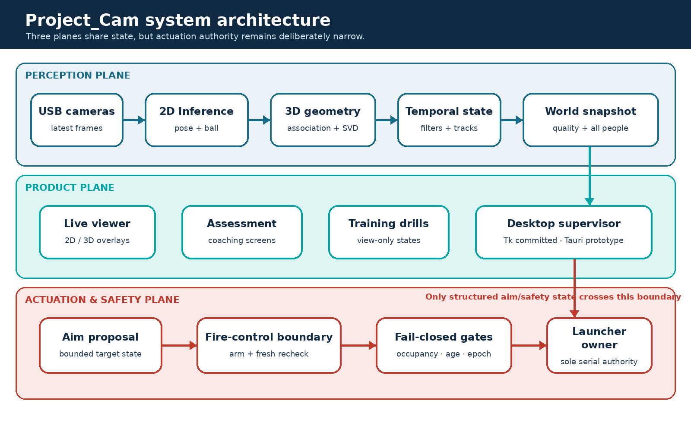
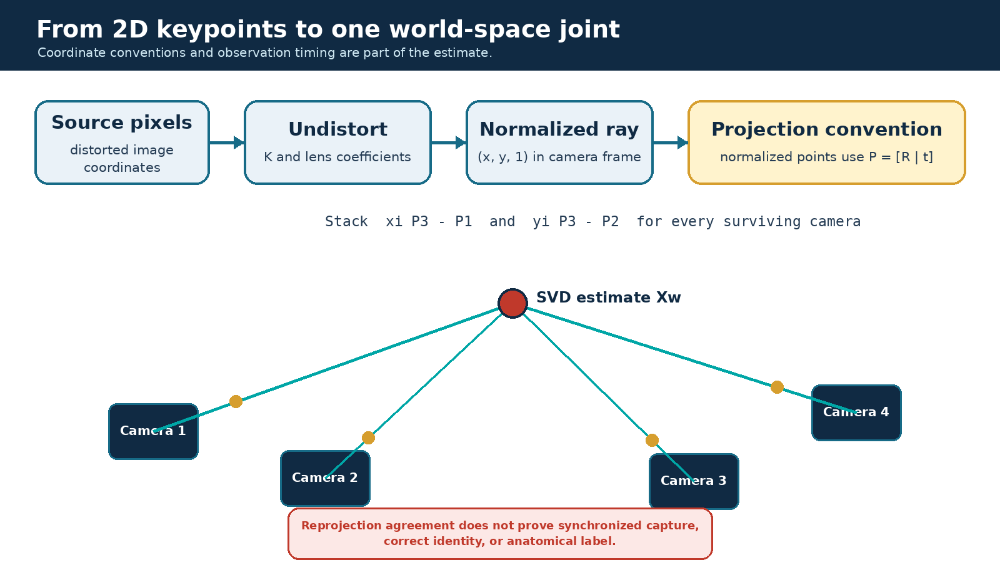
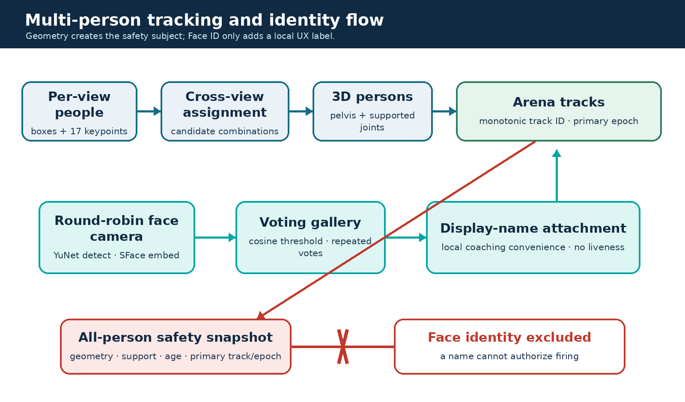
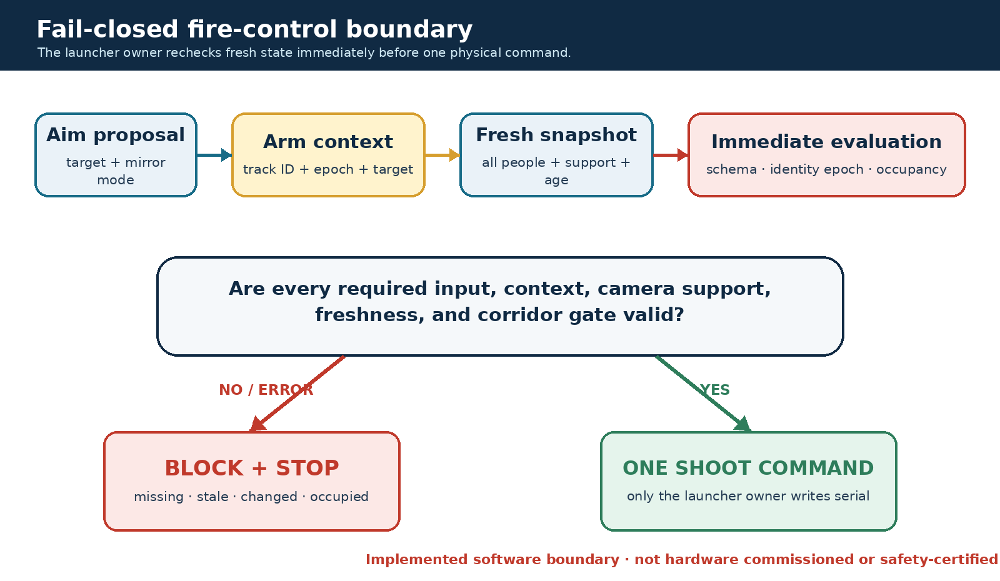
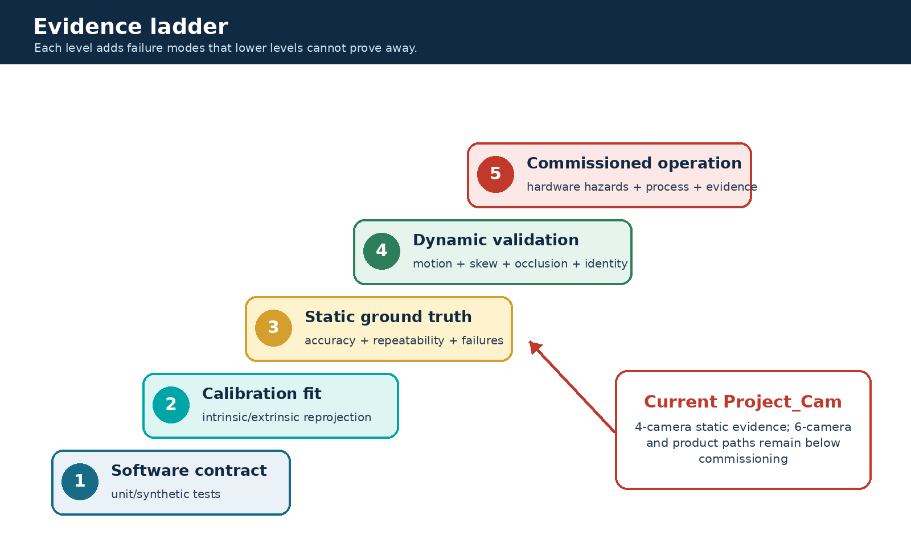

# Report Scope and Repository Snapshot

## Intended reader

This report is written for a junior computer-vision engineer who is comfortable with Python, neural-network inference, camera calibration, and basic linear algebra, but who has not previously worked on Project_Cam. It explains the reasoning behind the implementation, the runtime dataflow, the geometry, the validation evidence, and the product and safety boundaries. It is not a tutorial on pose estimation in isolation. The objective is to make the repository understandable as an engineering system.

## Snapshot used for this report

| Item | Snapshot value |
|---|---|
| Evidence date | 29 July 2026 |
| Branch | `feature/multi-person-face-id-desktop-20260712` |
| Committed HEAD | `7f937dbc` — garage demonstrator pilot roadmap |
| Repository state | Dirty working tree: modified tracked files and untracked July features are present |
| Evidence-backed fallback | Four-camera arena bundle `arena_fixed_20260406` |
| Current expansion path | Six-USB-camera low-latency runtime, still a prototype |

This distinction matters. Some capabilities described here are reproducible from committed HEAD. Others exist only in the local working tree: the React/Tauri desktop, five view-only training drills, the drill session runtime, left/right geometric splitting, the generic skeleton stabilizer, and the latest integration of the shared fire-control boundary into the UDP launcher runtime. The report labels these explicitly instead of treating the working directory as if it were a clean release.

## Maturity vocabulary

Every major capability is assigned one of four labels.

| Label | Meaning in this report |
|---|---|
| **Measured** | A concrete artifact records the behavior under a named rig, profile, dataset, and date. The measurement may still have limitations. |
| **Implemented** | Executable code and relevant software tests exist in committed HEAD. This does not imply live hardware validation or operational approval. |
| **Prototype** | Code, configuration, or a local artifact demonstrates the direction, but promotion gates or reproducibility are incomplete. Working-tree-only code is normally in this category. |
| **Planned** | The design or roadmap specifies the behavior, but the complete implementation or evidence does not yet exist. |

A passing unit test proves a software contract under its test inputs. It does not prove camera synchronization, human-subject validity, biometric performance, launcher accuracy, hazard containment, or safety commissioning. Likewise, a local diagnostic log is useful evidence, but it is not automatically a controlled benchmark.

## Source-of-truth hierarchy

Project_Cam has accumulated documentation across several development phases. Conflicts are resolved with the following hierarchy.

| Priority | Source class | Examples | How it is used |
|---:|---|---|---|
| 1 | Current executable code and tracked raw result artifacts | Viewer, geometry and safety code; ground-truth JSON summaries | Highest authority for implemented behavior and recorded results |
| 2 | Active configuration and current product design | Camera manifests, wrappers, July pilot specification | Authority for intended profiles, readiness gates, and current direction |
| 3 | Fresh local artifacts with clear provenance | July six-camera JSONL timing log, July training summaries | Diagnostic evidence; always labelled local and profile-specific |
| 4 | Narrative documentation and older status reports | README, architecture notes, performance prose | Context only when consistent with higher-priority evidence |

Three files need special care. `docs/current_status.md` is dated 30 June and describes another branch. `CANONICAL.md` remains useful for legacy geometry and launcher ownership, but predates the six-camera, multi-person, Face ID, desktop, and July safety work. `configs/models.yaml` is the formal model registry, yet its pose input size and some latency metadata conflict with the current low-lag wrapper. None of these files is discarded; each is interpreted within its date and scope.

## Terminology rules

The following terms are deliberately not interchangeable:

- **Accuracy** is distance from an independently known ground-truth location.
- **Repeatability** or **precision** is the spread of repeated reconstructions and may remain small even when all results share a large bias.
- **Latency** must name the measured stage, profile, image shape, batch behavior, camera count, hardware, and date.
- **Calibrated** may mean intrinsics and extrinsics were solved; it does not by itself mean the rig passed static 3D ground truth, temporal validation, and promotion gates.
- **Fail-closed** describes a software decision rule that blocks on missing or inconsistent input. It does not mean the surrounding electromechanical installation is commissioned or safety-certified.

The often-repeated `4.4 mm` pose figure is therefore described as approximately `4.39 mm reconstruction repeatability` for the four-camera joint experiment. It is not absolute joint-localization accuracy and not shot-placement accuracy.

<!-- PAGEBREAK -->

# Executive Technical Summary

Project_Cam is a garage-scale research and validation platform that connects multi-camera perception to sports analytics and, in a separately controlled path, to a ball launcher. Its central technical problem is not merely detecting a person in an image. The system must take several unsynchronized USB views, estimate 2D body keypoints and ball observations, associate information that belongs to the same physical subject, reconstruct a usable 3D world state, stabilize it over time, expose it to coaching and visualization tools, and prevent uncertain perception from becoming an unsafe actuation command.

The architecture has three interacting planes:

1. The **perception plane** captures camera frames, runs pose and ball inference, calibrates observations into a shared world frame, triangulates 3D state, and maintains short-lived temporal tracks.
2. The **product plane** presents live views, athlete identity, training state machines, session summaries, assessment reports, and operator controls.
3. The **actuation and safety plane** consumes a deliberately restricted snapshot, evaluates firing-line geometry and state freshness, and permits the dedicated launcher owner to send a single command only when every required gate is clear.



The four-camera arena bundle is the strongest tracked measurement baseline. Static ball trials completed `36/36` reconstructions with `156.90 mm` mean error, `288.34 mm` P95 error, and `3.09 mm` mean repeatability. The corresponding joint experiment completed only `62/81` trials: mean error was `178.98 mm`, P95 was `243.77 mm`, and repeatability was `4.39 mm`. The missing `19` joint trials are part of the result and prevent a clean “high-accuracy pose system” claim. The experiment shows that the geometry can be repeatable while retaining substantial systematic error.

The six-camera direction improves viewpoint coverage and the number of joints commonly triangulated, but it has not reached the same evidence level. Its manifest records six runtime-resolution intrinsics, solved extrinsics, and healthy per-camera freshness in one capture run; it also records that all devices remained on one USB controller and that static 3D ground-truth evaluation was not run. Its correct maturity label is **Prototype**.

A July 2 low-latency six-camera log contains eleven periodic samples. For that exact local profile, the mean pose stage was approximately `54.17 ms`, mean total loop time `100.77 ms`, and mean reported end-to-end time `113.97 ms`. The mean triangulated-joint count was `16.36` of 17; the median was `17`. These are useful engineering diagnostics, not a formal benchmark matrix. They also explain why an older isolated `6.2 ms` TensorRT pose number must not be presented as current pipeline latency: the two measurements cover different scopes.

Multi-person tracking, local Face ID, all-person safety snapshots, firing-line evaluation, and an interactive fire-control boundary are implemented in committed code. Their maturity is not uniform. The tracker is a pelvis-based association layer without a full motion model; Face ID uses local YuNet detection and SFace embeddings, has no liveness check, and remains unvalidated in representative two-to-six-person arena scenarios. The firing-line evaluator is intentionally fail-closed for stale, malformed, ambiguous, or insufficient state, but it is not commissioned on hardware and still lacks the complete primary-athlete catch-envelope and protected-body-region policy required by the active pilot design.

The product surface is also transitional. The committed Tk control center launches established viewer and recording profiles. A newer React/Tauri desktop has real process-group launch, stop, and log streaming, yet the tree is untracked, readiness checks are mostly file/device presence tests, and analytics and match screens remain demo data. Five new training state machines—balance, shuttle, line hops, goalkeeper save, and goalkeeper up/down—are working-tree prototypes. They are view-only by construction and cannot fire the launcher, which is the correct boundary for their current maturity.

The correct overall description is therefore:

> Project_Cam is an engineering validation stack with an evidence-backed four-camera baseline, a richer six-camera perception prototype, implemented software safety primitives, and an emerging operator/training product. It is not a production-ready or safety-certified launcher system.

<!-- PAGEBREAK -->

# What Project_Cam Is — and What It Is Not

## The system problem

A single-frame pose-estimation demo can stop after drawing a skeleton. Project_Cam cannot. A useful arena system must answer questions that cross subsystem boundaries:

- Did each camera observe the same instant closely enough for triangulation?
- Do the selected 2D detections belong to the same person?
- Which coordinate convention is used by every downstream consumer?
- Is a stable-looking point actually accurate, or merely repeatable?
- What happens when one view is stale, occluded, mirrored, or swaps left and right?
- Who is the primary athlete, and what happens when that identity changes?
- Can a product UI distinguish a healthy process from cameras that are truly producing usable frames?
- What information may influence aim, and what stronger evidence is required before a launcher may fire?

The repository contains answers at different maturity levels. The engineering task is to preserve the boundaries among them.

## Main current capabilities

| Capability | Current state | Maturity |
|---|---|---|
| Four-camera pose and ball reconstruction | Calibrated bundle with tracked static GT results | **Measured** |
| Six-camera low-lag pose/ball viewer | Intrinsics, extrinsics, capture and local performance artifacts; static 3D GT absent | **Prototype** |
| YOLO-Pose TensorRT path | Active low-lag wrapper uses exact 960 input and bounded batch | **Implemented** |
| MMPose path | Available as an alternative/default in the raw viewer CLI | **Implemented** |
| Multi-person tracking | Pelvis-based stable track IDs and primary selection | **Implemented** |
| Local Face ID | YuNet/SFace gallery, periodic voting, no liveness | **Implemented**, validation incomplete |
| Athlete assessment | Live capture plus offline JSON/HTML/C3D coaching reports | **Implemented** |
| Five training drills | View-only state machines and session summaries in working tree | **Prototype** |
| Ball tracking | YOLO/TRT, multi-view reconstruction, flight state and fallback | **Implemented**; six-camera accuracy unmeasured |
| Firing-line and fire-control rules | Fail-closed software boundary in committed code | **Implemented**, not commissioned |
| Tk control center | Launches viewer/recording profiles | **Implemented** |
| React/Tauri desktop | Process supervision and preview UI in untracked tree | **Prototype** |
| Pose-guided live firing | Requires primary protection policy, RPM calibration and commissioning | **Planned** |

## Non-goals and prohibited interpretations

The current system is not a clinical biomechanics instrument, medical diagnostic tool, talent-ranking system, security-grade biometric platform, synchronized motion-capture replacement, or safety-rated interlock. Coaching reports should be interpreted as screening and session-support outputs. Face identity is a convenience label and is deliberately excluded from firing authorization. Machine learning cannot be the sole safety function. The launcher remains outside a youth pilot unless governed by a separate, approved safety protocol.

# Evolution: From Four Cameras to a Six-Camera Product Direction

## The four-camera evidence baseline

The established arena bundle `arena_fixed_20260406` provides a consistent resolution, world coordinate frame in millimetres, four camera matrices, and tracked static reconstruction results. This baseline is valuable not because its absolute errors are small—they are not—but because its experiment is inspectable and repeatable. It exposes the gap between precision and accuracy and provides a fallback profile when the newer topology is not ready.

The ball and joint bundles also reveal different failure surfaces. All 36 ball trials reconstructed, while only 62 of 81 joint trials did. A spherical ball detector and a body-keypoint model do not fail in the same way: limbs are occluded, left/right semantics can flip, confidence varies by joint, and a keypoint may appear plausible in one view while belonging to the wrong physical landmark.

## Why add cameras

More views can increase the probability that at least two cameras see a joint with useful geometry. They can reduce dependence on any one occluded or oblique view and improve the continuity of a rendered skeleton. But camera count is not a monotonic accuracy control. Additional unsynchronized views may contribute temporal disagreement; poor baselines may add little triangulation information; a wrong person assignment can create a confident but physically impossible 3D point; and shared USB bandwidth can increase frame age or dropouts.

The six-camera expansion therefore needs four separate gates:

1. **Capture health:** every camera produces fresh frames at the runtime resolution and rate.
2. **Geometric calibration:** intrinsics and extrinsics are solved in the same convention.
3. **Static 3D validation:** independent known points quantify accuracy, repeatability, failure rate, and coverage.
4. **Dynamic validation:** representative motion quantifies timestamp skew, occlusion behavior, track stability, and end-to-end latency.

The current USB6 manifest records progress through the first two gates, while static GT fields remain null. Promotion language must reflect that fact.

## The current product split

The July product design intentionally separates two modes. The **Operational Zone Drill** is the reliability anchor: the design specifies a bounded program that must be validated under explicit safety controls, and pose is not intended to be the sole authorization source. The **Pose-Guided Validation** mode is a later controlled research path that depends on stronger primary-athlete protection, trajectory calibration, scenario testing, and commissioning. Treating these modes as equally ready would hide the system’s largest risk.

# Hardware and Camera Topology

## Measured host and devices

The repository’s performance documentation describes an Ubuntu 22.04 workstation with an Intel i9-7900X, 32 GB RAM, an RTX 2080 Ti 11 GB GPU, and a Quadro P400. The arena cameras are USB webcams with rolling shutters and no hardware trigger synchronization. Exact performance numbers are therefore properties of this host, model artifact, wrapper profile, camera topology, and date—not universal model specifications.

The USB6 capture artifact reports fresh per-camera rates between `16.51` and `29.94 FPS` and maximum gaps no greater than `81.11 ms` for that run. However, all six devices were still attached to one USB controller. The capture gate consequently failed its controller-separation requirement even though individual freshness measurements were acceptable. This is a useful example of a system-level gate: per-device health does not prove topology resilience.

## Calibration state

The six-camera manifest reports runtime-resolution intrinsics for all six devices and solved extrinsics, with mean extrinsic reprojection RMSE of approximately `2.97 px` and a worst camera near `6.41 px`. The largest recorded intrinsic reprojection error is about `1.12 px`. These numbers describe calibration fit, not 3D world accuracy.

There is also a metadata conflict. `configs/calibration/usb6_manifest.yaml` records that intrinsics and extrinsics gates passed, while `configs/cameras/cameras_6cam_usb.yaml` marks cameras as `calibrated: false`. A junior engineer should not “fix” this by choosing the more optimistic file. The likely explanation is that one flag means solved calibration while the other means fully promoted runtime configuration. The correct action is to reconcile the schema and attach explicit gate states.

## Rolling shutter and temporal implications

With rolling shutter, different image rows are exposed at slightly different times. Without a shared trigger, camera start times also differ. Static calibration cannot remove these effects. During fast limb or ball motion, two geometrically correct rays may correspond to different physical positions. The triangulator will still return the least-squares intersection, so temporal inconsistency can look like spatial noise or bias. Dynamic validation must therefore measure time alignment rather than assuming that more cameras solve it.

# End-to-End Runtime Architecture

The principal live path is the large parallel arena viewer at `Parallel_working/scripts/live_4cam_arena_view_parallel.py`. Its name reflects history; current wrappers can supply six cameras. The file combines capture, inference, geometry, tracking, visualization, UDP publication, and optional logging, while some reusable geometry and filter modules also exist under `src/project_cam`. This duplication is migration debt: documentation must identify the code actually executed by the wrapper, not only the cleaner library module.

## Runtime dataflow

```text
USB cameras
  -> per-camera capture threads and latest-frame slots
  -> freshness/sequence selection in the main loop
  -> per-view ball and pose inference
  -> camera-local detection/person selection
  -> undistortion and normalized image coordinates
  -> cross-view assignment and multi-view triangulation
  -> pose repair, confidence, and temporal state
  -> multi-person tracks / primary athlete / optional Face ID
  -> visualization, assessment/training consumers, event and UDP outputs
  -> launcher owner receives aim and safety snapshots through a separate boundary
```

The system does not send raw neural-network output directly to the launcher. Each transition changes the meaning and trust level of the data. A 2D keypoint is a model observation. A triangulated point is a geometric estimate. A filtered joint is a presentation/control state. A safety snapshot adds freshness, camera support, primary epoch, mirror mode, and all-person occupancy. A fire command requires a separate evaluation at the last responsible moment.

## Runtime profiles matter

The raw viewer CLI and the wrappers do not describe the same operating mode. The raw CLI historically defaults to MMPose, high capture resolution, and a 200 ms maximum frame age. The current low-lag USB6 wrapper selects YOLO-Pose TensorRT/PT artifacts, locks pose input to 960, allows a maximum batch of six, requests `1280 x 720` at `15 FPS`, uses measured-delta-time tracking, and enables display latency compensation. A simpler mirrored-skeleton wrapper defaults to `640 x 360` at `5 FPS` with pose every second frame. Any latency or quality claim that omits the wrapper is incomplete.

The low-lag profile deliberately keeps pose and ball inference sequential. An earlier attempt to overlap CUDA work produced illegal-memory-access failures. Sequential execution sacrifices theoretical concurrency for a stable ownership model on the measured GPU and TensorRT stack.

# Asynchronous Capture and Temporal Consistency

## Latest-frame aggregation

Each camera has a capture thread that continually updates a latest-frame slot with image data, sequence information, and timing metadata. The main loop does not wait for a synchronized set. It proceeds when useful new data exists, chooses frames that remain within the configured age window, and may reuse a frame from a camera that has not refreshed while another camera has advanced.

This design is appropriate for low-latency visualization because one slow device does not stall the entire loop. It is not equivalent to synchronized acquisition. A triangulated joint can combine observations from different capture instants, and freshness alone does not bound inter-camera timestamp skew tightly enough for fast motion.

## Why the original synchronous refresh was changed

A synchronous “wait until all cameras are new” loop makes the slowest or blocked camera the clock for the whole system. On USB webcams, that can create bursty latency and frozen displays. Latest-frame aggregation changes the failure mode: the display remains responsive, but geometry must explicitly reason about age, support count, and temporal uncertainty.

## What is checked and what remains open

Current code checks that frames are not older than a configured limit and tracks whether a sequence is new or reused. The low-lag wrapper uses a maximum age around `350 ms`; the training wrapper is stricter at approximately `250 ms`. Those values are availability controls, not proof of temporal alignment.

The current hot path has no hardware timestamp synchronization, no explicit cross-camera skew gate, and no motion compensation that warps observations to a common acquisition time before triangulation. A robust next step is to record monotonic capture timestamps for every contributing observation, reject or downweight combinations above a skew threshold, and validate the policy with a moving target whose ground truth includes time.

## Engineering consequence

Temporal quality should travel with the reconstructed point. A joint supported by four cameras with a 12 ms spread is not equivalent to one supported by four cameras with a 180 ms spread. At minimum, downstream messages should expose support count, maximum observation age, timestamp spread, reprojection residual, and whether any frame was reused. This would allow visualization to remain permissive while safety and measurement consumers use stricter policies.

# Pose Inference: Models, TensorRT, and Per-View Selection

## Two supported pose paths

The live viewer supports both an MMPose path and a YOLO-Pose path. MMPose reflects the original modular research workflow. The current six-camera low-lag wrapper selects YOLO-Pose because its TensorRT export offers a practical throughput/latency trade-off on the measured GPU. The raw CLI still defaults differently, which is why the wrapper—not the parser default—is the correct description of the deployed experiment.

The active low-lag artifact is `yolo11m-pose.engine`, with PT and ONNX neighbors available locally. The wrapper fixes the inference image size at `960` and bounds the batch at six. `configs/models.yaml` still records a `640 x 640` pose input, so the registry is stale for this engine. TensorRT engines are shape-specific: silently sending 640 to an engine exported for 960, or assuming arbitrary batch behavior, is not a harmless metadata mismatch. It can cause validation failure, wrong bindings, or a runtime crash.

## Per-camera inference pipeline

For each selected camera frame, the pose path conceptually performs:

1. resize/letterbox into the model input while retaining the mapping back to source pixels;
2. run the detector/pose head, preferably as one bounded batch across current camera views;
3. decode person boxes, 17 COCO-style keypoints, and confidence values;
4. map keypoints back into the original camera image;
5. choose which person candidates remain eligible for cross-view association;
6. reject individual joints below the pose-confidence threshold before geometry.

The YOLO call uses a relatively permissive detection confidence around `0.15` to avoid losing an entire person too early. Later geometry uses the configured joint confidence, commonly around `0.45`, on each landmark. Those thresholds solve different problems: box-level recall controls whether a candidate exists, while joint confidence controls whether a particular ray is trusted.

## Batching and exact shapes

With six cameras, independent inference calls repeat kernel-launch and preprocessing overhead. Batching increases GPU utilization, but only within the engine’s supported shape and batch range. The low-lag profile therefore carries `POSE_IMGSZ=960` and `MAX_BATCH=6` as operational constraints rather than cosmetic settings.

An older `6.2 ms` number in project prose refers to an isolated TensorRT pose benchmark. It is not the time to capture six images, preprocess them, run all current inference, associate people, triangulate joints, filter state, and render the UI. The July diagnostic log reports a mean pose stage near `54.17 ms` for its exact six-camera profile. Both figures can be true; using either without its scope is misleading.

## Person selection before geometry

The original single-person behavior chooses a candidate independently in each camera. That is fast and often adequate when only one athlete is present, but it has a fundamental multi-view risk: camera A may select person 1 while camera B selects person 2. Linear triangulation will still return a 3D point from the mismatched rays. Reprojection pruning may reject some views, yet a geometrically plausible false combination can survive.

The newer multi-person path retains multiple candidates and constructs cross-view assignments before triangulating each person. It improves the data model, but it does not turn identity association into a solved problem. The association is anchored mainly by reconstructed pelvis position and local continuity; it does not use a global multi-view appearance model or a full velocity-aware assignment solver. Representative crossing, occlusion, entry, exit, and re-entry scenarios are still required.

## Model output is an observation, not state

Keypoint confidence is not a calibrated probability that the joint is correct in world space. A high-confidence left ankle can be consistently mislabeled, belong to another person, or form poor triangulation geometry with another view. For that reason, Project_Cam applies separate gates for neural confidence, multi-camera support, reprojection consistency, temporal plausibility, and consumer-specific freshness.

# Calibration and Coordinate Frames

## Intrinsics

For a pinhole camera, a 3D point in camera coordinates projects through the intrinsic matrix

$$
K = \begin{bmatrix}
f_x & 0 & c_x \\
0 & f_y & c_y \\
0 & 0 & 1
\end{bmatrix}.
$$

Real lenses add radial and tangential distortion. The runtime begins with detected source-image pixels, undistorts them with the stored camera model, and converts them to normalized image coordinates. In normalized space, the intrinsic matrix has already been removed, so geometry uses the bare extrinsic projection matrix

$$
P_i = [R_i \mid t_i].
$$

Mixing normalized points with `K[R|t]`, or raw pixels with `[R|t]`, applies intrinsics either twice or not at all. Both mistakes can produce numerical outputs that look like 3D points while being systematically wrong.

## Extrinsics and world convention

Each camera extrinsic maps a world point into that camera’s coordinate system:

$$
X_{c,i} = R_i X_w + t_i.
$$

The arena bundle expresses world distances in millimetres. World axes, mirror handling, launcher coordinates, floor height, and visualization conventions must agree. A display mirror should not silently alter the physical world frame. The current repository still contains historical rules and wrappers that disagree about mirroring and joint fallback, so the report treats the executed wrapper and its emitted metadata as authoritative for a named run.

## Calibration fit versus system accuracy

A low checkerboard reprojection error says that the fitted camera model explains the calibration observations. It does not measure the complete chain that includes neural detections, timestamp differences, target labelling, world-frame survey error, and triangulation. The six-camera values of approximately `1.12 px` maximum intrinsic error and `2.97 px` mean extrinsic RMSE are encouraging calibration-fit indicators, not a substitute for static 3D ground truth.



## Practical coordinate checklist

Before comparing two code paths, an engineer should answer:

- Are keypoints in distorted pixels, undistorted pixels, or normalized coordinates?
- Does the projection matrix include `K`?
- Are `R` and `t` world-to-camera or camera-to-world?
- Are positions in metres or millimetres?
- Is a mirror applied to display only, to observations, or to world output?
- Is floor height derived from the same bundle as the cameras?
- Are launcher and pose coordinates connected by a measured transform?

Most “mysterious” 3D offsets are convention or provenance bugs before they are neural-network problems.

# Multi-View Triangulation and Quality Control

## Linear triangulation

For normalized observation $(x_i, y_i)$ in camera $i$ and projection matrix $P_i$, the implementation builds two homogeneous linear constraints:

$$
x_i P_{i,3} - P_{i,1} = 0, \qquad
y_i P_{i,3} - P_{i,2} = 0.
$$

Stacking constraints from all contributing cameras gives $A X = 0$. Singular-value decomposition returns the right singular vector associated with the smallest singular value. Dividing by its fourth homogeneous component produces the Euclidean world point.

This is an unweighted linear estimate. The main pose path does not currently run bundle adjustment, confidence-weighted nonlinear refinement, or a full RANSAC search. Neural confidences are used primarily as eligibility gates rather than statistical observation weights.

## Iterative reprojection pruning

After an initial estimate, the point is projected back into each contributing camera. If the worst pixel residual exceeds the configured threshold, that camera is removed and the point is recomputed. The loop continues until every surviving view is within the residual limit or fewer than the required minimum cameras remain.

This approach is easy to inspect and works well when one view is clearly wrong. It has limits:

- two mutually consistent but wrong observations may survive;
- removing one view greedily does not explore every camera subset;
- confidence and baseline geometry are not used as weights;
- no cheirality test explicitly requires the point to be in front of every camera;
- no world-volume constraint rejects a point outside the arena;
- reprojection agreement cannot detect a shared calibration bias.

The current code reports survivor camera count correctly, but the primary pose confidence is averaged over the original observation set rather than only the surviving cameras. That can make confidence semantics inconsistent with the final geometry. The fix is to compute every quality field from the same survivor set and preserve the rejected-camera diagnostics separately.

## A numerical intuition

Suppose two cameras observe an ankle with strong confidence, but their rays meet at a shallow angle. A one-pixel change can move the intersection substantially along depth. A third camera with a different baseline may improve conditioning even if its individual confidence is slightly lower. Conversely, adding a temporally stale fourth view can pull the solution away from the true dynamic position. Camera count alone is therefore insufficient; the system should eventually expose ray angle or covariance together with reprojection error.

## Pose and ball triangulators

Pose and ball share the same geometric principles but use different robustness and temporal assumptions. A joint has a semantic index, a kinematic neighborhood, and frequent occlusion. A ball is a compact object with a flight model, can move much faster, and may use a single-camera fallback when multi-view support disappears. Keeping their policies separate is correct; forcing both through one generic “3D point” API would hide useful domain constraints.

# Left/Right Semantics and Geometric Repair

## Why low reprojection error can still be wrong

Pose models label anatomical left and right from the subject’s perspective. Mirroring, back-facing athletes, occlusion, and overlapping limbs can cause a camera to swap labels. If every camera makes the same swap, the 3D skeleton may be geometrically clean but semantically reversed. If only some cameras swap, a joint may combine rays from two different limbs and produce a point between them or far from the body.

The problem is not solved by independently swapping each joint after triangulation. Human limbs form chains. A knee label decision should be compatible with hips and ankles, temporal continuity, and plausible segment lengths.

## Current repair layers

The current working tree adds per-pair left/right repair with a chain-level fallback, plus extra geometric handling for mixed-label artifacts. Each paired landmark is reprojected against the previous 3D state and reaches one of three verdicts: swap, keep, or ambiguous. A pair whose own evidence is conclusive decides for itself. Only an ambiguous pair — one whose two reprojections have collapsed onto each other, so the direct and crossed matchings cost the same — defers to the summed verdict of its conclusive siblings in the same chain. That fallback is what lets healthy hips and knees carry overlapping ankles in a single-leg stance, which no purely independent per-joint rule can repair.

An earlier revision of this layer decided the whole chain by one summed vote. That was withdrawn after it was shown to fail in both directions at rig scale: a single genuinely mirrored pair was outvoted by its correctly-labelled siblings and survived into the published state, and a mirrored majority dragged a correctly-labelled sibling along with it. Because this path writes the state that feeds aiming and the safety snapshot — and because the geometric hypothesis split below covers only knees and ankles, leaving the arms without a downstream backstop — the per-pair verdict is a correctness requirement, not a refinement. Two guards keep it from firing on noise: every verdict needs an absolute pixel advantage as well as a ratio, and the whole-body fallback counts only pairs whose reprojected separation is large enough to carry real evidence.

For severe mixed-label cases, the working-tree prototype can split camera observations into geometric hypotheses for paired knees and ankles. With at most six cameras, it can enumerate a bounded set of label assignments, triangulate candidate pairs, and compare separation and reprojection behavior. The current triggers use approximately `100 mm` 3D separation and `12 px` reprojection criteria, with an image-space separation check near `18 px`. These are engineering heuristics, not learned anatomical truth.

Important limitations remain. The hypothesis splitting covers knees and ankles rather than the full skeleton, caps the search to the six-camera topology, and currently assumes a two-camera minimum even if a stricter CLI setting is requested. Because this code is uncommitted and promotion evidence is incomplete, the correct label is **Prototype**.

## Better long-term formulation

A stronger approach would optimize paired-joint labels jointly across cameras and time. Its score could combine detector confidence, reprojection residual, epipolar compatibility, limb-length priors, temporal velocity, and assignment inertia. Such a solver should still expose ambiguity rather than forcing a visually pleasing skeleton. For measurement and safety, “unknown” is preferable to an unsupported semantic decision.

# Temporal Filtering, Prediction, and Rendering

## Three different temporal roles

Project_Cam contains several filters because they solve different problems:

1. **Adaptive exponential moving average (EMA):** reduces frame-to-frame noise in reconstructed joints while allowing larger movement to respond faster.
2. **One-Euro filtering:** smooths display coordinates with a cutoff that adapts to motion speed, reducing jitter without a fixed large lag.
3. **Per-joint Kalman filtering:** optionally estimates position and velocity for prediction, coasting, and latency compensation.

These layers should not be described collectively as “the Kalman filter.” In the current viewer, the Kalman path consumes fresh raw triangulated joints, not the EMA output, despite some CLI help text suggesting otherwise. Prediction is optional and mainly serves future/display state; normal pose presentation also relies on EMA and One-Euro behavior.

## EMA

For previous state $s_{t-1}$, new measurement $z_t$, and blend factor $\alpha$,

$$
s_t = (1 - \alpha)s_{t-1} + \alpha z_t.
$$

A high $\alpha$ follows new measurements quickly; a low value is smoother but lags. The low-lag and training wrappers use different values because responsive visualization and stable drill metrics have different priorities. Measured frame delta is preferable to assuming a constant loop rate, especially when inference and capture cadence vary.

## Prediction must remain bounded

Display latency compensation can extrapolate a joint to an estimated presentation time. This makes an overlay feel more responsive, but uncertainty grows rapidly when observations are stale or the athlete changes direction. The low-lag profile bounds prediction to roughly `300 ms`. Safety consumers should use the fresh measured snapshot and explicit age gates, not a cosmetically convenient long-horizon display prediction.

## Missing-data policy

When a joint disappears, the system must choose among holding the last value, coasting with a motion model, dropping the joint, or invalidating the whole consumer state. The right choice is consumer-specific. A renderer may briefly coast to avoid flicker. A coaching metric can mark the sample missing. A firing decision should fail closed if required localization is stale or lacks enough camera support.

The untracked `src/project_cam/viz` skeleton stabilizer is a fourth presentation stage, and in the working tree described here it is integrated and enabled by default (`--pose-bone-consistency`). It learns each athlete's bone lengths from confident triangulations and softly clamps the rendered limb lengths into a tolerance band, so the displayed skeleton is not simply the smoothed state: a frame whose upper arm has stretched to `+66 %` of the learned length is redrawn near `+37 %`, moving the rendered elbow by tens of millimetres relative to the filtered value. The same profile also applies a single rigid whole-body latency lead rather than an independent per-joint prediction.

Two properties matter more than the mechanism. First, the stage is display-only by construction: it writes the render buffer, and never the smoothed state, the UDP payload, drill scoring, or the firing-line safety snapshot. Second, it is uncommitted working-tree code that has not been live-commissioned, so it carries the **Prototype** label even though it is on by default. Anyone comparing the rendered skeleton against the published state should expect these two stages to differ, and should read the state — not the render — when reasoning about safety or measurement.

The 29 July adversarial pass completed the previously interrupted review. It
confirmed that coach/drill frames, UDP serialization, the BLM aim overlay, and
the firing-line snapshot consume `joints_state`, while latency compensation
and bone clamping remain confined to copied render buffers. Mathematical
tests also confirmed geometric soft-clamp convergence, root-outward shared
joint handling, degenerate-bone safety, and rigid-world-transform invariance.
Primary-athlete handoff resets the learned bone bank, filter state, Kalman
state, and rigid lead; secondary tracks do not share that bank and therefore
remain unstabilized render-only tracks. These are software contracts, not live
commissioning evidence.

# Multi-Person Tracking, Primary Selection, and Local Face ID

## From detections to arena tracks

The multi-person layer reconstructs candidate people, derives a pelvis/torso anchor, and associates those positions to existing tracks. Track identifiers increase monotonically and remain stable while association succeeds. The algorithm is intentionally lightweight; it does not currently maintain a full per-track velocity distribution or solve a global appearance-and-motion assignment across all cameras.

This is sufficient to create a coherent software contract:

- multiple people can exist in one safety snapshot;
- one track may be designated primary for coaching or aiming context;
- secondary people remain visible to occupancy/safety logic;
- changing the primary increments an epoch and resets person-specific temporal state;
- a stale primary identity cannot silently authorize a later action.



## Primary-athlete semantics

The primary athlete is a runtime role, not the only person the system tracks. Selection may follow the current track, an operator-requested enrolled name, or a viable candidate rule. When primary track or mirror state changes, downstream contexts tied to the previous person must be invalidated. The fire-control code captures both `primary_track_id` and `primary_epoch` at arm time and requires them to match at shoot time.

This distinction is essential. A display name is not stable enough for safety; two people can share a name, Face ID can be wrong, and a person can leave and re-enter. The numeric track plus epoch expresses the lifetime of one current geometric subject.

## Face detection and embeddings

Face ID is local. OpenCV YuNet detects and aligns faces; SFace produces normalized embeddings. Enrollment stores embeddings grouped by display name rather than retaining the source enrollment images. Gallery files are created with owner-only permissions, which reduces casual exposure but is not equivalent to encryption or a complete biometric governance workflow.

The live path performs identification periodically rather than on every frame. The default behavior samples one round-robin camera about every ten viewer frames, associates face detections to projected track heads, compares embeddings by cosine similarity, and requires multiple consistent votes. The current similarity threshold is around `0.363`, with approximately three votes required before assigning a label.

## Identity limitations

The implementation has no liveness detection, no anti-spoofing, and no arena-specific false-accept/false-reject evaluation. Enrollment does not yet enforce a sufficiently broad set of yaw angles, lighting, blur quality, or anchor-identity checks. Crossing and partial-occlusion scenarios with two to six people remain a stated validation gap.

Face identity is therefore a convenience for naming sessions and selecting a likely athlete. It is deliberately absent from the all-person safety packet and must never authorize firing. Geometry, freshness, operator intent, and non-ML safety controls form the relevant boundary.

# Ball Detection, Reconstruction, and Flight State

## Detection and multi-camera observations

The ball path uses a trained YOLO detector with PT and TensorRT artifacts. As with pose, model latency metadata is inconsistent across the repository: the registry records a ball TensorRT latency around `13.0 ms`, while older performance prose reports `8.1 ms`. Neither figure is safe to reuse without the export, image size, batch, hardware, and timing method. The current low-lag wrapper uses a ball input size near `672` and the July local six-camera log shows a mean ball stage of approximately `15.72 ms` for that profile.

Each camera contributes a detection center and confidence. Valid centers are undistorted into normalized coordinates, triangulated, reprojected, and pruned with a ball-specific residual threshold. A multi-camera point enters a temporal flight state that can reject implausible jumps, coast briefly through missing observations, and estimate velocity. The ball path also supports a limited single-camera fallback based on image geometry and contextual assumptions when normal multi-view reconstruction is unavailable.

## Why the ball path is different from pose

A football can move several metres between low-rate observations. The useful state is not only position but also velocity, flight phase, and confidence that the observation belongs to the same ball. A body joint moves within a kinematic chain and usually remains attached to the athlete. These different priors justify separate filters and fallback policies.

Single-camera fallback is availability logic, not equivalent-quality 3D. Its uncertainty depends on the assumed plane, floor contact, ball size, or contextual landmark used by the branch. Messages and visualizations should preserve the source mode so that downstream metrics do not combine stereo reconstruction and fallback as if they had the same error model.

## Four-camera evidence

The tracked static ball bundle contains `36/36` successful trials:

| Metric | Four-camera result | Interpretation |
|---|---:|---|
| Mean absolute 3D error | `156.90 mm` | Distance to labelled static ground truth |
| P95 absolute 3D error | `288.34 mm` | Tail error across the successful trials |
| Mean repeatability | `3.09 mm` | Spread of repeated reconstructions, not accuracy |

The small repeatability next to a much larger absolute error is strong evidence of systematic bias or survey/model mismatch. Correction coefficients exist in the bundle, but no held-out post-correction report demonstrates the corrected end-to-end error. A correction model’s existence must not be rewritten as achieved accuracy.

The raw result passes a relaxed repository gate around `180 mm` mean and `320 mm` P95, but it does not meet older launcher-stage goals such as mean below `60 mm`, P95 below `90 mm`, and maximum below `120 mm`. Both statements should be visible: it passes the configured software gate and remains insufficient for a strong launcher-placement claim.

## Six-camera status

Six-camera ball accuracy is not measured against static ground truth in the current manifest. Additional cameras may improve coverage, but no number should be transferred from the four-camera bundle. The July timing log is performance evidence only; it is not an accuracy evaluation.

# Athlete Assessment and View-Only Training Drills

## Assessment pipeline

The committed assessment package supports live multi-camera capture followed by offline processing into JSON, HTML, and C3D-oriented outputs. It derives coaching-facing measures from reconstructed joints and labels reports as coaching screens rather than diagnosis. That language is technically and ethically appropriate because camera reconstruction error, missing joints, anthropometric assumptions, and small subject samples limit clinical interpretation.

Useful assessment architecture separates four layers:

1. **Observation quality:** joint confidence, camera support, age, and reprojection behavior.
2. **Kinematic derivation:** angles, relative positions, symmetry measures, and event timing.
3. **Session aggregation:** repetitions, phases, summary statistics, and quality exclusions.
4. **Coach interpretation:** readable cues with uncertainty and scope, not medical conclusions.

A metric should not be emitted simply because a formula can be evaluated. For example, a knee angle with one stale ankle is numerically defined but not trustworthy. Quality metadata must travel into aggregation and reporting.

## Training state machines in the working tree

Five new training workflows exist as July working-tree prototypes:

| Drill | Primary perception inputs | Example state/output |
|---|---|---|
| Balance | Feet, pelvis/torso, floor relation | Hold duration, sway proxy, touchdowns, side |
| Shuttle | Athlete position relative to configured lines | Line crossings, repetitions, elapsed time |
| Line hops | Foot positions relative to a line | Valid hops, cadence, side transitions |
| Goalkeeper save | Body/hand motion and prompted zone | Response timing and zone outcome |
| Goalkeeper up/down | Torso and lower-body state transitions | Completed cycles and timing |

These drills are view-only by construction. Their CLI/runtime path does not own launcher fire control, and the Tauri launch catalog does not expose a drill that shoots. This is an intentional safety property, not a missing feature to bypass casually.

Local session summaries from 17 July show that the pipeline can record and aggregate a session. One goalkeeper-save file contains ten rounds and seven recorded saves, while one balance file contains four holds and derived sway/touchdown statistics. Those files demonstrate operational dataflow. They do not prove ground-truth reaction-time accuracy, validated balance biomechanics, or coaching outcome validity. Real validation needs synchronized reference timing, labelled events, representative athletes, repeat sessions, and explicit exclusion rules for low-quality pose.

## Product meaning

The assessment and drill layers are where Project_Cam becomes more than a reconstruction viewer. They translate geometric state into an interaction a coach can use. That translation should remain reversible: a coach-facing value must link back to the source session, runtime profile, calibration bundle, model versions, quality exclusions, and exact metric definition. The planned session manifest is therefore an engineering requirement, not administrative polish.

# Launcher Integration and the Fail-Closed Safety Boundary

## Separation of aim and fire

The HTTP API is intentionally aim-only and has no shooting route. The serial/UDP launcher runtime is the sole owner authorized to send physical launcher commands. This prevents a dashboard, model endpoint, or visualization process from acquiring actuation authority merely because it has a convenient network path.

The launcher runtime receives an aim target and a safety snapshot through bounded interfaces. The shared `FireController` arms a context against one current snapshot, captures the target parameters, primary track, primary epoch, and mirror state, and evaluates the firing line. Immediately before shooting, it re-evaluates a fresh snapshot against the captured context. A mismatch, stale state, malformed packet, ambiguity, insufficient camera support, or occupied corridor blocks the command and produces a stop action.



## All-person safety snapshot

The July committed path publishes every localized person rather than only the primary. Each person carries track identity, primary flag, joint positions, confidence/support metadata, and freshness information required by the evaluator. The packet intentionally omits Face ID. A wrong name must not change geometric clearance.

The firing-line evaluator checks internal consistency before geometry. It requires exactly one primary matching the declared `primary_track_id`, validates the captured epoch and mirror mode, rejects stale or malformed observations, and requires usable multi-camera joints for non-primary people. It then compares body segments or protected points with the commanded ballistic corridor. If a localized secondary person intersects the corridor, the shot is blocked.

## What remains unsafe or uncommissioned

Two major policy gaps prevent a commissioned pose-guided mode.

First, the current corridor loop skips the primary athlete. That means it does not yet enforce a complete catch envelope or explicit exclusion zones for the primary athlete’s head, face, neck, groin, and other protected regions. “The target athlete is expected to be in front of the launcher” is not a safety policy.

Second, the active product design requires a conservative first operational mode in which any secondary person blocks. Current code blocks a localized secondary that intersects the computed corridor and separately fails closed when localization quality is insufficient. A simpler whole-zone occupancy rule may be preferable during initial commissioning.

The latest integration into `launcher_runtime_from_udp.py` is modified but uncommitted. It includes an operator `--ignore-rpm-gate` bypass. Such a bypass may help bench diagnostics, but it must not be available in a commissioned profile without an explicit maintenance mode, authorization, logging, and physical isolation.

## RPM is not exit speed

The runtime currently maps desired velocity to wheel RPM with a configurable linear factor and biases. No tracked repeated-shot calibration artifact establishes the relationship among left/right wheel speed, compression, ball condition, spin, exit velocity, and trajectory. The calibration helper explicitly treats `10 m/s` as an assumption pending measurement.

This is safety-critical. A trajectory corridor based on an unverified exit speed can be geometrically precise and physically wrong. Required evidence includes chronographed or independently measured exit speeds across the operating range, repeated shots, uncertainty bounds, left/right differential effects, ball variation, and a held-out fit evaluation. Until then, the end-to-end pose-guided firing capability remains **Planned**, although some supporting perception and fire-control components are implemented or prototyped.

## Safety hierarchy

Computer vision is one layer in a larger hierarchy. A responsible pilot also requires physical containment, a bounded operating zone, independent emergency stop, visible arming state, supervised operation, mechanical limits, conservative speed, startup self-tests, event logs, and a documented commissioning procedure. The code’s fail-closed behavior is valuable precisely because it fits within this hierarchy; it must not be used to claim certification by itself.

# Desktop Supervision, API, Data, and Model Operations

## Committed Tk control center

The committed `desktop/arena_control_center.py` is the reproducible operator surface at HEAD. It launches four viewer/recording profiles, including a six-camera visualization direction, aim overlay, four-camera fallback, and recording. It improves lifecycle management around subprocesses. Its analytics and match views consume artifacts when available but otherwise show labelled demo content. Demo fallback must remain visually and technically distinct from measured session data.

## Working-tree React/Tauri application

The untracked `project-cam-desktop` tree is the newer product direction. React provides the coach/operator UI and Rust owns subprocess launch, process-group stop, and log streaming. This is a meaningful improvement over decorative buttons: the application can supervise real processes.

The prototype still has product-hardening gaps:

- the frontend can specify a generic program, arguments, and working directory instead of choosing only allowlisted profiles;
- readiness mainly checks device and file presence and explicitly does not open cameras or load model engines;
- no structured runtime health combines camera freshness, calibration identity, model load, GPU health, launcher state, and emergency-stop state;
- analytics and matches are static previews;
- no integrated session manifest joins viewer, drill, identity, launcher, and summary artifacts;
- identity listing exists, but consent, retention, deletion audit, and encryption are not integrated.

The prototype is not reproducible from committed HEAD and is not exercised by the current GitHub workflow. It should be described as **Prototype**, even if it builds locally.

## API surface

The service API is deliberately limited. Health mainly reports process liveness. Camera endpoints expose configuration metadata. Triangulation accepts caller-supplied matrices, and detector endpoints return HTTP 501 rather than running production inference. `Dockerfile.gpu` starts this same service, so labelling the image as a complete live-inference runtime overstates its current behavior.

This API is not the canonical high-performance viewer path. A future service boundary should either expose the actual runtime through structured state/events or remain a clearly scoped utility API; duplicating detector and geometry behavior across services risks drift.

## Session data and observability

Viewer and launcher event logging are optional rather than mandatory, and there is no authoritative session manifest. Monitoring documentation suggests broader live metric integration than the current code provides; most metric hooks are not wired through the main viewer/launcher path.

A minimum session manifest should record:

- session UUID, timestamps, operator and pseudonymous athlete ID;
- Git commit plus a dirty-tree diff identifier;
- exact launcher/viewer wrapper and arguments;
- camera serials, device paths, requested and achieved rates;
- calibration bundle hash and world convention;
- model artifact hashes, engine shapes, precision and runtime versions;
- per-stage latency summaries, frame age/skew, dropped/reused frames;
- safety configuration, arm/block/fire/stop events, and emergency-stop state;
- paths and checksums for raw, derived, and report artifacts.

Without this manifest, a visually successful session can be difficult to reproduce or audit.

## Model registry and provenance

`configs/models.yaml` lists default ball and pose artifacts, but checksums are absent. Local model files are ignored, so a fresh clone cannot reconstruct the exact inference environment. Existing weights may be reported as unregistered because the registry cannot verify their bytes. Face YuNet and SFace artifacts are also absent from the registry.

Model provenance should include dataset version/hash, data rights, training code commit, hyperparameters, evaluation split, export command, TensorRT/CUDA versions, input shape, batch range, precision, checksum, license, and a rollback identifier. Current ball provenance is roughly “garage ball detector” plus a model-card note about a dataset and 100 epochs—insufficient for a production audit.

<!-- PAGEBREAK -->

# Evidence and Benchmark Matrix



## Current quantitative evidence

| Area | Artifact/profile | Result | Evidence interpretation |
|---|---|---:|---|
| Four-camera ball GT | `arena_fixed_20260406`, 36/36 successful | Mean `156.90 mm`; P95 `288.34 mm`; repeatability `3.09 mm` | Tracked static accuracy and repeatability evidence |
| Four-camera joint GT | Same bundle, 62/81 successful | Mean `178.98 mm`; P95 `243.77 mm`; repeatability `4.39 mm` | Tracked evidence with a 23.5% missing/failed-trial caveat |
| USB6 calibration fit | `usb6_manifest.yaml` | Intrinsic max `1.12 px`; extrinsic mean `2.97 px`, max `6.41 px` | Calibration-fit evidence, not 3D accuracy |
| USB6 capture | 29 June local gate | Fresh FPS `16.51–29.94`; max gap at most `81.11 ms`; one controller | Local topology/capture evidence; controller gate failed |
| USB6 low-lag timing | 2 July JSONL, 11 samples | Pose mean `54.17 ms`; ball `15.72 ms`; triangulation `6.61 ms`; total `100.77 ms`; end-to-end `113.97 ms` | Local diagnostic timing, not formal benchmark matrix |
| Current test discovery | 29 July working tree | `682` tests collected across `60` files | Fresh inventory after the display-fix guard and session-evidence reviews; no hardware implication |
| Critical targeted software check | 29 July working tree | `245` tests passed across `11` files | Fresh bounded software verification; no hardware implication |
| Full local suite | 29 July working tree | `682` tests passed, including all `25` API tests; one deprecation warning | Fresh full software verification; no launcher commissioning implication; a separate view-only USB6 probe opened 6/6 streams |
| Synthetic CI accuracy fixture | Five point pairs | Fresh gate: mean `3.92 mm`, P95 `5.80 mm`, precision `2.33 mm` | Verifies metric/gate code on synthetic inputs, not cameras/models |

The repository benchmark CSV files under `benchmarks/results` are dry-run scaffolding with `measured=False` and blank performance fields. Their own README forbids citing them as results. A future benchmark table must be generated by a controlled run, not filled from narrative prose.

The test counts are local observations from the 29 July dirty working tree,
not durable CI artifacts. Discovery and the full run were executed with
`venv/bin/python -m pytest`; the focused 11-file command below passed 245
tests. The full suite recorded `682` tests passed across `60` files in about
14 s, with one pre-existing Starlette/httpx deprecation warning. A
CUDA-forward-compatibility warning also appears intermittently inside a
CPU-valid SMPL test, depending on GPU state; it is not a failure.

The `25` FastAPI `TestClient` tests are included in that total and passed in
under one second. An earlier session recorded them as an environment-level
hang and excluded them; that behaviour does not reproduce here, so the full
suite is now claimed green rather than partitioned. Because the cause of the
earlier hang was never identified, a CI run remains the authority for this
group. These results verify software behavior under the test inputs; they do
not establish camera, biometric, trajectory, or launcher commissioning
evidence.

```text
./venv/bin/pytest -q tests/test_triangulation.py tests/test_live_parallel_usb6.py \
tests/test_multi_person_tracking.py tests/test_face_id.py tests/test_firing_line.py \
tests/test_fire_control.py tests/test_launcher_runtime_fire_control.py \
tests/test_pose_lr_fix.py tests/test_pose_lr_split.py tests/test_training_drills.py \
tests/test_desktop_training_contracts.py
```

No clean-tree diff identifier or committed transcript accompanies those
observations. They should be rerun after any working-tree change.

## Why evidence levels must stay separate

Consider five statements:

1. The triangulation unit test recovers a synthetic point.
2. A checkerboard fit has low reprojection error.
3. A static labelled object reconstructs within a measured error distribution.
4. A moving athlete remains stable under occlusion and timestamp skew.
5. A launcher installation is commissioned to operate under a safety protocol.

Each statement depends on the previous engineering foundation but adds new failure modes. Passing statement 1 does not imply statement 5. The evidence ladder in this report is designed to keep that dependency visible.

## Test coverage boundaries

The targeted software set covers triangulation, USB6 runtime contracts, multi-person tracking, Face ID, firing-line and fire-control logic, launcher integration contracts, left/right repair, training drills, and desktop training contracts. The current GitHub Actions workflow exercises a smaller curated hardware-free subset and a synthetic evaluation gate. July desktop, tracking, Face ID, fire-control, and untracked training tests are not all represented in CI.

Software coverage is strongest for state transitions and fail-closed parsing. Evidence remains weakest for live multi-person identity, dynamic six-camera accuracy, human drill timing, launcher trajectory, and complete hardware hazard behavior.

# Failure-Driven Engineering Case Studies

Project_Cam’s architecture is easiest to understand through failures that changed the design. The following cases show why the current implementation contains apparently redundant gates and profile constraints.

## Case 1 — Waiting for every camera increased latency

**Failure.** A loop that effectively waited for a complete refresh made the slowest USB camera determine system responsiveness. One delayed stream could make the arena view bursty or appear frozen.

**Diagnosis.** USB webcams are independent producers. Host scheduling, shared controller bandwidth, decoder behavior, and device buffering create different arrival times. Treating them as a synchronous sensor array without a hardware trigger did not create synchronization; it only created blocking.

**Engineering decision.** Move capture into per-camera threads and aggregate latest frames. The main loop can proceed when useful new data exists while excluding frames older than a configured limit.

**Remaining risk.** Responsiveness improved, but a reconstructed point may combine different capture times. Frame age is bounded; cross-camera skew is not yet an explicit geometry gate. Fast motion still needs timestamp-aware validation.

## Case 2 — TensorRT engine metadata did not match runtime shape

**Failure.** An engine exported for one exact pose shape could not be treated like a dynamic PyTorch model. Registry metadata continued to state `640`, while the current low-lag artifact and wrapper require `960`.

**Diagnosis.** TensorRT bindings encode input dimensions, optimization profiles, precision, and batch behavior. A model filename alone is not sufficient provenance. A stale registry can turn a wrapper change into a runtime incompatibility that looks like an inference bug.

**Engineering decision.** Lock the low-lag profile to the engine’s actual input shape and batch ceiling. Keep PT/ONNX neighbors for re-export and fallback. Treat wrapper settings as part of the runtime artifact.

**Remaining risk.** Checksums and export metadata are still absent from the registry, and local engine files are ignored. Reproducing the same engine from a clean clone is not guaranteed.

## Case 3 — Concurrent CUDA inference crashed

**Failure.** Attempting to overlap pose and ball inference produced CUDA illegal-memory-access behavior in the measured stack.

**Diagnosis.** TensorRT execution contexts, buffers, streams, and framework-owned CUDA state require disciplined ownership. Two Python workers sharing a device can expose unsafe context reuse or lifetime assumptions even when each model works alone.

**Engineering decision.** Keep pose and ball inference sequential in the stable low-lag profile. Optimize batching, preprocessing, cadence, and rendering before reintroducing concurrency.

**Remaining risk.** Sequential execution limits peak throughput. A future concurrent design needs isolated execution contexts, explicit streams and synchronization, stable buffer ownership, soak tests, and a fallback profile.

## Case 4 — Left/right labels created plausible but broken legs

**Failure.** Per-view left/right swaps could combine observations from different anatomical limbs. Some results had low enough reprojection error to survive while producing crossed, collapsed, or temporally jumping legs.

**Diagnosis.** Reprojection measures whether rays agree, not whether the semantic label is correct. Independent per-joint correction ignores the fact that hip, knee, and ankle form a chain.

**Engineering decision.** Add chain-level repair and, for difficult knee/ankle cases, bounded geometric hypothesis splitting across camera label assignments.

**Remaining risk.** The new logic is working-tree-only, heuristic, limited to part of the skeleton, and not yet validated across a labelled multi-person motion dataset. Ambiguity should remain observable rather than hidden by aggressive repair.

## Case 5 — A nominal velocity was treated as a physical launcher model

**Failure.** Aim/trajectory code could express a desired velocity and convert it to wheel RPM, but the physical mapping was based on a nominal factor rather than repeated-shot evidence.

**Diagnosis.** Wheel RPM is not ball exit speed. Compression, slip, ball pressure, wear, differential RPM, spin, and mechanism geometry all affect flight. An accurate perception corridor cannot compensate for an incorrect projectile model.

**Engineering decision.** The active design treats RPM-to-speed calibration as a P0 safety and evidence requirement. Pose-guided firing is separated from the operational zone-drill direction.

**Remaining risk.** No tracked calibration artifact or commissioned trajectory envelope exists. The software contains a diagnostic RPM-gate bypass that must be excluded from any operational profile.

## Case 6 — A polished desktop could overstate readiness

**Failure.** A UI can show green devices, analytics cards, and match history even when it has only checked that `/dev/video*` and model files exist or when the displayed data is static.

**Diagnosis.** File presence is not active readiness. A camera may exist but fail to stream; an engine may exist but fail to load; a calibration may target another resolution; a launcher may be disconnected; and demo metrics can be mistaken for session evidence.

**Engineering decision.** The current product design calls for active readiness probes, allowlisted launch profiles, structured event streams, and explicit demo labels. Rust owns process lifecycle; Python remains the perception/session runtime; only the launcher owner can actuate.

**Remaining risk.** These hardening steps are not complete, and the Tauri tree itself is untracked.

# Current Limitations, Technical Debt, Privacy, and Licensing

## Perception and geometry limitations

- Cameras are not hardware synchronized, and no explicit observation-skew gate aligns dynamic triangulation.
- Six-camera static and dynamic ground-truth evaluation is absent.
- Cross-view multi-person association can mix identities during crossings or occlusion.
- Linear triangulation is unweighted and lacks nonlinear refinement, covariance, cheirality, and arena-volume gates.
- Pose quality fields are not all derived consistently from the final survivor camera set.
- Left/right repair can improve continuity while also hiding uncertainty if used too aggressively.
- The four-camera joint result has a substantial missing/failed-trial rate and large absolute error.
- Ball correction coefficients lack a held-out post-correction validation artifact.

## Runtime and architecture debt

- The principal viewer is nearly six thousand lines and duplicates reusable geometry/filter behavior found under `src/project_cam`.
- Raw CLI defaults and production-like wrappers diverge, so invoking the script directly can produce a different system than documentation implies.
- Runtime profiles vary from `1280 x 720 @ 15 FPS` low-lag to `640 x 360 @ 5 FPS` mirrored skeleton; generic performance claims are meaningless.
- Event logging is optional and no session manifest binds code, models, cameras, calibration, safety, and outputs.
- Formal benchmark tables are scaffolding rather than measured runs.
- The current full test-suite result is unknown for the dirty working tree.

## Product and safety limitations

- The primary athlete does not yet have complete protected-region and catch-envelope evaluation.
- Initial “any secondary person blocks” policy is not fully encoded as the simplest operational rule.
- RPM-to-exit-speed and trajectory calibration is absent.
- There is no safety commissioning artifact, independent hazard analysis, or certification.
- Tauri active readiness, profile allowlisting, structured health, session aggregation, and exit containment remain incomplete.
- Analytics and Matches contain demo data; drill metrics lack human/reference validation.
- The generic `--ignore-rpm-gate` path is incompatible with a normal operational profile.

## Privacy and biometric governance

Face embeddings are biometric data even when source images are not stored. Display names and athlete names also appear in session artifacts. The current implementation lacks a complete integrated workflow for consent, guardian approval where applicable, pseudonymous identifiers, retention periods, deletion, deletion audit, access control review, and encryption at rest.

The youth-pilot governance direction requires guardian consent, pseudonymous IDs, local raw media, defined deletion procedures, and no medical diagnosis or talent ranking. It excludes launcher use unless a separate safety protocol is approved. Those requirements should be implemented as product behavior and operational process, not left only in a policy document.

## Licensing and commercial readiness

Ultralytics licensing is an open P0 business decision because both ball and pose paths use Ultralytics artifacts. MMPose may replace the pose dependency but does not remove the ball-model question. SMPL-related assets should be removed from a commercial package unless appropriate rights are obtained. Dataset rights, model weights, face models, and third-party code require a consolidated inventory.

The repository package is proprietary, but proprietary application code does not confer rights to distribute every model, dataset, or dependency. A release gate should require an SPDX-style software inventory, model cards with license fields, dataset-rights records, and checksums for every shipped artifact.

## Contradictory documentation that should be corrected

| Document/metadata | Conflict | Required correction |
|---|---|---|
| `docs/current_status.md` | June branch/test state presented as current | Regenerate from the current branch and record evidence date |
| `CANONICAL.md` | Predates six-camera, multi-person, Face ID, desktop and July safety | Preserve launcher ownership rules; add current runtime/product map |
| `configs/models.yaml` | Pose 640 vs active 960; missing hashes; latency conflicts | Register exact artifacts, shapes, profiles, checksums and measurement scope |
| `README.md` | Simplifies canonical model/filter behavior and uses production wording | Name wrapper profiles and maturity labels |
| `docs/monitoring.md` | Implies live integration not present in the main runtime | Mark planned metrics and wire structured events |
| `Dockerfile.gpu` | Suggests live detector service while routes return 501 | Rename/scope image or implement the advertised service |
| Tauri README | Says launch wiring is missing while current untracked code is wired | Update only after the tree is tracked and verified |

<!-- PAGEBREAK -->

# Validation Roadmap and Onboarding Guide

## P0 — Evidence and safety foundation

1. Freeze a clean, reproducible runtime profile and reconcile `CANONICAL.md`, wrappers, model registry, and camera manifests.
2. Add checksums and export metadata for pose, ball, YuNet, and SFace artifacts.
3. Create a mandatory session manifest and structured event schema used by viewer, drills, desktop, and launcher.
4. Run six-camera static ground truth for ball and representative joints, reporting failures as well as successful errors.
5. Measure dynamic timestamp skew with a time-labelled moving target and define consumer-specific skew gates.
6. Calibrate wheel RPM to measured exit speed across the bounded operating range, including uncertainty and held-out validation.
7. Define the primary-athlete catch envelope and protected regions; make any secondary person a conservative initial block.
8. Remove or physically isolate diagnostic bypasses from operational launch profiles.

## P1 — Multi-person, identity, and coach workflow validation

1. Build a labelled two-to-six-person scenario matrix: entry, exit, crossing, occlusion, primary switch, re-entry, and identity ambiguity.
2. Measure track switches, lost tracks, wrong primary selection, Face ID false accepts/rejects, and time to stable label.
3. Strengthen enrollment with multiple yaw angles, lighting conditions, blur checks, and an operator-confirmed anchor identity.
4. Validate drill events against reference video/timing and define quality exclusion policies.
5. Replace static analytics/matches with session-backed views and keep demo mode explicit.
6. Implement consent, pseudonymous identity, retention, and deletion workflows.

## P2 — Controlled pose-guided validation

1. Perform launcher tests in a physically contained, unoccupied setup using independently measured trajectories.
2. Verify arm/shoot revalidation, stale packets, primary epoch changes, camera loss, malformed input, serial loss, emergency stop, and power recovery.
3. Establish a bounded target volume that avoids protected body regions and remains valid under trajectory uncertainty.
4. Run supervised staged trials only after the safety case and commissioning checklist are approved.

## P3 — Pilot packaging and commercial decisions

1. Resolve Ultralytics, SMPL, face-model, dataset, and redistribution rights.
2. Track the Tauri product, replace generic execution with allowlisted profiles, and add active readiness.
3. Package deterministic model/calibration artifacts and a rollback strategy.
4. Produce an operator manual, maintenance mode, incident log, privacy notice, and pilot-specific governance pack.

## First-week onboarding path for a junior CV engineer

### Day 1 — Understand conventions before models

Read this report, the active July product design, `CANONICAL.md`, the four-camera and USB6 manifests, and the low-lag wrapper. Draw the coordinate flow from source pixels to world millimetres. Confirm which projection matrix is valid for normalized observations.

### Day 2 — Run hardware-free geometry and tracking tests

Start with triangulation, multi-person tracking, Face ID gallery behavior, firing-line parsing, and fire-control contracts. Inspect synthetic fixtures and identify what each test does not prove. Do not connect the launcher.

### Day 3 — Trace one pose frame through the viewer

Follow camera selection, pose preprocessing, keypoint decoding, confidence gates, undistortion, cross-view assignment, triangulation, reprojection pruning, EMA/One-Euro/Kalman state, and UDP/event serialization. Record the exact variables and coordinate units at every boundary.

### Day 4 — Reproduce evidence, not screenshots

Parse the tracked four-camera GT summaries and the local six-camera timing log. Recompute means and percentiles. Verify why `4.39 mm` is repeatability while `178.98 mm` is mean absolute joint error. Inspect failed/missing trials instead of filtering them from the narrative.

### Day 5 — Make one bounded improvement

Choose a change with an observable contract: survivor-only confidence, timestamp-spread telemetry, registry checksum validation, or a session-manifest field. Add a failing test first, implement the smallest change, and record the evidence scope. Avoid beginning with model replacement; current system risk is dominated by provenance, timing, association, validation, and safety boundaries.

## Mental model to retain

Project_Cam is a chain of uncertainty transformations. Detection confidence does not become truth when triangulated. Repeatability does not become accuracy when reported to more decimal places. A stable track does not become identity because it has a name. A fail-closed function does not become a commissioned safety system because unit tests pass. Good engineering in this repository means preserving those distinctions while steadily converting prototypes into measured, reproducible capabilities.

# Repository Evidence Index

The following local sources support the report and should be read in roughly this order. Line numbers may change as the repository evolves; paths identify the artifact.

## Active direction and repository state

- `docs/superpowers/specs/2026-07-15-garage-pilot-product-design.md` — current pilot/product direction, readiness distinctions, safety, privacy, licensing, and roadmap.
- `README.md` — high-level system entry point; interpret performance and production language with the maturity caveats in this report.
- `CANONICAL.md` — legacy canonical runtime and launcher ownership; incomplete for July additions.
- `docs/current_status.md` — historical 30 June snapshot for another branch, not current status.

## Runtime and profiles

- `Parallel_working/scripts/live_4cam_arena_view_parallel.py` — current multi-camera hot path despite its historical filename.
- `Parallel_working/run_live_lowlag.sh` — current richer USB6 low-latency profile, exact model shapes and runtime overrides.
- `Parallel_working/run_live_usb6_mirrored_skeleton.sh` — lower-rate mirrored-skeleton profile.
- `Parallel_working/run_training_drill.sh` — working-tree view-only drill wrapper.
- `garage_lab_combined/scripts/training_drill.py` — working-tree session recording and drill runtime.

## Geometry, tracking, identity, and assessment

- `src/project_cam/geometry/triangulation.py` and `src/project_cam/geometry/kalman.py` — reusable geometry/filter implementations; verify whether the viewer uses duplicated hot-path code.
- `src/project_cam/tracking/multi_person.py` — pelvis-based arena tracking.
- `src/project_cam/tracking/face_id.py` — YuNet/SFace gallery, association, voting, and local storage.
- `src/project_cam/assessment/` — coaching-screen assessment and report generation.
- `src/project_cam/training/` — working-tree view-only training state machines.

## Safety and launcher ownership

- `src/project_cam/closed_loop/firing_line.py` — fail-closed all-person snapshot validation and corridor geometry.
- `src/project_cam/closed_loop/fire_control.py` — arm context and immediate pre-shoot revalidation.
- `garage_lab_combined/scripts/launcher_runtime_from_udp.py` — sole launcher owner and current working-tree integration.
- `services/api/app/main.py` and `src/project_cam/api/service.py` — aim-only/utility API boundaries.

## Calibration and measured evidence

- `arena_fixed/config/calibration_manifest.yaml` — four-camera active bundle and GT references.
- `garage_lab_combined/gt_eval/reeval_arena_fixed_20260406/reports_ball/summary_metrics.json` — tracked ball results.
- `garage_lab_combined/gt_eval/reeval_arena_fixed_20260406/reports_joint/summary_metrics.json` — tracked joint results including failed/missing counts.
- `configs/calibration/usb6_manifest.yaml` — six-camera prototype gates and missing static GT.
- `configs/cameras/cameras_6cam_usb.yaml` — USB6 camera mapping with calibration-status conflict.
- `Parallel_working/output/perf_lowlag_20260702_185011.jsonl` — ignored local July timing diagnostics.
- `benchmarks/results/README.md` — explains why dry-run CSVs are not measured results.
- The test commands printed in the Evidence and Benchmark Matrix section — ephemeral 29 July local verification; no committed transcript or clean-tree identifier.

## Product, governance, and model operations

- `desktop/arena_control_center.py` — committed Tk operator surface.
- `project-cam-desktop/` — untracked React/Tauri product prototype.
- `configs/models.yaml` and `src/project_cam/models/registry.py` — model metadata and checksum behavior.
- `docs/model_card.md` and `docs/performance_report.md` — historical model/performance context with noted conflicts.
- `docs/data_governance/kz_youth_academy_pilot.md` — consent, pseudonymization, retention, and youth-pilot boundaries.

---

**End of report.**
