# Pose Guided Predictive Ballistics for Body Part-Targeted Football Training

**Author:** Arlen Smagulov  
**Program:** Master of Science in Electrical and Computer Engineering  
**School:** School of Engineering and Digital Sciences  
**Department:** Department of Electrical and Computer Engineering  
**University:** Nazarbayev University  
**Main Supervisor:** Sultangali Arzykulov  
**Co-Supervisor:** Mohammad Hashmi  
**Date:** March 11, 2026

---

## Declaration
I hereby declare that this thesis manuscript is my own work and has not been submitted in this or substantially similar form for the award of any other degree at Nazarbayev University or any other institution. All external sources, published results, and repository artifacts that are not my original work are appropriately cited.

---

## Abstract (<=500 words)
This thesis develops a vision-first training intelligence stack for football applications where a launcher is expected to target body parts and geometric zones in a closed-loop mode. Existing launcher systems in practical sport centers are typically open loop: the machine can vary speed and direction, but player state, ball trajectory, and hit events are not reconstructed in one unified 3D frame with measurable error bounds. The central objective of this work is to build, validate, and stress-test a four-camera 3D perception pipeline that can become the control backbone of an intelligent launcher.

The work spans the full `Project_Cam` repository lifecycle. The early phase (`src/legacy`, `src/core`, `src/calibration`) established first-principles multi-view geometry and 3D rendering. The capture-hardening phase (`GARAGE_CAMERAS`) addressed practical recording reliability and camera-device instability. The transfer phase (`garage-20260217T113109Z-3-001`) provided prior arena reconstruction logic, AprilTag mapping assets, and high-speed inference references. The integration phase (`garage_lab_combined`) consolidated calibration, synchronization, 3D triangulation, rendering, and quantitative GT evaluation into one reproducible workflow.

The final system includes: ChArUco intrinsics calibration, robust AprilTag extrinsics calibration, synchronized four-camera acquisition at 1280x720, per-frame 3D triangulation of ball and 17-keypoint human pose, arena-aware visualization, and protocol-based GT analysis. Ball evaluation used a 36-point static grid and dynamic clips (`ball_slow`, `ball_fast`, `no_ball`). Joint evaluation used an 81-point plan (62 valid trials) for `left_shoulder`, `right_hip`, and `right_knee` touch tests.

Measured results show that the stack is operational and quantitatively characterized. Intrinsics reprojection errors are sub-pixel to low-pixel. Extrinsics quality is acceptable for three cameras and weaker for one camera under deployment disturbances, emphasizing camera-stability and tag-visibility sensitivity. Ball static localization reports mean error 150.77 mm raw and 95.17 mm after axis-wise correction. Dynamic performance is stable in slow motion and degrades in fast throws due to visibility and reprojection outliers. Joint localization shows approximately 143 mm mean error, with clear per-joint bias patterns and non-negligible human placement uncertainty.

The thesis contribution is a validated perception and evaluation backbone, not a fully closed-loop launcher product. The final stage (voice command -> target semantic binding -> ballistic solver -> launcher actuation -> visual hit verification) is specified and technically feasible, but remains future work. The manuscript therefore positions the project at the transition from robust perception research to hardware-in-the-loop intelligent actuation.

---

## Acknowledgements
I thank my supervisors, Prof. Sultangali Arzykulov and Prof. Mohammad Hashmi, for sustained scientific guidance and pragmatic engineering feedback during the entire project cycle. I also thank colleagues and friends who supported repeated calibration sessions, synchronized recordings, ground-truth measurements, and validation runs under difficult practical conditions. Their support was critical in moving this work from fragmented scripts to an integrated research-grade pipeline.

---

## Table of Contents
- Chapter 1. Introduction
- Chapter 2. Literature and Technology Review
- Chapter 3. Project_Cam Repository Evolution and Cross-Folder Logic
- Chapter 4. System Architecture and Mathematical Methodology
- Chapter 5. Implementation Details and Engineering Decisions
- Chapter 6. Experimental Protocols and Ground-Truth Methodology
- Chapter 7. Results, Error Analysis, and Correction Strategy
- Chapter 8. Toward Intelligent Launcher Control: Architecture, Ballistics, and Safety
- Chapter 9. Conclusion and Future Research Directions
- Bibliography/References
- Appendices

---

## List of Abbreviations
- CV: Computer Vision  
- GT: Ground Truth  
- RMSE: Root Mean Square Error  
- PnP: Perspective-n-Point  
- DLT: Direct Linear Transform  
- EMA: Exponential Moving Average  
- FPS: Frames Per Second  
- ROI: Region of Interest  
- HIL: Hardware-in-the-Loop  
- ASME: American Society of Mechanical Engineers  
- IoU: Intersection over Union  
- MPC: Model Predictive Control

---

## List of Tables
- Table 1.1 Research questions, hypotheses, and validation criteria
- Table 2.1 Literature comparison: sensing and targeting approaches
- Table 3.1 Whole-repository folder-to-function map
- Table 4.1 Camera hardware and runtime configuration
- Table 4.2 Intrinsics calibration summary
- Table 4.3 Extrinsics calibration summary
- Table 5.1 System modules in `garage_lab_combined`
- Table 6.1 Ball static GT grid design (36 points)
- Table 6.2 Ball dynamic test protocol
- Table 7.1 Ball static error metrics: raw vs corrected
- Table 7.2 Dynamic ball performance metrics
- Table 7.3 Joint-touch localization metrics
- Table 8.1 Closed-loop launcher integration phases and exit criteria

---

## List of Figures (Planned)

## Note on Embedded Figures and Tables
This v3 draft includes direct figure embed links and finalized metric tables aligned to available artifacts in `garage_lab_combined/thesis/figures_selected`. In Word, keep the same numbering and captions when pasting/formatting.
- Figure 1.1 Problem framing: open-loop launcher vs closed-loop vision-driven launcher
- Figure 2.1 Typical camera model and projection pipeline
- Figure 3.1 Repository evolution timeline
- Figure 3.2 Data/control flow across major folders
- Figure 4.1 Unified four-camera architecture
- Figure 4.2 Arena world frame and AprilTag map
- Figure 4.3 Camera poses in 3D garage frame
- Figure 5.1 Synchronized recording workflow and metadata
- Figure 5.2 Robust triangulation with iterative reprojection rejection
- Figure 6.1 Static GT point cloud layout
- Figure 6.2 Dynamic test setup (`ball_slow`, `ball_fast`, `no_ball`)
- Figure 7.1 Raw vs corrected ball GT scatter
- Figure 7.2 Joint error distribution by body part
- Figure 8.1 Voice-command to actuation closed-loop pipeline
- Figure 8.2 Launcher coordinate transform and ballistic planning

---

# Chapter 1 - Introduction

## 1.1 Background and Context
Intelligent sports training systems are moving from fixed mechanical routines toward adaptive decision-making. In football-specific training, launcher machines can generate repeatable balls but commonly operate as programmable throwers, not as situationally aware systems. In most real deployments, operator experience and manual setup still dominate targeting quality. This practical gap becomes critical when training objectives require consistent stimulation of specific body parts, directional responses, or tactical patterns.

The target use case of this thesis is a body-part-targeted football training scenario where the athlete occupies a constrained indoor arena and the machine should eventually interpret commands such as `left shoulder`, `right knee`, `body center`, or `goal zone A`. The core requirement for this vision is a unified metric 3D understanding of the scene: camera poses, player keypoints, ball trajectory, and virtual/physical targets must coexist in one world frame.

This requirement reframes the problem from "detection" to "geometric consistency and decision readiness". A visually appealing 2D overlay is insufficient if triangulated 3D points drift by 20-40 cm. For launcher control, these errors directly map to dangerous or ineffective shots. Therefore, this thesis focuses on building a measurable perception backbone with explicit error budgets and operational constraints.

## 1.2 Problem Statement
The research problem addressed is:

How can a practical four-camera vision system be calibrated, synchronized, validated, and integrated so that it provides reliable 3D positions of ball and body keypoints in a fixed indoor arena with accuracy sufficient for staged closed-loop launcher control?

This problem includes five tightly coupled sub-problems:
1. Camera intrinsics must be stable and geometry-faithful at target runtime resolution.
2. Extrinsics must remain valid despite physical adjustments and partial marker visibility.
3. Multi-camera synchronization and triangulation must tolerate real-world frame inconsistencies.
4. Ball and human 2D detections must be converted to robust 3D with controllable outliers.
5. Error must be quantified against protocolized GT before any control-loop claim is made.

## 1.3 Research Objectives
The objectives of this thesis are:
1. Build an end-to-end four-camera 3D perception pipeline for a garage arena.
2. Consolidate historical scripts and assets in `Project_Cam` into one coherent research workflow.
3. Define and execute reproducible GT protocols for ball and human-joint localization.
4. Quantify absolute error, bias, precision, and dynamic robustness.
5. Propose a technically consistent roadmap from perception to launcher control.

## 1.4 Research Questions and Hypotheses
### Table 1.1 Research questions, hypotheses, and validation criteria

- **RQ1:** Can four fixed USB cameras provide stable millimeter-frame 3D tracking in this garage setup?  
  **H1:** Yes, if intrinsics and extrinsics are calibrated in the same deployment state and periodically validated.

- **RQ2:** Which factors dominate reconstruction error under practical operation?  
  **H2:** Camera movement, tag visibility imbalance, and multi-view overlap are dominant over detector confidence tuning alone.

- **RQ3:** Can post-processing correction reduce systematic bias to support downstream targeting?  
  **H3:** Axis-wise linear correction significantly reduces static bias, but cannot replace geometric recalibration.

- **RQ4:** Is the current system already sufficient for autonomous body-part-targeted launching?  
  **H4:** Not yet for autonomous actuation; yes for perception-level guidance and staged HIL integration.

Validation criteria include intrinsics reprojection quality, extrinsics overlay quality, static GT error metrics, dynamic stability metrics, and joint localization consistency.

## 1.5 Scope
### In Scope
- Four-camera capture and synchronization.
- ChArUco intrinsics and AprilTag extrinsics calibration.
- 3D triangulation of ball and 17-joint human pose.
- Unified 3D rendering in garage arena frame.
- Ball and joint GT protocols with statistical error reporting.
- System design for future launcher integration.

### Out of Scope (Current Thesis Stage)
- Full closed-loop autonomous launcher operation with real actuation.
- Certified safety validation under production-risk conditions.
- Real-time voice model training and multilingual command robustness.
- Advanced biomechanics personalization and long-term athlete adaptation.

## 1.6 Methodological Position
This thesis follows an engineering research approach rather than demonstration-only implementation. Claims are supported with:
- repeatable protocols,
- explicit assumptions,
- quantitative metrics,
- failure analysis,
- and reproducible scripts/artifacts.

In this sense, the work is not evaluated by one "best demo" video, but by statistically summarized behavior across controlled and stress-test conditions.

## 1.7 Practical Relevance
For football training environments where budget or infrastructure constraints limit specialized sensor deployment, a calibrated camera-only approach is attractive. It can define and update target geometry in software, reduce hardware complexity, and support replay-based analysis for both coaching and system diagnostics. The same architecture can also extend to rehabilitation drills, reaction-time training, or human-robot interaction studies.

## 1.8 Chapter Roadmap
Chapter 2 reviews relevant literature and identifies the contribution gap. Chapter 3 explains how all major folders in `Project_Cam` connect into one coherent system. Chapter 4 formalizes mathematical and architectural foundations. Chapter 5 details implementation and runtime decisions. Chapter 6 describes experimental and GT protocols. Chapter 7 reports measured performance and error analysis. Chapter 8 defines the launcher integration blueprint. Chapter 9 concludes with limitations and future research.

## 1.9 Research Deliverables by Thesis Stage
To keep the manuscript aligned with research-based evaluation, the final outputs are organized by maturity level:

**Concept outputs (completed):**
- problem framing from open-loop launching to perception-guided targeting,
- hypothesis set and measurable validation criteria,
- full repository map connecting early scripts and current integrated workflow.

**Engineering outputs (completed):**
- fixed camera role mapping and reproducible recording scripts,
- calibrated intrinsics and robust extrinsics workflow,
- synchronized four-camera processing from raw clips to 3D trajectories,
- arena visualization where camera poses, tags, skeleton, and ball share one frame.

**Scientific outputs (completed):**
- static and dynamic GT protocols for ball localization,
- joint-touch protocol for human keypoint localization,
- quantitative error reports with bias decomposition,
- correction model analysis and limits.

**Translational outputs (partially completed):**
- architecture for command-driven launcher control,
- safety-aware no-fire and confidence gating logic,
- launcher integration phase plan with measurable exit criteria.

This explicit separation is important during defense because it avoids ambiguity between what has been proven and what remains as development work.

## 1.10 Expected Thesis Reading Strategy for Committee
The thesis can be read in two passes:

1. **Scientific pass:** Chapters 1, 2, 4, 6, and 7 establish hypotheses, method, protocols, and evidence.
2. **Engineering pass:** Chapters 3, 5, and 8 explain implementation lineage, design trade-offs, and deployment roadmap.

This dual-pass structure is intentional for an ECE committee where some members focus on methodology validity and others focus on system integration viability.

## 1.11 Success Criteria for the Current Semester
The current semester success criteria were defined as:
- creating a unified world-frame system that includes arena and dynamic entities,
- quantifying localization errors rather than relying on visual impression,
- preparing control-ready interfaces and safety constraints for future launcher integration.

These criteria were met at the perception and validation level. Autonomous launcher firing remains future work and is declared as such throughout the manuscript.

---

# Chapter 2 - Literature and Technology Review

## 2.1 Introduction
The literature review is organized around the technical chain required for intelligent targeting: camera geometry, multi-view reconstruction, 2D detection, 3D pose recovery, target event detection, and control-oriented integration. The intention is not to enumerate unrelated methods, but to position design decisions in this thesis against known trade-offs.

## 2.2 Camera Models and Multi-View Geometry
Classical pinhole projection and distortion modeling remain the foundation of metric 3D reconstruction. Hartley and Zisserman formalized epipolar geometry and projective reconstruction constraints; practical systems now use calibrated projection matrices with robust numerical solvers. In real deployments, calibration quality often dictates final performance more strongly than detector model capacity.

A recurring issue in sports environments is the mismatch between calibration scene and operational scene. Intrinsics estimated at one resolution or focus setting may not transfer perfectly to another runtime condition. Extrinsics degrade when cameras are slightly moved, even if the movement is visually minor. Therefore, calibration must be treated as a lifecycle process, not a one-time setup.

## 2.3 Fiducial-Based Calibration in Practice
ChArUco and AprilTag approaches are commonly used because they combine robust detection and practical field usage. ChArUco supports subpixel corners and robust calibration with fewer images than plain chessboards under difficult angles. AprilTag provides reliable marker identification for extrinsic estimation in environments where full calibration boards are impractical.

However, real-world conditions introduce errors rarely highlighted in idealized experiments:
- tags taped on uneven surfaces,
- dirt/print quality degradation,
- door panels with local non-planarity,
- partial occlusions by people/equipment,
- strong perspective and low contrast at frame periphery.

This thesis confirms these challenges and shows that robust tag filtering and camera-specific tag maps are necessary for stable extrinsics.

## 2.4 2D Ball Detection and 3D Ball Tracking
Single-frame 2D ball detection has improved significantly with modern YOLO variants. Yet for 3D tracking in multi-camera systems, detector confidence alone is insufficient. A high-confidence false detection in one camera can corrupt triangulation if not geometrically checked.

Recent practice favors hybrid logic:
1. confidence thresholding,
2. geometric triangulation,
3. reprojection consistency checks,
4. temporal constraints (speed gates, smoothness priors).

This thesis adopts that philosophy through iterative reprojection rejection and optional speed/EMA filtering. Dynamic tests show that fast throws remain challenging due to motion blur and reduced simultaneous visibility.

## 2.5 Human Pose Estimation in Multi-Camera Setups
2D keypoint models such as RTMPose are strong for single-person scenes, but practical multi-camera usage adds identity consistency challenges. If multiple persons appear briefly, per-camera detector outputs may switch identities, creating large 3D artifacts after triangulation.

Key mitigations include:
- per-camera person tracking using previous frame geometry,
- dominance heuristics (area/confidence),
- minimum camera count per joint,
- confidence gating per keypoint.

This thesis incorporates these mechanisms and documents failure modes when entering/exiting persons interfere with target identity.

## 2.6 Sensorized vs Vision-Centric Target Verification
Traditional systems often use dedicated physical sensors in target frames (switches, pressure sensors, contact detectors). These are robust but constrained by wiring, placement, and reconfiguration costs. Vision-centric verification defines target planes/volumes in software and checks ball trajectory intersection in 3D.

The key advantage of camera-based target verification is reconfigurability. A 1x1 m target and a 1x1.5 m target can be changed without rewiring hardware. The key disadvantage is dependence on calibration quality and line-of-sight robustness.

This thesis contributes to that transition by building a calibrated world frame where virtual target zones can be evaluated consistently.

## 2.7 Closed-Loop Actuation and Ballistics in Training Robotics
In launcher control research, perception-to-actuation pipelines usually include:
- target state estimation,
- coordinate transform to launcher frame,
- ballistic parameter solving,
- actuator command generation,
- and post-shot verification.

The major risk is compounded uncertainty: if perception and actuation errors are both high, closed-loop behavior becomes unstable or unsafe. Therefore, a staged approach is standard: perception validation first, then HIL calibration, then autonomous operation with strict confidence gates.

This thesis intentionally follows this staged strategy.

## 2.8 Literature Gap and Thesis Position
A practical gap exists between algorithm papers and deployable arena systems. Many works report model metrics but do not provide full-system calibration discipline, GT protocols, or operational failure analysis. This thesis is positioned as an integration-and-validation contribution:
- multi-camera arena deployment,
- full-pipeline reproducibility,
- quantitative GT evidence,
- and explicit roadmap to safe control.

It does not claim novel neural architecture design. The novelty is in system unification, deployment realism, and measurable progress toward intelligent actuation.

## 2.9 Critical Review of Footbot/Footbonaut-Style Systems
Industrial and commercial football training platforms generally prioritize reliable ball feeding, repeatability, and user-programmed drill scenarios. Their sensing layers are often selective and event-driven (trigger zones, gate crossings, button-like targets), which is sufficient for many drills but limited for body-part-aware adaptation.

A recurring limitation is that sensing is frequently external to a full 3D scene graph. For example, a machine can know whether a ball passed through a gate sensor, but not necessarily where the player's shoulder, hip, and knee were in the same calibrated frame at the event time. This gap prevents advanced drills where machine behavior should react to dynamic posture.

The literature and market observations suggest that many systems are optimized around launcher mechanics and throughput, while vision is either optional, single-camera, or loosely coupled analytics. The contribution of this thesis is to invert that priority: launcher commands become a downstream consumer of high-integrity 3D perception.

## 2.10 Why Camera-Only Sensing Is Both Attractive and Difficult
Camera-only sensing can reduce sensor wiring, simplify arena reconfiguration, and support richer analytics from the same hardware. However, this architecture transfers complexity into calibration, synchronization, and robust triangulation.

Advantages:
- software-defined targets can be changed quickly,
- one perception stack can serve ball tracking, pose tracking, and event verification,
- archived video enables retrospective debugging and model improvement.

Difficulties:
- every small camera movement can invalidate geometry,
- occlusions and lighting shifts can cause intermittent tracking failures,
- dynamic tasks can produce outliers that are hard to reject in real-time,
- multi-person scenes require identity management.

The experiments in this thesis confirm both sides of this trade-off. The camera-only approach is viable and flexible, but only with strict operational discipline.

## 2.11 Review of Error Modeling Approaches Relevant to This Work
Error modeling in multi-camera systems commonly uses one or more of:
- reprojection-error analysis,
- spatial bias fitting,
- temporal smoothness diagnostics,
- camera contribution and observability statistics.

This thesis follows that stack with explicit reports:
- per-camera reprojection behavior,
- axis-wise bias (ex, ey, ez),
- static precision inside hold windows,
- mean camera participation per estimate,
- dynamic jump/speed diagnostics.

This structure is practical for engineering decisions. For example, if high error coincides with low camera participation, effort should target overlap and mounting geometry rather than model retraining.

## 2.12 Synthesis for Method Selection
The literature review and practical constraints jointly justify the following method choices in this project:
1. ChArUco intrinsics to improve corner robustness and calibration repeatability.
2. AprilTag extrinsics with robust filtering and optional tag maps per camera.
3. Triangulation with iterative worst-view rejection by reprojection error.
4. Minimum camera support thresholds for ball and joints.
5. Protocolized static and dynamic GT campaigns before actuation claims.

This synthesis directly connects Chapter 2 to the methodological details in Chapters 4-6 and to the results analysis in Chapter 7.

## 2.13 Review of Triangulation Robustness Strategies
Robust triangulation strategies in practical multi-camera systems usually combine geometry and temporal logic. The simplest DLT solution is sensitive to outliers and should be supplemented with one or more of the following:
- RANSAC over view subsets,
- reprojection-error trimming,
- confidence-weighted linear systems,
- temporal continuity priors,
- multi-hypothesis tracking.

This thesis selected reprojection-based iterative rejection due to transparency and ease of debugging. While RANSAC could be added, iterative rejection with deterministic thresholds already provided predictable behavior and understandable failure patterns.

## 2.14 Confidence Calibration in Detection Models
Confidence scores from detectors are not calibrated probabilities in a strict statistical sense. Thresholds therefore should be tuned empirically in target environment. A threshold that is optimal in one dataset may produce missed detections or false positives in another environment with different lighting and textures.

The project used task-oriented threshold tuning informed by dynamic tests rather than generic benchmark expectations.

## 2.15 Multi-Person Ambiguity in Sports Scenes
Sports scenes can include coaches, assistants, or bystanders. Even brief additional person presence can cause identity switching when detector outputs are independently processed per camera. In 3D reconstruction, asynchronous identity switches across cameras can create impossible skeletons.

Literature suggests combining appearance embeddings and motion consistency. This thesis implemented lightweight geometry-based tracking due to runtime constraints, and enforced one-active-subject protocol for evaluation sessions.

## 2.16 Event Verification in 3D vs 2D
2D event verification (e.g., line crossing in one view) is vulnerable to perspective effects and occlusion. 3D verification using world-frame intersections provides physically interpretable criteria. For this reason, target verification in future launcher mode should be defined in 3D space, even if 2D overlays are used for visualization.

## 2.17 Domain Shift and Deployment Drift
A major challenge observed in this project is domain shift not only between datasets, but between physical sessions in same room. Small lighting changes, camera tilt adjustments, and tag condition deterioration introduce distribution shifts. Continuous validation and periodic recalibration are therefore integral to deployment.

## 2.18 Research Methods for Engineering Prototypes
In engineering prototypes, literature recommends staged validation:
- component-level tests,
- integrated system tests,
- controlled-field tests,
- operational stress tests.

This thesis follows that sequence, culminating in GT campaigns and dynamic stress scenarios.

## 2.19 Positioning Against Purely Data-Driven Alternatives
Purely data-driven end-to-end approaches could directly map images to control commands. However, for high-stakes actuation this may reduce interpretability and complicate safety assurance. The geometric pipeline in this thesis preserves interpretability and provides explicit quality gates at each stage.

## 2.20 Chapter Summary
The literature supports the architectural direction of this work: geometry-centered, protocol-validated, and safety-aware integration. The next chapters demonstrate how these principles were implemented and measured in practice.

## 2.21 Extended Comparative Matrix: Why This Thesis Uses a Hybrid Classical-Deep Pipeline
A useful way to position this work is by comparing three families of systems.

**Family A: Fully classical geometry systems**  
These systems rely on fiducials, segmentation, and deterministic tracking. They are interpretable and often fast, but can be brittle in clutter and lighting changes. Human pose extraction without learned models is limited.

**Family B: Fully deep end-to-end systems**  
These systems can be highly adaptive and achieve strong benchmark performance, but often require large curated datasets and may be hard to certify for safety-critical behavior. Debugging specific geometric failures is difficult.

**Family C: Hybrid systems (this thesis)**  
Deep models handle object/keypoint detection, while geometric consistency and calibration provide physical interpretability and safety gates. This approach offers a practical compromise between robustness and transparency.

The thesis adopts Family C because it is more suitable for staged transition to actuation where uncertainty must be explicitly reasoned about.

## 2.22 Academic Novelty vs Engineering Novelty
In research discussions, novelty is sometimes interpreted narrowly as a new algorithm. This thesis positions novelty at the systems level:
- integration novelty (unifying multiple modules into a measurable pipeline),
- deployment novelty (real arena with practical constraints),
- validation novelty (structured GT protocols and correction workflow),
- translational novelty (explicit control-ready architecture with safety gates).

This form of novelty is valid and important in engineering disciplines where practical deployment is nontrivial and scientific rigor requires measurable end-to-end behavior.

## 2.23 Relevance to Computer Vision in Sports Analytics
Sports analytics often emphasizes tactical analysis from broadcast-like views. This thesis is different: it targets actionable 3D localization for immediate machine interaction. The target audience is not only analysts but also robotic training-system designers.

The work therefore contributes to a niche intersection of CV, robotics, and sports engineering.

## 2.24 Open Research Questions Beyond This Thesis
Unresolved questions include:
- How to robustly track body-part intent under high-speed full-body motion?
- What uncertainty representation best supports safe firing decisions?
- How to fuse short-horizon prediction with conservative safety logic?
- How to calibrate launcher dynamics online without risking unsafe behavior?

These questions define a credible multi-semester research agenda.

## 2.25 Review Summary Linked to Assessment Rubric
The handbook evaluates literature quality by depth, relevance, and positioning. This review supports those criteria by:
- covering foundational geometry and practical calibration methods,
- discussing detector and pose models relevant to the implemented stack,
- comparing sensorized and camera-only paradigms,
- identifying explicit gap addressed by this thesis (integration + deployment + measurable validation),
- connecting literature claims to concrete implementation choices.

Rather than presenting a broad but disconnected survey, the review is intentionally selective and method-linked. This improves technical coherence and aligns with research-based thesis expectations.

---

# Chapter 3 - Project_Cam Repository Evolution and Cross-Folder Logic

## 3.1 Why Whole-Repository Analysis Is Required
The final garage pipeline cannot be explained only from `garage_lab_combined`. Critical assumptions, scripts, and design choices emerged across multiple stages. This chapter maps those stages and clarifies folder-level responsibilities.

### Table 3.1 Whole-repository folder-to-function map
| Folder | Role in project evolution | Key artifacts |
|---|---|---|
| `src/calibration`, `src/core`, `src/legacy` | Early algorithm prototypes and baseline 3D logic | `triangulate_3d.py`, `render_3d_robot.py`, `main_3d_tracker.py` |
| `src/capture`, `src/tools`, `scripts` | Utility capture and calibration automation | `auto_sport_calibrate.py`, `record_dual_cameras.py` |
| `GARAGE_CAMERAS` | Practical multi-camera recording reliability layer | `record_cams.py`, `sync_record_2.py` |
| `garage-20260217T113109Z-3-001` | Imported baseline arena calibration and environment scripts | `extrinsics_1`, `environment/reconstruction.py` |
| `garage_lab_combined` | Unified final pipeline and GT protocols | `process_4cam_to_3d.py`, `gt_eval/*`, `thesis/*` |
| `output`, `data`, `cal`, `Intrinsicsdec17` | Historical data, calibration snapshots, and rendered evidence | videos, calibration JSONs |

## 3.2 Stage A: Baseline Geometry and Rendering (`src/*`)
The earliest phase built foundational capabilities: video capture, 2D detection integration, geometric triangulation, and 3D rendering. `src/core/triangulate_3d.py` and `src/core/triangulate_v2.py` implemented multi-view reconstruction logic with projection-based consistency checks. `src/core/render_3d_robot.py` and related scripts provided visual sanity checks for skeleton and ball trajectories.

At this stage, the system could demonstrate concept feasibility but lacked robust operational procedures. Scripts were often tuned to specific sessions and had limited standardized evaluation.

## 3.3 Stage B: Capture Robustness Under Real Constraints (`GARAGE_CAMERAS`)
As practical experiments intensified, capture became a bottleneck. USB camera IDs changed after reconnects, frame rates varied, and operator workflow required preview plus recording control. The `GARAGE_CAMERAS` folder addressed these constraints with ffmpeg/openCV recording tools, camera discovery helpers, and synchronized recording scripts.

This stage established an important lesson: poor capture discipline can invalidate even strong triangulation algorithms. Reliable input streams are a prerequisite for reproducible geometry.

## 3.4 Stage C: External Baseline Transfer (`garage-20260217...`)
This folder supplied a prior garage setup with established AprilTag geometry and reconstruction scripts. It included:
- `extrinsics_1`: camera pose and arena visualization workflow,
- `environment`: dual-camera high-speed tracking utilities,
- `Intrinsics`: board/intrinsics references.

The transfer was not direct reuse. Intrinsics/extrinsics from the old setup were useful for understanding but not always valid for the current camera placement and lens conditions. The major outcome was methodological: reuse structure, recalibrate parameters.

## 3.5 Stage D: Unified Pipeline Construction (`garage_lab_combined`)
`garage_lab_combined` became the operational research package integrating:
- config management (`config/cameras.yaml`),
- intrinsics/extrinsics scripts,
- synchronized short-clip recorder,
- 4-camera processing to 3D JSON,
- rendering and live views,
- GT evaluation pipelines for ball and joints.

This stage transformed the project from loosely coupled scripts into a coherent scientific workflow.

## 3.6 Stage E: Quantitative Validation and Bias Modeling (`gt_eval`)
The `gt_eval` subtree formalized evaluation protocol design and reporting. For ball localization, static and dynamic protocols were separated to distinguish geometric bias from temporal instability. For joints, touch-based protocols highlighted the difference between algorithmic precision and human placement uncertainty.

This stage enabled rigorous statements such as "raw mean error is 150.77 mm" instead of subjective statements such as "trajectory looks better".

## 3.7 Cross-Folder Dependency Graph
A simplified dependency graph is:

1. `GARAGE_CAMERAS` and `garage_lab_combined/scripts/record_*` produce synchronized clips.  
2. `garage_lab_combined/cal/*` produces intrinsics and extrinsics JSON files.  
3. `process_4cam_to_3d.py` consumes clips + calibration and outputs 3D motion JSON.  
4. render scripts consume motion JSON + arena map and generate videos/plots.  
5. evaluation scripts consume motion JSON + trials CSV and output reports/correction models.

The historical `src/*` and `garage-20260217.../*` layers provide the mathematical and practical foundations for this final graph.

## 3.8 Repository-Level Contribution

### Figure 3.1 - Arena 3D Reconstruction (Reference View)
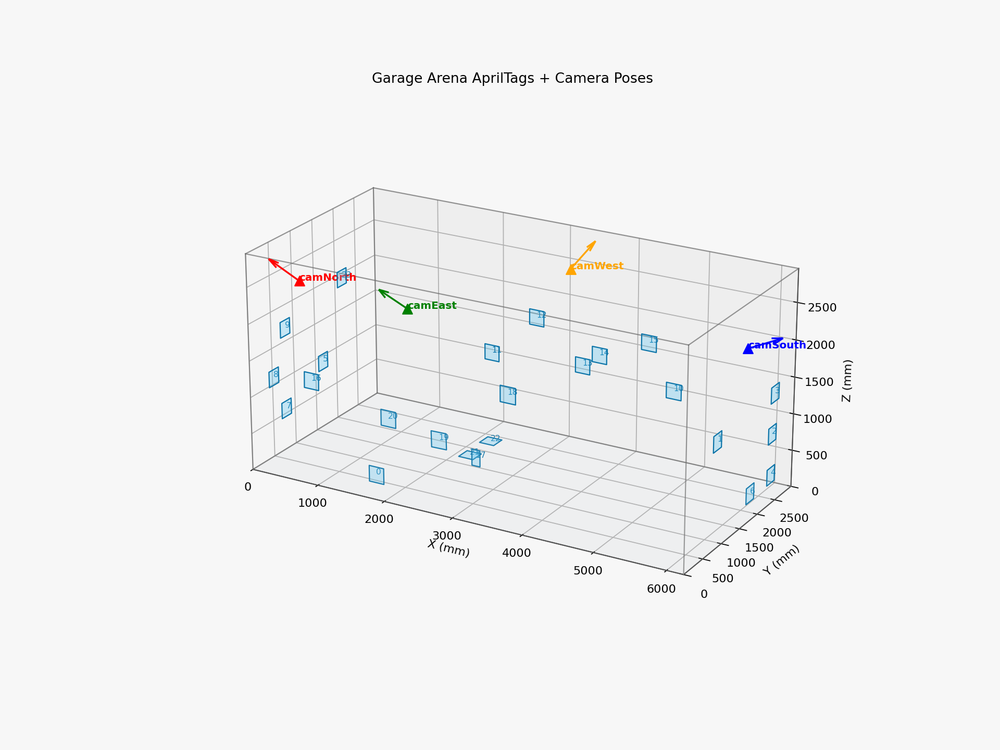

### Figure 3.2 - Arena 3D Reconstruction (Orbit View)
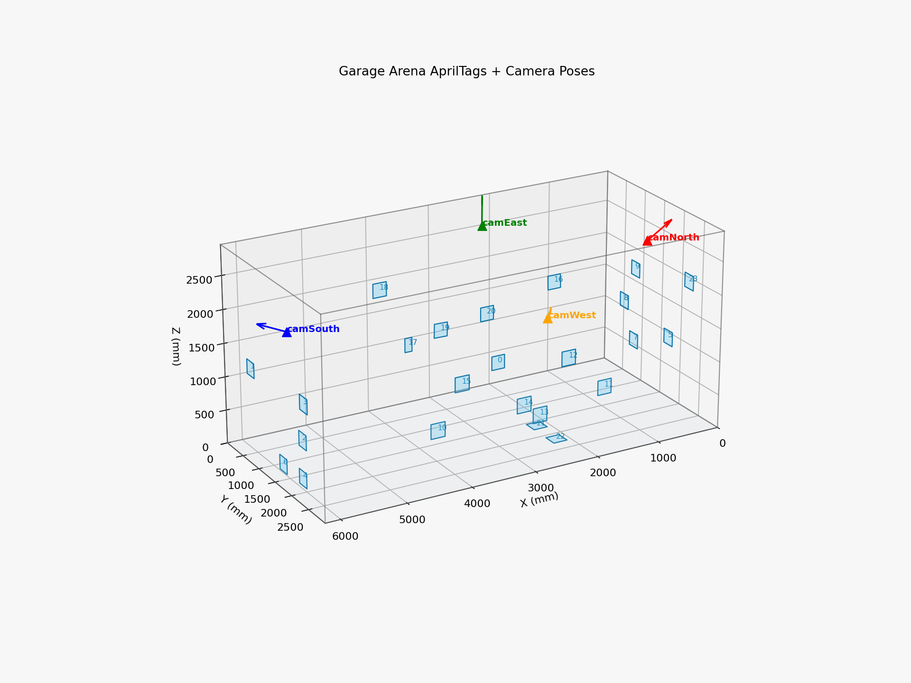

### Figure 3.3 - Arena 3D Reconstruction (Extended Orbit View)
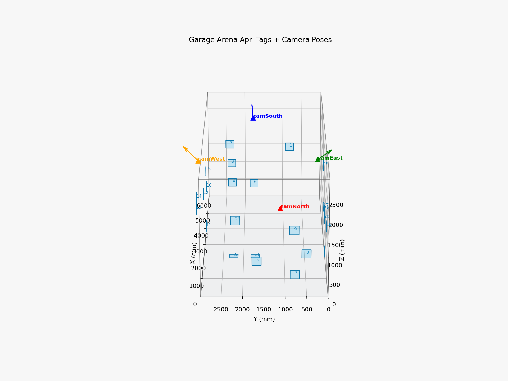

This cross-folder evolution is a contribution in itself. In many student projects, older scripts are abandoned and final results become hard to reproduce. Here, the lineage is preserved and can be audited: from first prototype to quantitative evaluation and thesis-grade documentation.

## 3.9 Lessons Learned from Legacy-to-Unified Transition
The transition from legacy scripts to unified workflow produced several engineering lessons:

1. **Naming conventions matter.**  
   Early scripts used generic camera names (`Cam1`, `Cam2`) while the unified system uses physical-role names (`camNorth`, `camEast`, `camSouth`, `camWest`). This reduced class of mistakes where processing used correct files with wrong physical semantics.

2. **Sessionized outputs are mandatory.**  
   Moving from ad-hoc output filenames to timestamped session folders made experiment repeatability and report traceability significantly better.

3. **Visual diagnostics should be first-class outputs.**  
   Overlay and 3D render diagnostics were not decorative; they detected calibration failure earlier than scalar metrics alone.

4. **Partial recalibration is operationally valuable.**  
   In realistic operation, one camera may move while others remain stable. Being able to recalibrate and merge one camera's extrinsics reduced downtime.

## 3.10 Data Governance and Reproducibility Practices
Repository maturity improved when the team adopted data governance habits:
- preserve raw clips before trimming/alignment,
- keep processing outputs immutable per session,
- store trial CSV and metadata near result files,
- never overwrite reference calibration files without versioning,
- generate summary reports as machine-readable JSON and human-readable markdown.

This thesis benefits directly from these practices because every major claim can be traced to a concrete file.

## 3.11 How Historical Folders Continue to Add Value
Although `garage_lab_combined` is the active integration folder, historical folders remain useful:
- `src/*` preserves algorithmic prototypes and alternative renderers,
- `garage-20260217...` preserves independent calibration/reporting approaches,
- `GARAGE_CAMERAS` keeps robust standalone capture tools.

Maintaining these layers avoids knowledge loss and supports troubleshooting when regressions appear in the main pipeline.

## 3.12 Detailed Chronology of Technical Milestones
The following chronology clarifies how engineering decisions were driven by observed failure modes rather than by theoretical preference:

- **Initial semester phase:** early stereo and 3D rendering scripts demonstrated that reconstructed trajectories were possible from low-cost cameras, but produced unstable scale and orientation between sessions.
- **Lab phase:** more controlled calibration and multi-camera processing produced convincing demonstration outputs (`final_3d_robot.mp4`), but assumptions from that environment did not transfer directly to the garage.
- **Garage migration phase:** adoption of arena tags and room dimensions enabled physical-world interpretation, revealing hidden inconsistencies that were previously masked in lab-only visualizations.
- **Calibration hardening phase:** repeated intrinsics and extrinsics recalibration, plus overlay-based diagnostics, improved geometric reliability.
- **Protocol phase:** formal GT campaigns replaced impression-based evaluation and identified exact bias structure in ball and joint estimates.

This chronology is important because it shows methodological maturity: from prototype confidence to evidence-driven iteration.

## 3.13 Data Artifacts and Their Role in Scientific Argumentation
For each claim in this thesis, supporting artifacts exist:
- **Calibration quality claims:** intrinsics JSON, extrinsics JSON, overlay image sets.
- **Tracking claims:** per-session motion JSON files and rendered videos.
- **Accuracy claims:** summary metrics and per-trial CSV reports from GT scripts.
- **Robustness claims:** dynamic metrics from slow/fast/no-ball scenarios.

The artifact-oriented workflow allowed rapid dispute resolution when contradictory observations appeared. For example, when a render looked physically implausible, it was possible to inspect camera maps, overlays, and reprojection metrics to isolate root cause.

## 3.14 Integrating Human Workflow into Technical Design
A recurring practical issue was operator distance from workstation during capture. This influenced script evolution toward:
- automatic triggers based on corner quality,
- settle delays before recording,
- compact keyboard controls and status overlays,
- deterministic output naming.

This is not trivial UI work; it directly affects data quality and therefore scientific validity. In research systems involving physical spaces, user workflow is a technical dependency.

## 3.15 Repository Sustainability for Future Students
The project now has a structure that future researchers can extend:
- clear folder responsibilities,
- documented session pipelines,
- reproducible report generators,
- thesis-linked artifact paths.

This sustainability is a meaningful contribution in academic engineering labs where toolchains often become unusable after one cohort.

---

# Chapter 4 - System Architecture and Mathematical Methodology

## 4.1 High-Level Architecture
The system architecture has four pipelines:
1. Calibration pipeline (intrinsics + extrinsics).
2. Acquisition pipeline (synchronized 4-camera capture).
3. Inference and triangulation pipeline (ball + joints).
4. Evaluation and visualization pipeline.

All pipelines operate in a shared world frame defined by `Dimensions.txt` and extrinsics JSON.

## 4.2 Camera Projection Model
For each camera, the projection model is:

\[ s\mathbf{u} = \mathbf{K}[\mathbf{R}|\mathbf{t}]\mathbf{X}_w \]

where:
- \(\mathbf{X}_w\) is a 3D world point,
- \(\mathbf{R}, \mathbf{t}\) are extrinsics,
- \(\mathbf{K}\) is intrinsics matrix,
- \(\mathbf{u}\) is image point.

Distortion is handled by OpenCV distortion coefficients and undistortion routines. In `process_4cam_to_3d.py`, points are undistorted before triangulation to operate in normalized coordinates.

## 4.3 Triangulation Formulation
Given normalized observations \((x_i, y_i)\) and projection matrix \(P_i\), DLT constructs a linear system:

\[
A\mathbf{X}=0,
\]

with two equations per camera:
\[
x_iP_{i,3} - P_{i,1}=0,
\]
\[
y_iP_{i,3} - P_{i,2}=0.
\]

The solution is obtained by SVD, using the right singular vector corresponding to the smallest singular value, then homogeneous normalization.

## 4.4 Robust Reprojection-Based Rejection
Naive triangulation from all cameras is vulnerable to one bad observation. The robust logic in this thesis triangulates then reprojects to each camera and computes pixel error. If worst error exceeds threshold, that camera is dropped and triangulation repeats until error is acceptable or minimum camera count is violated.

This iterative rejection is central for practical robustness, especially during dynamic ball tests.

## 4.5 Temporal Filtering for Ball Trajectory
Optional post-triangulation filters include:
- speed gate: reject physically implausible jumps,
- EMA smoothing: reduce jitter while preserving trajectory trend.

These filters are tuned conservatively to avoid over-smoothing true dynamics. The thesis explicitly compares raw and filtered behavior to prevent hidden bias.

## 4.6 2D Pose to 3D Joint Triangulation
For each frame and each camera:
1. run person detection + keypoint model,
2. select target person with identity-consistency heuristic,
3. for each joint, gather confident 2D observations from multiple cameras,
4. triangulate joint 3D with minimum-camera requirement.

Per-joint triangulation ensures one bad keypoint does not invalidate all joints.

## 4.7 Coordinate Frame Definition
The arena frame is expressed in millimeters with origin at north-east floor corner. Wall definitions and AprilTag corner coordinates are listed in `garage_lab_combined/cal/extrinsics/Dimensions.txt`. Camera positions measured in the same frame provide physically interpretable outputs.

Consistency in units is critical. Earlier mixed-unit drafts (cm/mm) were removed and unified to mm across GT, processing outputs, and reporting.

## 4.8 Calibration Methodology
### 4.8.1 Intrinsics
Intrinsics are solved per camera using ChArUco images captured at runtime resolution (1280x720). Frames with low corner quality are excluded via minimum-corner thresholds.

### 4.8.2 Extrinsics
Extrinsics are estimated with AprilTag detections against known tag corner coordinates. Robust options include:
- point error filtering,
- sigma-based outlier rejection,
- minimum points threshold,
- camera-specific include-tags map.

When one camera physically moves, partial recalibration is performed for that camera and merged into final extrinsics.

## 4.9 Synchronization Strategy
The pipeline supports both software-based offset estimation and manual flash-based alignment. In deployment, manual flash alignment was preferred for interpretability. Aligned clips are trimmed to common start and length before 3D processing.

## 4.10 Measurement Model for GT Evaluation
For each trial:
- estimated point \(\hat{p}\) is compared to ground truth \(p\),
- error vector \(e=\hat{p}-p\),
- norm \(|e|=\sqrt{e_x^2+e_y^2+e_z^2}\).

Aggregate metrics include mean, median, RMSE, P90/P95, max, axis-wise bias, and static precision (window standard deviation).

## 4.11 Correction Model
Axis-wise linear correction is modeled as:

\[
x_c = a_x x + b_x,
\]
\[
y_c = a_y y + b_y,
\]
\[
z_c = a_z z + b_z.
\]

The model is fit on static GT data. It removes systematic bias but does not fix local nonlinear distortions caused by calibration errors or visibility limitations.

## 4.12 Design Rationale

### Table 4.2 Intrinsics Calibration Summary (Current Active Set)
| Camera | Reprojection Error (px) | Frames Used |
|---|---:|---:|
| camNorth | 0.7279 | 77 |
| camEast | 0.3998 | 78 |
| camSouth | 0.4844 | 77 |
| camWest | 0.3570 | 80 |

### Table 4.3 Extrinsics Reprojection RMSE (Current Active Set)
| Camera | RMSE (px) |
|---|---:|
| camNorth | 1.4427 |
| camEast | 1.1776 |
| camSouth | 5.2332 |
| camWest | 2.2555 |

### Figure 4.1 - Calibration Overlay (camNorth)
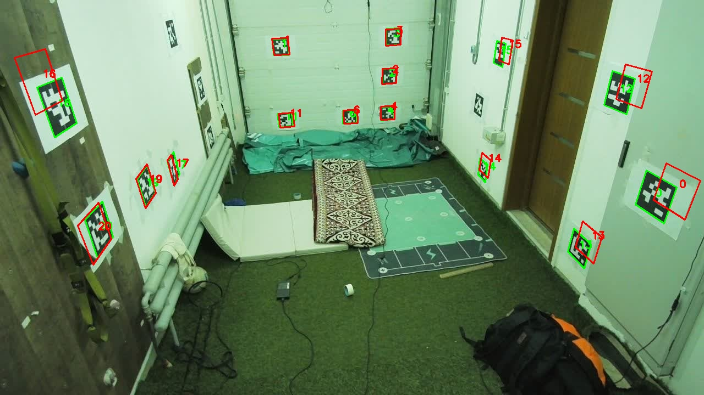

### Figure 4.2 - Calibration Overlay (camEast)
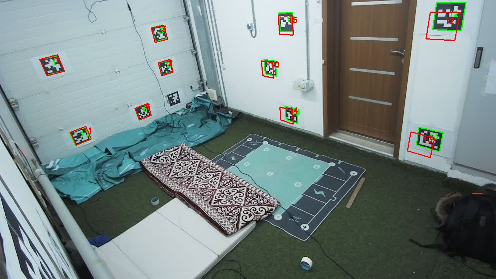

### Figure 4.3 - Calibration Overlay (camSouth)
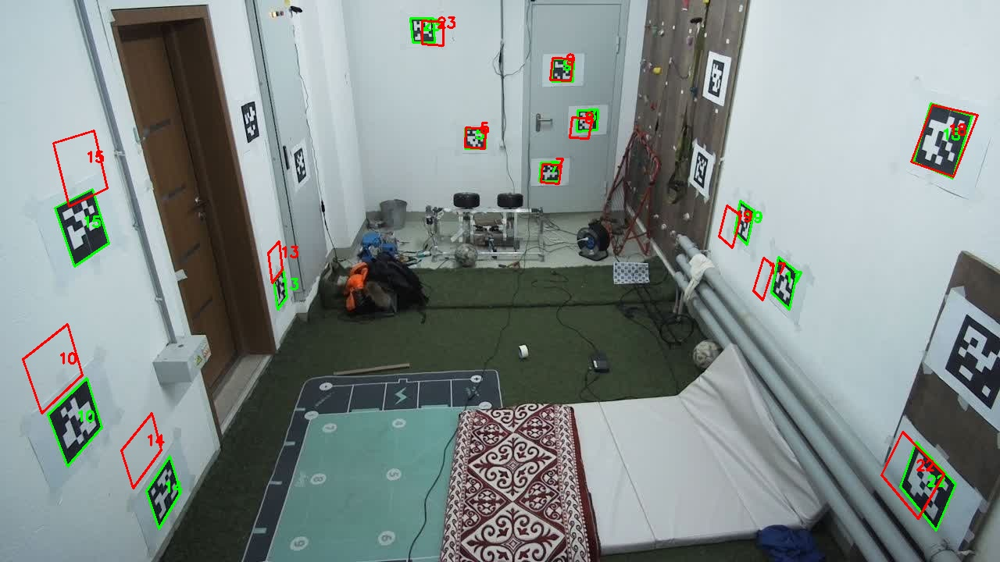

### Figure 4.4 - Calibration Overlay (camWest)
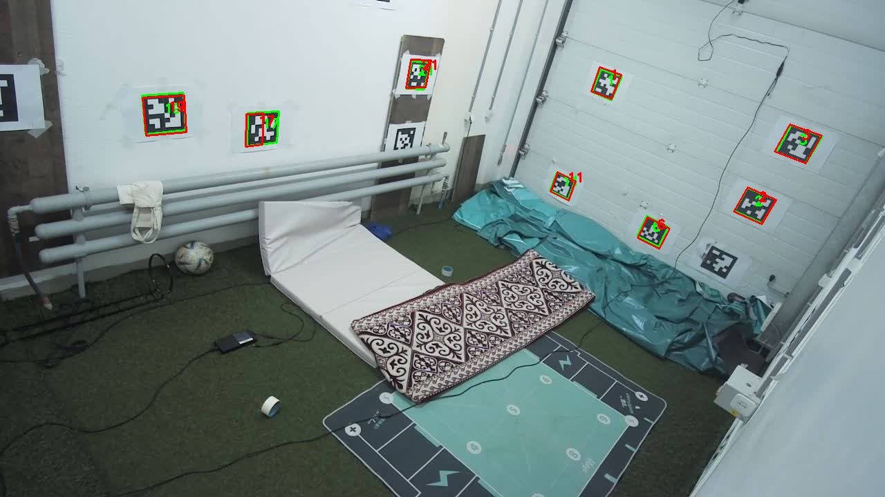

The architecture prioritizes:
- transparency over black-box fusion,
- metric consistency over visual-only quality,
- staged safety over aggressive automation.

This is aligned with the thesis goal: produce a defensible research foundation for later launcher control.

## 4.13 Sensitivity Analysis: Why Small Geometry Errors Cause Large Targeting Errors
A practical sensitivity observation from this project is that a visually small camera rotation can generate large target displacement in reconstructed space, especially near room edges and for points seen by only two cameras. This is consistent with triangulation geometry: when ray intersection angles are shallow, small angular errors amplify depth uncertainty.

For launcher-control relevance, this means calibration quality cannot be summarized only by average reprojection error. Spatially varying uncertainty must be considered. Points near weak-overlap regions may have significantly higher targeting risk than central points.

## 4.14 Observability and Camera Contribution
The system logs the number of cameras used per triangulated point. This statistic is essential because:
- 2-camera triangulation is geometrically valid but less robust,
- 3-4 camera support allows outlier rejection and better depth stability.

Therefore, observability itself is treated as a quality feature. Future controllers should incorporate this value into confidence gating.

## 4.15 Human Keypoint Semantics and Measurement Ambiguity
Unlike a rigid marker, human joints in 2D keypoint models represent anatomical landmarks estimated from appearance. Shoulder location may shift with clothing, arm rotation, and partial occlusion. Knee estimation changes with leg orientation and camera angle.

Hence joint-touch GT error includes two components:
1. geometric reconstruction error,
2. semantic labeling uncertainty of the joint in 2D model space.

This reinforces the recommendation to use rigid calibration targets for final controller calibration and treat human-joint metrics as performance on realistic but noisy semantic targets.

## 4.16 Why the Methodology Is Appropriate for Research-Based Assessment
The selected methodology aligns with MSc research criteria:
- clearly justified methods,
- explicit assumptions and constraints,
- objective test protocols,
- critical evaluation of results,
- clear separation between completed and pending system blocks.

This creates a defensible manuscript for a research university context and avoids overstatement.

## 4.17 Additional Mathematical Notes for Controller Interface
When the perception stack is connected to launcher control, the following uncertainties should be propagated:
- triangulation covariance as function of view geometry,
- temporal uncertainty from frame latency,
- calibration uncertainty from extrinsics drift.

A simple controller-ready uncertainty score can be computed from normalized components:
\[
U = w_1\cdot	ext{reproj\_norm} + w_2\cdot	ext{cams\_deficit} + w_3\cdot	ext{temporal\_instability},
\]
where lower values indicate safer actuation conditions. This score can be used to decide no-fire states.

## 4.18 Latency and Time Alignment Considerations
For live operation, synchronization is not only frame-index alignment. End-to-end latency includes:
- camera capture delay,
- decode delay,
- model inference time,
- triangulation and visualization time,
- command dispatch delay.

If total latency is high relative to target motion, aiming may use outdated coordinates. Therefore, future live systems should include timestamp-based synchronization and predictive extrapolation for moving targets.

## 4.19 Prediction for Moving Targets
For dynamic body-part targeting, point estimates can be enhanced with short-horizon prediction:
\[
\hat{p}(t+\Delta t)=p(t)+v(t)\Delta t,
\]
with velocity estimated from filtered finite differences. More advanced filters (e.g., Kalman) can improve noise handling, but must be tuned per joint behavior.

Prediction should be confidence-gated: if uncertainty is high, actuation should be suppressed.

## 4.20 Calibration Drift Monitoring Model
A lightweight drift monitor can run online by projecting stable tags and comparing expected vs observed corners. If median error exceeds threshold over a sustained window, system raises `calibration_stale` flag and blocks autonomous firing.

This approach converts calibration from offline task into monitored runtime health signal.

## 4.21 Model Selection Rationale Under Resource Constraints
The project selected practical detector and pose models that run on available hardware. While larger models may improve raw accuracy, deployment constraints (4-camera throughput and response needs) required balanced models. The selection criterion was end-to-end system utility, not isolated benchmark ranking.

This reflects real engineering constraints where operational reliability outranks single-module peak accuracy.

## 4.22 Uncertainty-Aware Triangulation Extensions (Future)
A future extension is weighted triangulation where each view contributes according to a confidence-derived variance estimate. In matrix form, this can be expressed as minimizing weighted reprojection residuals. Combined with robust loss functions, this can reduce sensitivity to outlier observations while preserving deterministic behavior.

## 4.23 Spatial Calibration Residual Mapping
Instead of one global correction model, residuals can be mapped in 3D using radial basis functions or low-order polynomial surfaces. This allows location-dependent corrections where corner regions systematically deviate more than central regions.

Such nonlinear correction should only be applied after geometric calibration is stable; otherwise model drift can become hard to interpret.

## 4.24 Time-Series Stability Metrics for Live Readiness
For live operation, point-wise error is insufficient. Additional stability metrics are needed:
- frame-to-frame acceleration outliers,
- confidence drop frequency,
- temporary track loss duration,
- recovery latency after occlusion.

These metrics can be monitored online and used to trigger safe mode.

## 4.25 Bridging Perception and Control Timescales
Perception may run at 10-15 FPS while launcher control loops can run faster. A bridging strategy is needed:
- hold-last-valid-target with timeout,
- short-term prediction with uncertainty expansion,
- no-fire when target freshness exceeds threshold.

This prevents stale-target actuation.

## 4.26 Mathematical Summary
The mathematical backbone of this thesis combines:
- calibrated projection,
- robust multi-view triangulation,
- quality gating via reprojection/camera count,
- optional temporal filtering,
- and post-hoc bias correction.

This stack is intentionally modular and interpretable, supporting both scientific analysis and future control integration.

---

# Chapter 5 - Implementation Details and Engineering Decisions

## 5.1 Runtime Environment
- OS: Ubuntu 22.04
- Python: 3.10 (`venv`)
- Main libraries: OpenCV, NumPy, Ultralytics, MMPose/MMEngine
- Camera hardware: Hikvision DS-E12 USB cameras
- Runtime resolution and frame rate: 1280x720 at 15 FPS target

## 5.2 Configuration Layer
Two camera configs co-exist in repository:
- `config/cameras.yaml` (older generic mapping),
- `garage_lab_combined/config/cameras.yaml` (role-based mapping with by-path links).

Role-based mapping (`camNorth`, `camEast`, `camSouth`, `camWest`) is necessary because control and extrinsics logic depend on physical orientation, not on changing `/dev/video*` indices.

## 5.3 Intrinsics Capture Automation
`auto_capture_charuco_multi.py` was improved to auto-save frames when sufficient corners are detected, replacing fixed delay logic. This addressed practical constraints where the operator was physically far from the workstation.

A preview window and corner-threshold trigger improved data quality and reduced unusable captures.

## 5.4 Intrinsics Solving
`calibrate_intrinsics_from_images.py` handles per-camera image sets and outputs JSON files with:
- camera matrix,
- distortion coefficients,
- reprojection error,
- frames used.

Practical lesson: an A4 full-page ChArUco board with accurate printed dimensions and high contrast improved corner distribution quality over earlier board setups.

## 5.5 Extrinsics Solving and Iterative Hardening
`calibrate_extrinsics_apriltag_robust.py` supports robust fitting and camera-specific tag maps. This was essential when cameras were moved and visibility changed.

Engineering decisions that improved results:
- re-measuring camera coordinates in world frame,
- correcting swapped east/west camera positions in `Dimensions.txt`,
- updating moved AprilTag coordinates (e.g., IDs 13, 14, 18, 21, 22),
- using two-stage optimization (strict tags first, expanded tags second).

## 5.6 Overlay Validation
`validate_extrinsics_overlay.py` provides red/green projection diagnostics:
- green: detected tag corners,
- red: expected projected corners from calibration model.

Overlay checks prevented silent geometric failures and guided targeted correction of tags/camera poses.

## 5.7 Capture and Session Management
`record_short_clips_multi.py` supports short synchronized clips with keyboard controls. For joint tests, `auto_record_joint_trials.py` was adapted to include operator settle time after pressing `r`, making single-operator experiments feasible.

Session folder conventions (`clips`, `results`, `reports`, `visualizations`) simplified reproducibility and report generation.

## 5.8 3D Processing Pipeline Decisions
`process_4cam_to_3d.py` options used in final experiments:
- `--ball-min-cams 2` (practical minimum under visibility constraints),
- reprojection threshold gating,
- optional EMA and speed gates,
- `--pose-min-cams 3` for stricter joint reliability in main smoke runs.

This parameterization reflects a tradeoff: stricter rules improve quality but reduce frame coverage.

## 5.9 Rendering and Presentation
`render_arena_ball_skeleton.py` was tuned for stakeholder-friendly visuals:
- arena wireframe and camera arrows,
- black skeleton lines for contrast,
- ball trajectory with visible markers,
- optional no-smoothing render for diagnostic honesty.

Additional scripts (`render_multiviews.py`, live view) supported top/side perspective analysis.

## 5.10 CPU/GPU Split Discussion
The current pipeline can run CPU-only but with limited real-time throughput. A practical split strategy is:
- GPU: ball detector + pose model inference,
- CPU: decode, synchronization logic, triangulation, rendering control.

This separation reduces contention and is suitable for future live deployment goals.

## 5.11 Failure Modes and Mitigations
Observed failure modes:
- camera index remapping after reconnects,
- one-camera movement causing global 3D drift,
- multiple-person identity switching,
- ball outliers during fast motion,
- low overlap causing 2-camera-only triangulation.

Mitigations applied:
- by-path camera mapping,
- partial camera recalibration and merge,
- single-subject protocol enforcement,
- reprojection/speed gates,
- redesigned GT point placement for >=3-camera visibility where possible.

## 5.12 Why This Implementation Is Research-Ready

### Figure 5.1 - Smoke Session Render (frame 80)
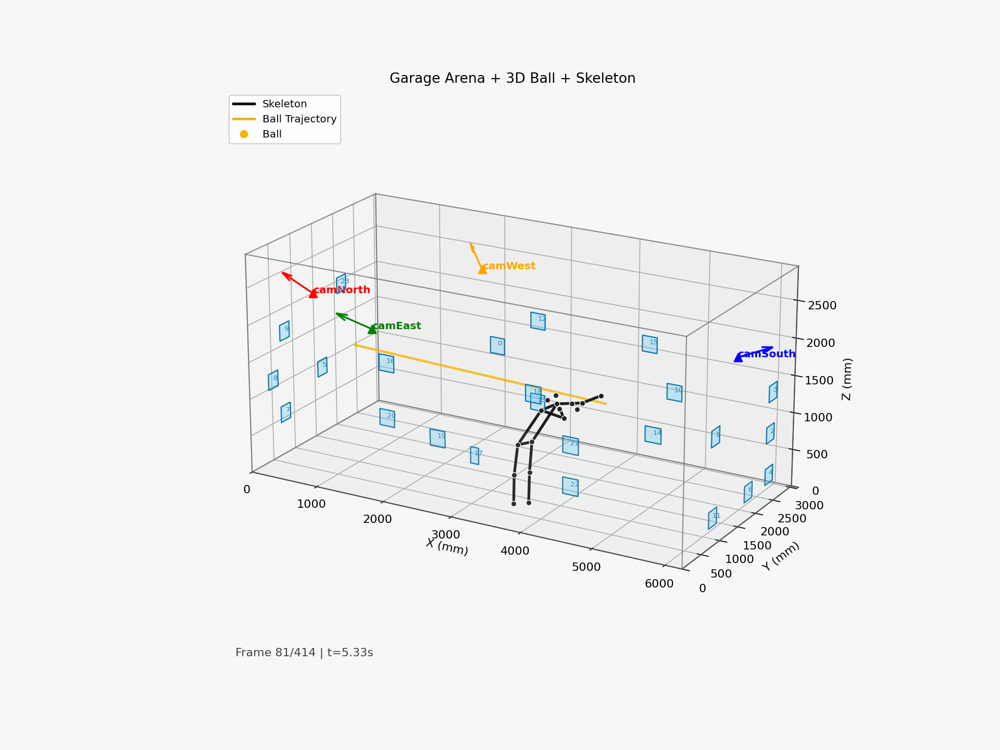

### Figure 5.2 - Smoke Session Render (frame 200)
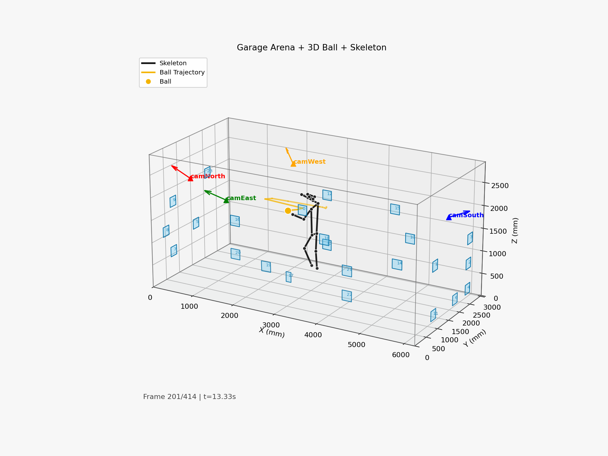

### Figure 5.3 - Smoke Session Render (frame 320)
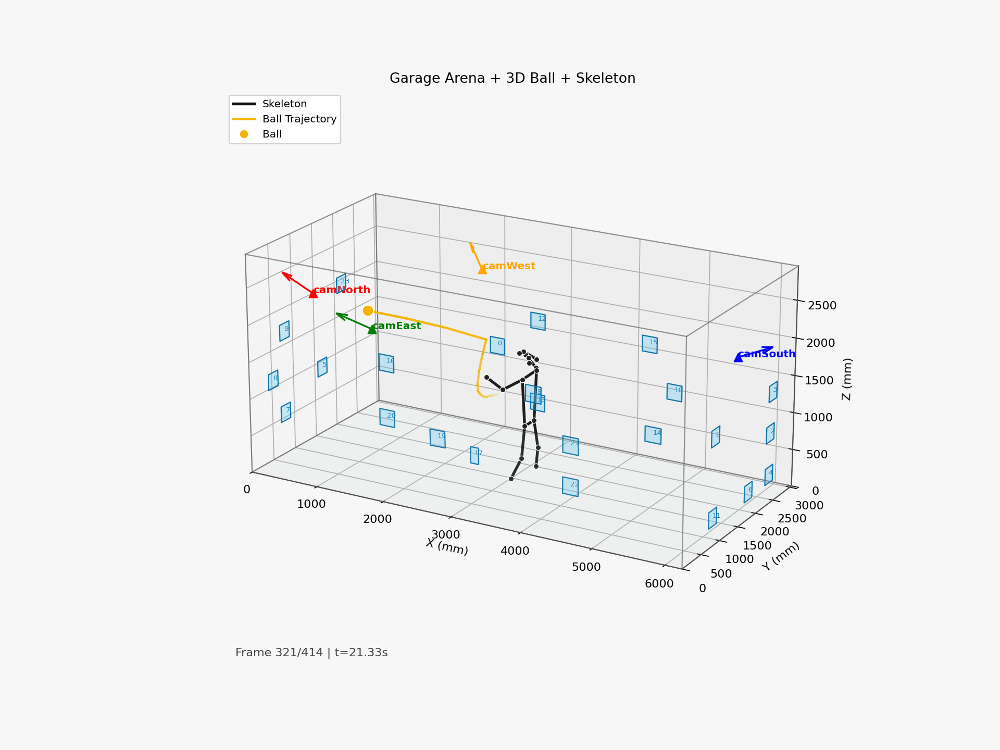

The implementation is not only script-complete; it is protocolized. Every critical phase has:
- data artifacts,
- configuration snapshots,
- metrics outputs,
- visual diagnostics.

This traceability enables scientific defense and iterative improvement.

## 5.13 Multi-Session Calibration Management
A major practical difficulty was the accumulation of many calibration files across dates and variants. To prevent accidental use of outdated calibration, the workflow now follows:
1. create dated calibration IDs,
2. run overlay validation snapshots,
3. pin an explicit `extrinsics_final_<timestamp>.json` for each evaluation session,
4. record this file path in experiment logs.

This discipline reduced silent failure cases where processing succeeded but used inconsistent geometry.

## 5.14 Camera Movement Incident Handling
The project experienced multiple real incidents where one or more cameras moved. The adopted response procedure:
- identify moved camera(s),
- capture short recalibration clip,
- extract stills,
- rerun robust extrinsics for affected camera(s),
- merge updated camera entries with stable entries,
- validate with overlays,
- rerun smoke processing before any GT campaign.

This procedure is now part of operational knowledge and should be retained in final project documentation.

## 5.15 Runtime Performance and Throughput Strategy
At 1280x720 and 4 cameras, the practical throughput depends on inference backend and scene complexity. For future live usage:
- decouple capture and inference queues,
- keep deterministic frame indexing,
- prioritize inference on GPU,
- run triangulation and logging on CPU,
- use adaptive frame skipping only when confidence remains stable.

The objective is not maximum FPS but stable, interpretable, and safe timing behavior.

## 5.16 Visualization as a Debug Instrument
Several major issues were discovered through visualization first:
- skeleton appearing outside plausible room area,
- ball vanishing due to over-strict filtering,
- coordinate squeezes when wrong extrinsics were used,
- person entry confusion when another person stayed in scene.

Therefore, visual outputs are integrated into validation pipeline, not only into presentation pipeline.

## 5.17 Engineering Trade-Off Summary
Key trade-offs made in implementation:
- strict thresholds improve reliability but reduce detection coverage,
- smoothing reduces jitter but can hide dynamics,
- partial recalibration is faster but may preserve old global inconsistencies,
- high resolution improves detail but reduces real-time throughput.

These trade-offs are documented explicitly so future development can adjust based on application priority (accuracy, latency, safety, or ease of operation).

## 5.18 Detailed Command-Line Pipeline for Reproducibility
A complete session generally follows this order:
1. record synchronized clips,
2. run calibration updates if needed,
3. validate overlays,
4. process 4-camera clips to 3D JSON,
5. render arena outputs,
6. run GT evaluation scripts,
7. review summary metrics and diagnostics.

Each stage writes durable outputs. No stage depends on hidden in-memory state, which improves reproducibility.

## 5.19 File Versioning and Non-Overwrite Policy
The workflow intentionally avoids silent overwrite of major artifacts by:
- timestamped output paths,
- suffixes like `_raw`, `_fixed`, `_corrected`,
- per-session roots with subfolders.

This design made comparative analysis feasible (e.g., old vs new extrinsics) and protected against accidental data loss.

## 5.20 Engineering of Manual Flash Synchronization Workflow
Manual synchronization with flashlight was retained because it is transparent and operator-verifiable. Automated offset estimates were available but less trusted under varying lighting and frame truncation artifacts. The final process used manual frame identification and explicit clip trimming for deterministic alignment.

## 5.21 Integration with Legacy Renderers
Legacy renderers in `src/core` were preserved to cross-check the new renderer's behavior. If one renderer showed implausible behavior while another did not, this indicated differences in coordinate assumptions or smoothing logic. Cross-render consistency checks improved confidence in final outputs.

## 5.22 Practical Hardware Notes
Observed practical notes relevant for replication:
- USB port topology affects camera enumeration stability.
- Identical camera names in Linux require by-path or by-id mapping.
- Mechanical mounting with tape is insufficient for long-term calibration stability.
- Uneven wall surfaces can distort tag planarity assumptions.

These details strongly influence geometric quality and should be documented as part of method, not as anecdotal notes.

## 5.23 Calibration Session Documentation Template
Each calibration session should record:
- date/time and operator,
- active camera mapping,
- board/tag assets used,
- command lines executed,
- produced calibration files,
- overlay validation verdict,
- notes on anomalies.

This template enables rapid rollback and forensics when a later session behaves unexpectedly.

## 5.24 Handling Corrupted or Truncated Video Files
During long recordings, occasional container warnings (e.g., premature end in MKV) were observed. Mitigation strategies:
- prefer robust codecs/containers for intermediate work,
- validate frame counts immediately after recording,
- keep raw and aligned versions separate,
- avoid deleting source clips until processing passes sanity checks.

## 5.25 Smoothing Policy for Scientific Reporting
A key reporting principle in this project: always preserve a raw-processing output and report it explicitly. Smoothed outputs may be used for visualization and operator interpretability, but should not replace raw metrics in scientific claims.

This policy prevents accidental inflation of perceived system quality.

## 5.26 Camera Placement Engineering
Camera placement should maximize:
- overlap in central operational volume,
- diversity of view angles for depth conditioning,
- visibility of key calibration tags.

The project learned that rotating side cameras too far toward one wall reduces overlap for certain regions and increases triangulation instability.

## 5.27 Tag Maintenance as a Technical Task
Marker maintenance was operationally significant. Dirty or damaged tags reduced detection quality and increased reprojection residuals. Routine maintenance should include:
- cleaning marker surfaces,
- replacing warped paper,
- checking tape adhesion and planarity,
- updating coordinates after any physical relocation.

## 5.28 Continuous Integration Possibility for Scripts
Although not yet implemented, scripts can be CI-checked for:
- command-line argument integrity,
- JSON schema consistency,
- report generation consistency on sample clips.

This would further improve long-term maintainability.

## 5.29 Why Some Legacy Files Were Retained Unmodified
Certain legacy files were retained as historical references instead of being refactored into the new pipeline. This was a deliberate decision to preserve provenance and avoid introducing regressions in already validated scripts.

## 5.30 Chapter Summary
Implementation maturity was achieved through repeated practical corrections: better camera mapping, stronger calibration discipline, deterministic session structure, and protocolized reporting. These engineering choices are central to the final performance.

---

# Chapter 6 - Experimental Protocols and Ground-Truth Methodology

## 6.1 Experimental Design Philosophy
This chapter defines how measurement integrity was maintained. The key principle is separation of concerns:
- static tests for geometric accuracy and bias,
- dynamic tests for temporal behavior,
- no-ball tests for false-positive robustness,
- joint-touch tests for human keypoint localization.

## 6.2 World-Frame Fixation and Units
All experiments use millimeters in a fixed world frame. Before each session:
1. confirm camera mapping,
2. confirm active extrinsics file,
3. confirm arena dimensions and tag coordinates,
4. confirm no unit conversions are required in trial CSV.

This avoids hidden scaling and axis convention errors.

## 6.3 Ball Static GT Protocol (36 Points)
### 6.3.1 Point Layout
The static matrix uses:
- X = 3000, 4000, 5000 mm
- Y = 2300, 1600, 1000 mm
- Z = 200, 750, 1300, 1800 mm

Total: 36 points.

### 6.3.2 Capture Procedure
For each trial ID:
1. place ball center at known coordinate using physical holder,
2. press `r` in recorder preview,
3. hold position for 2-4 s,
4. save clip under matching trial folder.

### 6.3.3 Processing and Reporting
Each trial clip is processed into 3D JSON and rendered for visual QA. Statistical reports aggregate per-trial results and produce summary metrics plus correction model.

## 6.4 Dynamic Ball Protocol
### 6.4.1 `ball_slow`
20 s gentle movement. Target is smooth trajectory with high detection coverage.

### 6.4.2 `ball_fast`
20 s realistic throws. Target is stress testing under blur/occlusion and speed.

### 6.4.3 `no_ball`
15 s background-only clip. Target is false-positive suppression verification.

This three-clip design is simple yet highly informative for practical system readiness.

## 6.5 Joint-Touch Protocol (81 Planned)
### 6.5.1 Motivation
Joint GT is harder than ball GT because the body part itself is not a rigid marker and human posture introduces uncertainty.

### 6.5.2 Design
81 planned trials across multiple XY points and elevation platforms. Joints tested: `left_shoulder`, `right_hip`, `right_knee`. The objective is to measure localization behavior in central operational volume.

### 6.5.3 Execution Reality
62 trials were valid, 19 missing/failed (time and protocol constraints). This is acceptable for exploratory evaluation but should be completed in future campaigns.

## 6.6 Rigid Target Protocol Importance
A rigid-point protocol is included to decouple system geometry from human placement variability. This protocol is critical before launcher actuation, since controller calibration requires trustworthy measurement of geometric error floor.

## 6.7 Trial Metadata and Naming
Session data uses deterministic naming:
- session root with timestamp,
- per-trial clip folder (`B001`, `J021`, etc.),
- result JSON per trial,
- report outputs (`summary_metrics.json`, `error_report.md`, correction model).

This structure reduces audit friction and supports reproducibility.

## 6.8 Statistical Metrics
Primary metrics:
- mean/median/RMSE/P90/P95/max norm error,
- axis bias (`ex`, `ey`, `ez` means),
- static precision (`std_norm`),
- detection ratio and camera participation,
- mean reprojection error.

These were selected because they map directly to control relevance: absolute targeting error, direction-specific bias, temporal consistency, and confidence quality.

## 6.9 Validity Threats and Mitigation
Threats:
- imperfect manual placement,
- incomplete camera overlap,
- camera movement between sessions,
- residual synchronization offset,
- environmental lighting variation.

Mitigations:
- structured session checklist,
- by-path camera assignment,
- overlay validation after recalibration,
- no-ball clips for detector sanity,
- separate static and dynamic reporting.

## 6.10 Protocol Readiness Assessment
The protocol suite is sufficient to make evidence-based decisions:
- whether to recalibrate,
- whether correction model helps,
- whether dynamic behavior is acceptable,
- whether launcher integration can proceed to next risk level.

## 6.11 Protocol Execution Checklist Used in Practice
Before each capture session, the following checklist was used:
1. verify camera role mapping in config,
2. verify active intrinsics/extrinsics files,
3. verify arena `Dimensions.txt` consistency,
4. run quick preview to check exposure/focus,
5. clear scene of extra people for pose trials,
6. prepare trial CSV and session folders,
7. run one pilot clip and process quickly for sanity.

This checklist reduced failed sessions and is recommended as standard operating procedure.

## 6.12 Why 2-3 Second Holds Were Preferred
For static GT trials, hold windows around 2-3 s provided enough frames to estimate stable center while limiting operator fatigue and posture drift. Longer holds did not improve precision significantly and increased trial execution time.

## 6.13 Handling Partial Trial Completion
In real sessions, full protocol completion may be difficult. The thesis explicitly handles partial completion by:
- marking missing trials in reports,
- keeping valid subset statistics,
- avoiding imputation of missing coordinates,
- separating "planned" vs "executed" trial counts.

This preserves transparency and statistical integrity.

## 6.14 Protocol Transferability
The protocol design is transferable to other indoor arenas with minimal modifications:
- redefine world frame and dimensions,
- remap camera roles,
- regenerate tag corner coordinates,
- reuse same capture/process/evaluation scripts.

Therefore, the contribution is not only a one-room setup but a reusable methodology.

## 6.15 Extended Static Protocol Design Rationale
The chosen 3x3x4 static ball grid balances coverage and execution effort. It samples central and off-center zones and multiple heights relevant for realistic passes/chests/head-level interactions. A denser grid was considered but would substantially increase session time and fatigue risk.

The grid is designed to identify:
- global bias trends by axis,
- corner/cross-volume degradation,
- height-dependent distortions.

## 6.16 Joint Protocol Human-Factors Constraints
Joint-touch protocols are constrained by human repeatability. Maintaining exact shoulder or knee contact to invisible 3D points is physically difficult, especially across many trials. The project partially addressed this by introducing platform heights and more central target points.

A stronger future protocol should include physical target markers and helper fixtures to reduce placement uncertainty.

## 6.17 Why Dynamic and No-Ball Tests Are Non-Negotiable
Static performance can be misleadingly optimistic. Dynamic tests reveal temporal instability and outlier behavior under realistic motion blur. No-ball tests ensure detector robustness against background patterns that can mimic ball texture.

Without these tests, a system may appear accurate in controlled points but fail operationally.

## 6.18 Reporting Standards Used
Each report includes both machine-readable and narrative forms:
- `summary_metrics.json` for scripts and dashboards,
- `error_report.md` for human interpretation,
- per-trial CSV for traceability.

This dual-format reporting supports both engineering iteration and thesis writing.

## 6.19 Session Health Metrics
Beyond final accuracy, session health was assessed via:
- percentage of valid trials,
- camera participation rates,
- proportion of clips requiring manual intervention,
- frequency of calibration refresh events.

These meta-metrics indicate operational maturity and should be tracked in future deployments.

## 6.20 Mapping Protocols to Thesis Grading Criteria
The protocol design directly supports manuscript assessment criteria:
- **Problem/objectives:** protocols test core claim of metric 3D readiness.
- **Methodology:** controlled static/dynamic/joint procedures with traceable scripts.
- **Testing and analysis:** quantitative metrics and correction modeling.
- **Conclusions/future work:** explicit readiness boundaries and next-stage gates.

This mapping ensures that experimental design is not only technically useful but also academically aligned with program expectations.

---

# Chapter 7 - Results, Error Analysis, and Correction Strategy

## 7.1 Calibration Quality Summary
Intrinsics quality is strong across all cameras under current A4 ChArUco workflow, with sub-pixel to low-pixel reprojection errors. Extrinsics quality is non-uniform but usable after robust tag-map tuning and partial recalibration.

Representative final extrinsics RMSE values:
- camNorth: 1.44 px
- camEast: 1.18 px
- camSouth: 5.23 px
- camWest: 2.26 px

The camSouth value reflects recent movement and remaining sensitivity.

## 7.2 Ball Static GT: Raw Performance
From `reports_static_raw/summary_metrics.json`:
- mean: 150.77 mm
- median: 156.55 mm
- RMSE: 167.39 mm
- P90: 236.38 mm
- P95: 288.34 mm
- max: 361.83 mm
- axis bias: ex +54.50 mm, ey +14.28 mm, ez -103.36 mm
- mean cameras used: 2.87
- mean reprojection: 6.01 px

Interpretation:
- raw estimates are precise within windows (std low) but biased globally,
- Z-axis underestimation is dominant,
- camera coverage below 3 in many points limits triangulation robustness.

## 7.3 Ball Static GT: Axis-Wise Correction
After linear axis correction:
- mean: 95.17 mm
- median: 84.18 mm
- RMSE: 102.23 mm
- P95: 166.51 mm
- max: 214.60 mm

Bias means become near zero by construction. Precision remains similar, showing correction mainly addresses systematic offset, not random jitter.

### Table 7.1 Ball static metrics (raw vs corrected)
| Metric | Raw | Corrected |
|---|---:|---:|
| Mean (mm) | 150.77 | 95.17 |
| Median (mm) | 156.55 | 84.18 |
| RMSE (mm) | 167.39 | 102.23 |
| P90 (mm) | 236.38 | 142.18 |
| P95 (mm) | 288.34 | 166.51 |
| Max (mm) | 361.83 | 214.60 |

## 7.4 Dynamic Ball Behavior
From dynamic summary:

### `ball_slow`
- detect ratio: 0.975
- mean reproj: 4.03 px
- jump P95: 58.16 mm
- max jump: 173.07 mm

### `ball_fast`
- detect ratio: 0.891
- mean reproj: 6.51 px
- jump P95: 462.70 mm
- max jump: 814.46 mm

### `no_ball`
- detect ratio: 0.0 (desired)

### Table 7.2 Dynamic metrics summary
| Clip | Detection ratio | Mean reproj (px) | P95 jump (mm) | Max jump (mm) |
|---|---:|---:|---:|---:|
| ball_slow | 0.975 | 4.03 | 58.16 | 173.07 |
| ball_fast | 0.891 | 6.51 | 462.70 | 814.46 |
| no_ball | 0.000 | - | - | - |

Interpretation:
- slow dynamics are acceptable,
- fast throws still produce outliers,
- false positives are strongly controlled.

## 7.5 Joint Localization Results
From `joint_tuning_20260310_124311/reports/summary_metrics.json`:
- valid trials: 62 / 81
- mean error: 143.38 mm
- median: 148.90 mm
- RMSE: 147.73 mm
- P95: 198.73 mm
- max: 217.34 mm
- axis bias: ex +50.68 mm, ey +46.57 mm, ez -106.98 mm

Per-joint means:
- left_shoulder: 164.38 mm
- right_hip: 150.38 mm
- right_knee: 110.03 mm

### Table 7.3 Joint-touch metrics
| Joint | Mean (mm) | RMSE (mm) | P95 (mm) |
|---|---:|---:|---:|
| left_shoulder | 164.38 | 165.60 | 199.54 |
| right_hip | 150.38 | 151.54 | 172.31 |
| right_knee | 110.03 | 118.68 | 170.75 |

Interpretation:
- shoulder is most difficult due to visibility and anatomical movement,
- knee is comparatively better,
- human placement uncertainty likely inflates measured error.

## 7.6 Error Budget Decomposition
Estimated contributors (qualitative ranking):
1. camera movement and extrinsics drift (high),
2. overlap and view geometry limitations (high),
3. fast-motion blur (medium-high),
4. person identity ambiguity (medium),
5. intrinsics residual error (low-medium),
6. manual GT placement uncertainty (medium, especially for joints).

This ranking justifies prioritizing geometry discipline and overlap redesign before advanced model tuning.

## 7.7 Why Skeleton Appears to "Lag" or "Jump"
Observed lag/jumps were mainly caused by:
- identity switching when a second person was visible,
- insufficient camera support for some joints in certain frames,
- sudden reprojection-consistent but semantically wrong triangulations under partial occlusion.

Mitigations used:
- target person selection with area/confidence and temporal proximity,
- `pose-min-cams` gating,
- scene protocol with one active subject.

## 7.8 Discussion: Is Correction Model Needed?
Correction model is useful only when:
- calibration is reasonably stable,
- residual error is predominantly systematic,
- and corrected model is applied within calibrated operating volume.

If camera positions change, correction learned from previous geometry may become invalid. Thus correction is a secondary layer after geometry stabilization.

## 7.9 Readiness Conclusion from Results

### Figure 7.1 - Ball Static Error Metrics: Raw vs Corrected
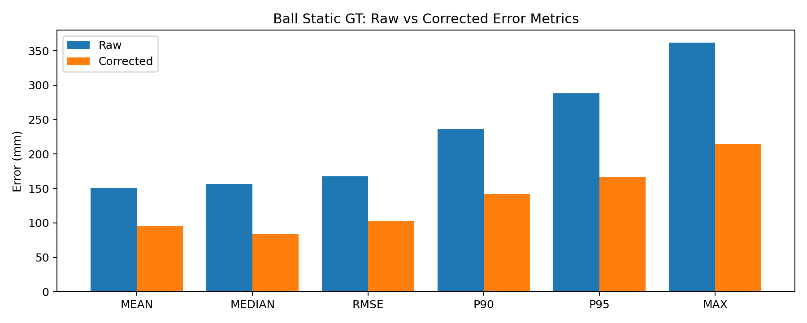

### Figure 7.2 - Ball Static Axis Bias (Raw)
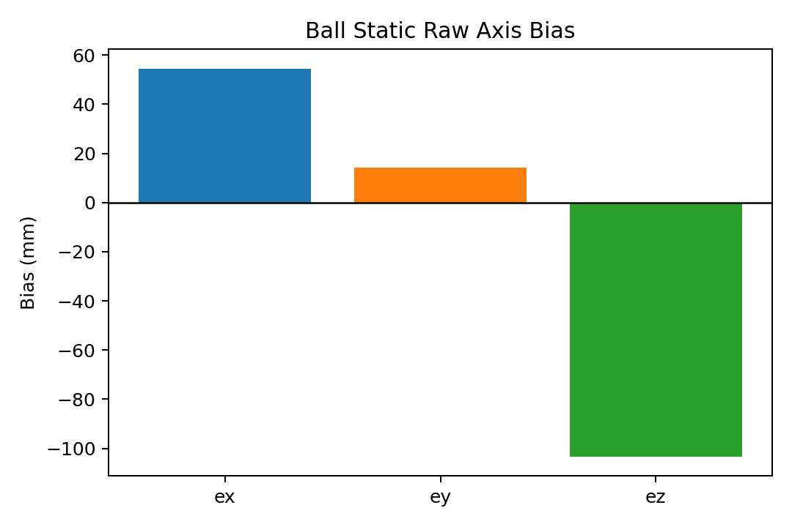

### Figure 7.3 - Ball Dynamic Summary
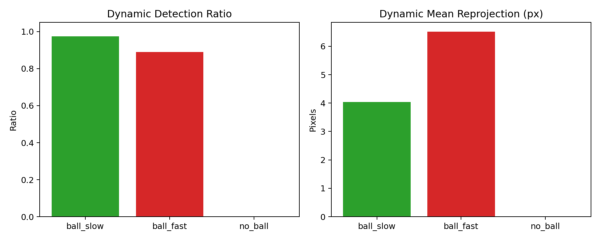

### Figure 7.4 - Intrinsics Reprojection by Camera
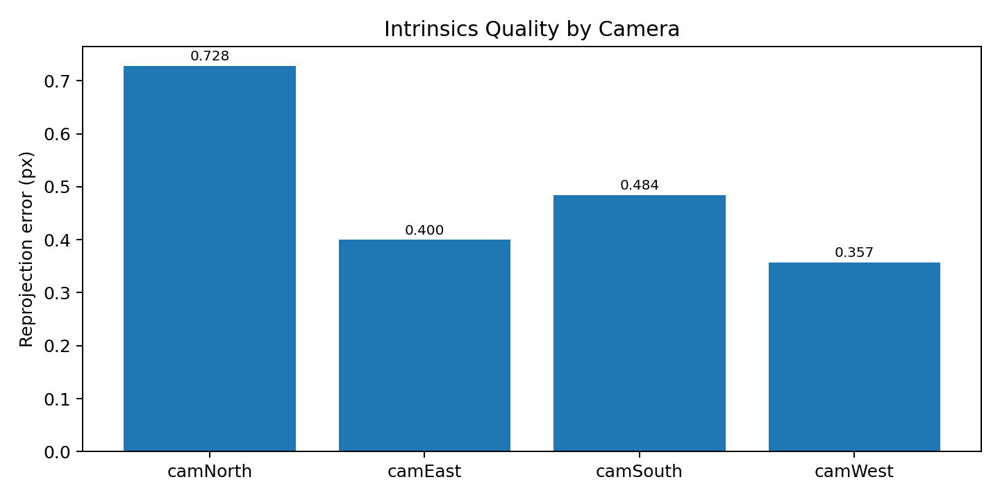

### Figure 7.5 - Extrinsics RMSE by Camera
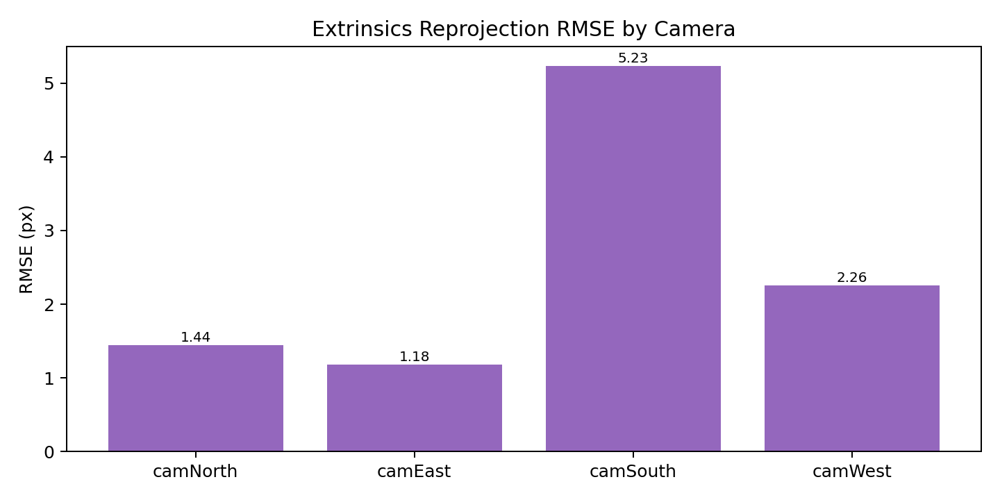

### Figure 7.6 - Joint 3D GT vs Estimated Points
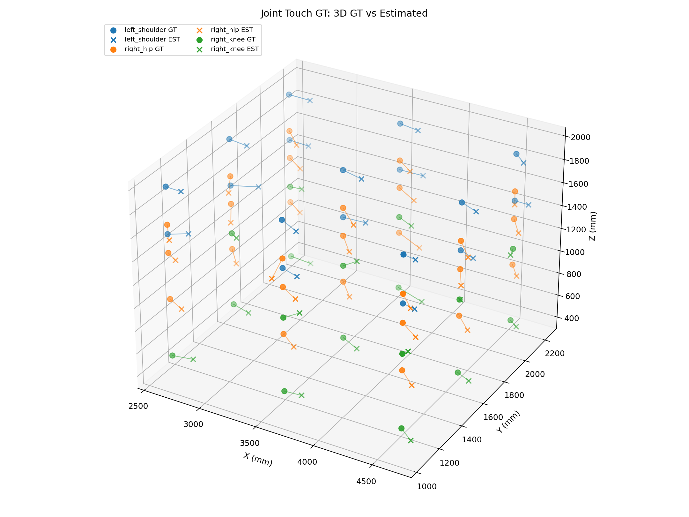

### Figure 7.7 - Joint Error Boxplot
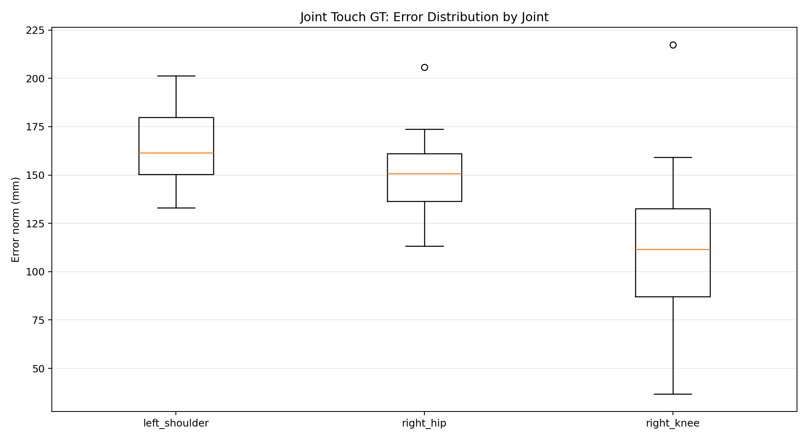

### Figure 7.8 - Joint Mean Error by Joint Type
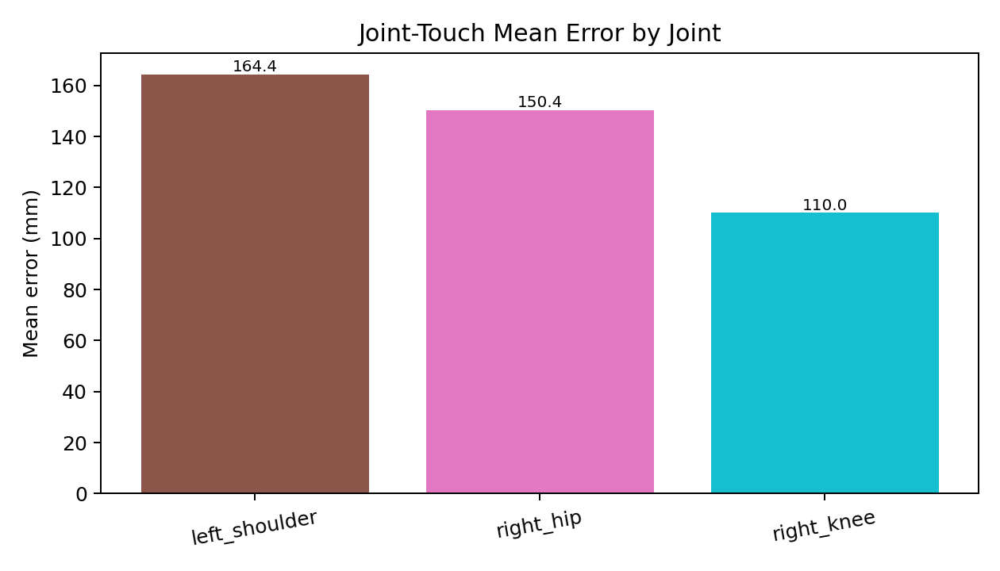

The perception stack is suitable for:
- visualization and analytics,
- target-zone event prototyping,
- supervised launcher integration experiments.

It is not yet sufficient for unsupervised autonomous actuation against strict centimeter-level body-part targets.

## 7.10 Interpretation for Stakeholders
From a stakeholder perspective, the key message is:
- the system is already useful for visual analytics and controlled targeting research,
- the system is not yet validated for unsupervised high-precision body-part launch commands.

This balanced interpretation protects project credibility and supports realistic planning.

## 7.11 What Improvements Give Highest Return
Based on measured data, highest-return improvements are:
1. increase average camera participation from ~2.87 toward >=3.3,
2. harden camSouth (or weakest camera) extrinsics and overlap,
3. maintain strict single-subject protocol during pose tracking,
4. use rigid calibration targets for final controller tuning.

Detector model changes are secondary until these geometric constraints are addressed.

## 7.12 Recommended Acceptance Gates Before Actuation
Suggested acceptance gates before any autonomous firing trial:
- static corrected mean <= 80 mm,
- static corrected P95 <= 130 mm,
- dynamic fast outlier max <= 500 mm,
- no-ball false positive ratio <= 0.5%,
- joint-touch median <= 120 mm in central operational zone.

These thresholds can be refined, but explicit gates are necessary for safe progression.

## 7.13 Evidence Strength and Remaining Uncertainty
Evidence strength is high for:
- pipeline reproducibility,
- static bias characterization,
- dynamic failure mode identification.

Remaining uncertainty is high for:
- full-volume joint accuracy under free movement,
- controller-level hit accuracy once launcher dynamics are integrated.

This uncertainty profile is acceptable for concluding perception-stage success and moving to HIL-stage research.

## 7.14 Comparative Interpretation: Ball vs Joint Error
Ball static estimates benefit from a clear visual target and rigid center concept. Joint estimates depend on semantic body landmarks and pose model interpretation. Therefore, it is expected that joint errors are larger and less uniform.

This comparison is useful when setting performance expectations for control logic: joint-targeted commands should carry stricter confidence and safety gating than zone-level commands.

## 7.15 Spatial Distribution of Errors
Although aggregate metrics are informative, spatial distribution matters. Errors were generally higher near weaker-overlap regions and for heights with reduced multi-camera support. This suggests future target-selection logic should consider "safe operational zones" where geometry is best conditioned.

## 7.16 Precision vs Accuracy Distinction in This Project
The project repeatedly observed low within-window jitter (precision) with nontrivial absolute bias (accuracy issue). This distinction is essential:
- precision indicates stable estimations,
- bias indicates frame alignment/calibration issues.

Correction models improved accuracy but do not change underlying precision characteristics.

## 7.17 Implications for Commanded Target Types
Given current error profile, target categories can be staged:
- **ready now:** larger zones (1x1 or 1x1.5 m planes), body-center approximations,
- **near-term:** lower-body targets with better current metrics,
- **later:** small body-part targets (e.g., shoulder points) requiring tighter error bounds.

This staged approach reduces risk while preserving project momentum.

## 7.18 Statistical Confidence and Reporting Transparency
All reported metrics are deterministic from stored trial data, and missing/failed trials are explicitly reported rather than excluded silently. This transparency is important for committee trust and for future replication.

## 7.19 Scenario-Based Interpretation for Training Use Cases
To connect metrics with training decisions, consider three scenarios:

1. **Large-zone passing drills (>=1 m targets):** current corrected ball errors are often acceptable, especially in central volume.
2. **Body-region targeting (torso/hip zones):** feasible with strict confidence gating and supervised operation.
3. **Small body-part targeting (e.g., shoulder point):** currently high risk without further geometry improvement.

This scenario framing helps stakeholders make informed deployment decisions.

## 7.20 Case Study: Camera Movement and Recovery
When camSouth moved, pipeline accuracy degraded. Partial recalibration and merge restored operational consistency without redoing full system setup. This case demonstrates practical maintainability of the chosen architecture and validates the partial-recalibration strategy.

## 7.21 Case Study: Two-Person Scene Instability
When a second person remained visible, skeleton identity instability increased. Enforcing single-subject protocol resolved major artifacts. This case emphasizes that protocol constraints are not optional for meaningful evaluation.

## 7.22 Case Study: Ball Visibility and Camera Count
Trials with only one or two camera views were significantly more unstable. Redesigning trial points toward higher overlap improved reliability. This reinforces observability-first design for future protocols and control logic.

## 7.23 Practical Performance Envelope
Given current results, practical envelope is:
- best performance in central region with >=3 camera support,
- reduced reliability near edge/corner zones,
- higher instability in high-speed throws and partial occlusions.

Controllers should incorporate this envelope and restrict autonomous behavior outside it.

## 7.24 Chapter Summary
Results confirm meaningful progress and clear remaining work. The key conclusion is that geometric and protocol discipline produce stronger gains than isolated detector tuning at this stage.

## 7.25 Multi-Metric Decision Policy for Next-Step Progression
A single metric cannot determine readiness. A practical policy should combine:
- corrected static mean and P95,
- dynamic outlier rate,
- no-ball false-positive rate,
- camera participation statistics,
- calibration health state.

Only if all indicators are within thresholds should stage transition be approved.

## 7.26 Why P95 Is More Informative Than Mean for Safety
Mean error can hide dangerous tails. P95 better reflects near-worst operational behavior without being dominated by one extreme outlier. For launcher safety, tail behavior is critical because one extreme miss can have severe consequences.

## 7.27 Handling Discrepancy Between Visual Plausibility and Metrics
There were cases where rendered trajectories looked acceptable but metric errors remained high. This discrepancy arises because visualization perspective can mask absolute displacement. Therefore, quantitative reporting must take precedence in technical decisions.

## 7.28 Error Reduction Prioritization Plan
Ordered plan for further error reduction:
1. lock hardware mounts and tag planarity,
2. maximize overlap and tag observability,
3. rerun full rigid-point GT,
4. recalibrate correction model only after steps 1-3,
5. tune dynamic filters for fast motion.

This sequence avoids premature algorithm tuning on unstable geometry.

## 7.29 Lessons for Thesis Defense
The strongest defense narrative is:
- clear problem framing,
- measurable protocol execution,
- transparent limitations,
- concrete next-step gates.

The current results satisfy this narrative and show rigorous research process.

---

# Chapter 8 - Toward Intelligent Launcher Control: Architecture, Ballistics, and Safety

## 8.1 Target System Vision
The end goal is a closed-loop training system that accepts semantic commands and executes safe, accurate shots. Example command path:

`"right shoulder" -> select target point -> compute launch solution -> fire -> verify hit/miss -> adapt next shot`

This requires tight coupling between perception and actuation.

## 8.2 Functional Blocks
### Block A: Command Interface
- voice/text parser,
- intent classification (body part vs zone target),
- command validation and confirmation.

### Block B: Target Semantic Resolver
- map command token to 3D target in world frame,
- estimate confidence of selected body joint,
- gate on minimum confidence and camera support.

### Block C: Launcher Frame Transform
- transform target from world frame to launcher frame,
- apply launcher pose calibration,
- include static offsets (barrel origin, release point).

### Block D: Ballistics Solver
Given target point \((x_t, y_t, z_t)\) in launcher frame and release constraints, solve for initial velocity magnitude \(v_0\) and azimuth/elevation angles \((\phi, \theta)\). For simplified projectile model (without spin and strong drag):

\[
x(t)=v_0\cos\theta\cos\phi \cdot t,
\]
\[
y(t)=v_0\cos\theta\sin\phi \cdot t,
\]
\[
z(t)=v_0\sin\theta\cdot t - \frac{1}{2}gt^2.
\]

In practice, launcher-specific calibration tables and empirical correction are needed due to wheel dynamics, spin, and drag.

### Block E: Actuation and Safety Controller
- send shot command,
- enforce no-fire constraints,
- require clear field and confidence threshold,
- emergency stop integration.

### Block F: Visual Verification and Adaptation
- reconstruct actual trajectory,
- compute impact/closest-approach to target,
- update correction model for future shots.

## 8.3 Why Perception Quality Directly Affects Safety
If 3D target estimate is wrong by 20-30 cm, a body-part-targeted shot can miss significantly and potentially create unsafe trajectories. Therefore, perception confidence gating is mandatory.

Recommended no-fire conditions:
- fewer than 3 cameras support target joint,
- reprojection error above threshold,
- rapid target uncertainty spikes,
- second person detected in risk zone,
- stale calibration flag.

## 8.4 Integration Phases
### Table 8.1 Integration phases and exit criteria
| Phase | Description | Exit criteria |
|---|---|---|
| P1 | Perception freeze and rigid GT qualification | rigid mean <= 60 mm, P95 <= 90 mm |
| P2 | Command parser and target semantic binding | >95% command parsing accuracy in test set |
| P3 | Ballistic solver in simulation | trajectory error < predefined tolerance |
| P4 | HIL supervised firing tests | zero safety violations, logged verification |
| P5 | Semi-autonomous training mode | stable performance across multi-session trials |

## 8.5 Voice Command Integration Notes
Voice recognition can be implemented as modular front end:
- offline keyword spotting or online ASR,
- strict vocabulary of target terms,
- explicit confirmation step before fire command.

Because command errors are high-risk, a two-step interaction is preferred:
1. system repeats interpreted target,
2. operator confirms.

## 8.6 Practical Engineering Constraints
- USB camera bandwidth and decode load can bottleneck live FPS.
- GPU acceleration is required for robust near-real-time operation.
- Camera mounts must be mechanically stable across sessions.
- Calibration updates must be part of standard operating procedure.

## 8.7 Ethical and Safety Considerations
The system should include:
- operator override,
- activity logging for all commands and shots,
- explicit exclusion of bystanders,
- transparent uncertainty signaling,
- conservative default behavior under uncertainty.

A research prototype must never claim production safety without formal certification and controlled testing.

## 8.8 Expected Impact

### Table 8.2 Recommended Launcher Readiness Gates (Perception-Side)
| Gate | Target Value | Current Status |
|---|---:|---|
| Ball static corrected mean | <= 80 mm | Not yet |
| Ball static corrected P95 | <= 130 mm | Not yet |
| Dynamic max jump (fast) | <= 500 mm | Not yet |
| No-ball false positive ratio | <= 0.5% | Achieved |
| Joint median error | <= 120 mm | Not yet |

If completed, this architecture can replace fixed-program training with adaptive, measurable drills. It can also reduce dependence on distributed physical sensors by using camera-defined target geometry and 3D event verification.

## 8.9 Launcher Dynamics Calibration Requirements
Even with perfect target coordinates, launcher output depends on wheel speed curves, spin-induced drift, release timing, and mechanical vibration. Therefore, ballistic planning should include empirical launcher calibration:
- map command parameters to observed trajectory outcomes,
- fit correction surfaces for speed and angle,
- include uncertainty bounds in shot planning.

This calibration must be repeated after maintenance or hardware modifications.

## 8.10 Control Strategy Options
Three control strategies are feasible:

1. **Lookup-table control:** fastest to deploy, uses pre-measured shot map.  
2. **Model-based control:** uses projectile equations with calibrated corrections.  
3. **Hybrid adaptive control:** starts with model/lookup and updates from visual feedback.

For this project stage, the recommended path is model-based + empirical correction, then gradual adaptation.

## 8.11 Human Factors and User Experience
A practical training system must present clear operator feedback:
- selected target and confidence score,
- whether system is in safe-to-fire state,
- reason for no-fire decisions,
- post-shot hit/miss and distance-to-target metrics.

Transparent feedback improves trust and enables coaches to interpret system behavior.

## 8.12 Deployment Roadmap to Field Trials
A realistic near-term roadmap:
1. lock mounts and finalize rigid GT campaign,
2. integrate command parser and target resolver,
3. calibrate launcher-to-world transform,
4. run low-energy supervised HIL shots,
5. evaluate hit statistics and safety logs,
6. expand to realistic training drills with controlled progression.

This roadmap is feasible within phased research milestones and supports future publication-quality results.

## 8.13 Interface Definition Between Perception and Launcher Controller
A clean interface is recommended:

Input to controller:
- `target_point_world_mm`,
- `target_type` (joint/zone),
- `confidence_score`,
- `timestamp`,
- `uncertainty_score`,
- `safety_flags`.

Output from controller:
- planned launch parameters,
- fire/no-fire decision,
- reason code,
- post-shot feedback summary.

This explicit contract prevents hidden assumptions between software modules.

## 8.14 Progressive Safety Envelope
A progressive safety envelope should be implemented:
1. simulation-only mode,
2. dry-run command mode (no firing),
3. low-energy supervised firing,
4. bounded autonomous mode.

Each level should have quantitative pass/fail criteria.

## 8.15 Validation Campaign for Launcher Stage
A full launcher-stage validation campaign should include:
- static target hit tests,
- moving target tracking without firing,
- supervised firing to large zones,
- supervised firing to body-part proxies,
- stress tests with occlusions and lighting shifts.

Each campaign must log confidence and no-fire decisions, not only successful hits.

## 8.16 Research Publication Opportunities
Potential publication directions after next stage:
- practical robust extrinsics in constrained indoor arenas,
- protocol-driven benchmarking for sports CV systems,
- perception-aware safe actuation framework for training robotics.

The current thesis establishes the data and methods foundation for these outcomes.

## 8.17 Data Logging Requirements for Autonomous Mode
When launcher control is introduced, logs must include:
- target command and parsed intent,
- selected 3D target and confidence,
- launch parameters sent,
- pre-fire safety checks,
- post-shot trajectory verification,
- hit/miss and residual distance.

Such logs are essential for safety audits and model improvement.

## 8.18 Failure Recovery Strategy
Controller should define explicit recovery policies:
- if perception confidence drops before fire: cancel shot,
- if confidence drops after fire: mark low-confidence outcome,
- if repeated uncertainty events occur: enter safe hold mode,
- require operator acknowledgment to resume.

This state-machine approach prevents uncontrolled behavior.

## 8.19 Calibration-Aware Command Scheduling
Autonomous commands should be blocked when calibration age exceeds a threshold or when drift monitor flags inconsistency. Scheduling commands based on calibration health avoids accumulating hidden risk.

## 8.20 Human-in-the-Loop Training Progression
A recommended progression:
1. coach-assisted command selection,
2. system proposes target and waits confirmation,
3. system executes low-energy shot,
4. coach reviews visual verification,
5. system updates adaptation parameters.

This creates a safe transition from manual operation to increasing autonomy.

## 8.21 Ethical Communication in Stakeholder Reporting
It is important to communicate project status honestly:
- perception system is validated with known limitations,
- launcher autonomy is planned and partially architected,
- safety-critical deployment requires additional testing.

This communication style aligns with research integrity and protects project credibility.

## 8.22 Chapter Summary
The architecture and control roadmap are technically grounded and immediately actionable for the next project phase. The design emphasizes measurable readiness and safety at every step.

## 8.23 Proposed Software Stack for Controller Integration
A practical software split is:
- perception process (capture + inference + triangulation),
- decision process (target resolution + safety gating),
- control process (ballistic solve + actuator IO),
- monitoring process (visualization + logs + alerts).

Inter-process communication can use lightweight message queues with timestamped packets.

## 8.24 Real-Time Validation Dashboard Requirements
Before autonomous mode, operators need a dashboard displaying:
- current target and confidence,
- camera participation per estimate,
- calibration health flag,
- no-fire reason codes,
- recent hit/miss history.

This dashboard is crucial for supervised transition stages.

## 8.25 Human-in-the-Loop Ethics and Accountability
In mixed human-machine training, accountability should be explicit. The system should preserve logs linking each fire command to perception state and operator approvals. This enables post-event analysis and responsible use in training contexts.

## 8.26 Final Integration Perspective
The integration task is not blocked by unknown fundamentals; it is blocked by engineering hardening steps already identified by this thesis. This is a strong position for next-phase execution.

---

# Chapter 9 - Conclusion and Future Research Directions

## 9.1 Thesis Summary
This thesis built and validated a full four-camera perception pipeline for body-part-targeted football training research. The work integrated the full `Project_Cam` history into one coherent framework and delivered measurable performance under real garage constraints.

Main outputs include:
- robust calibration workflows,
- synchronized 4-camera data acquisition,
- 3D ball and skeleton triangulation,
- arena-aware rendering and diagnostics,
- GT protocols and quantitative reports.

## 9.2 Scientific Contributions
1. A repository-wide integration narrative from prototype to validated pipeline.
2. A practical calibration methodology with robust extrinsics and partial camera recalibration support.
3. A protocol-driven GT framework for both rigid-like ball tests and joint-touch tests.
4. Quantitative evidence distinguishing raw performance, bias-corrected performance, and dynamic stress behavior.
5. A concrete, safety-aware roadmap to launcher integration.

## 9.3 Limitations
- One camera remained more sensitive to drift and limited tag overlap.
- Dynamic fast ball throws still produce outliers.
- Joint GT includes unavoidable human placement uncertainty.
- Closed-loop launcher control was not fully implemented in this thesis window.

These limitations are explicitly documented to avoid over-claiming.

## 9.4 Future Work
### Immediate
- complete rigid-point campaign after final mount lock,
- improve overlap for >=3-camera support across operational volume,
- finalize south-camera stabilized recalibration procedure,
- refine dynamic outlier handling with physically informed filtering.

### Mid-Term
- implement command parser and target semantic mapper,
- calibrate launcher frame and release model,
- run HIL supervised firing tests with visual verification.

### Long-Term
- adaptive user-specific targeting profiles,
- predictive motion compensation,
- curriculum-based autonomous training sessions.

## 9.5 Final Statement
The project has reached a meaningful milestone: perception and evaluation are now organized, quantified, and reproducible. This is the necessary scientific and engineering foundation for safe intelligent actuation. The remaining work is substantial but clearly defined, making the transition from research prototype to functional smart training system realistic.

## 9.6 Final Research Positioning
The thesis should be interpreted as a completed perception-and-validation milestone in a larger intelligent training system program. The foundational question "Can we build and measure a deployable 3D perception stack in this environment?" is answered positively with quantified limitations.

## 9.7 What This Enables Immediately
Immediate enabled capabilities include:
- software-defined target-zone analytics,
- objective player-session review in 3D,
- controlled experiments for command-driven aiming logic,
- robust baseline for publishing system-integration findings.

## 9.8 Closing Remark
A strong research thesis in engineering is not the one that claims everything is solved; it is the one that clearly defines what is solved, what is measured, what remains uncertain, and what the next technically sound step is. This manuscript follows that principle.

## 9.9 Final Outcome Statement for Stakeholder and Academic Audiences
For stakeholders, the project now provides a practical and measurable 3D perception platform that can support smarter training workflows. For academic evaluation, the thesis provides a complete research cycle: hypothesis, implementation, protocolized experimentation, quantitative analysis, and a technically grounded roadmap.

The final claim is therefore precise: the perception backbone is validated and integration-ready, while full autonomous launcher control is the next phase, not a completed component of this manuscript.

---

# Bibliography/References (ASME Numeric Style)

[1] Hartley, R., and Zisserman, A., 2004, *Multiple View Geometry in Computer Vision*, 2nd ed., Cambridge University Press, Cambridge, UK.

[2] Szeliski, R., 2022, *Computer Vision: Algorithms and Applications*, 2nd ed., Springer, Cham.

[3] Garrido-Jurado, S., Munoz-Salinas, R., Madrid-Cuevas, F. J., and Marin-Jimenez, M. J., 2014, "Automatic generation and detection of highly reliable fiducial markers under occlusion," *Pattern Recognit.*, 47(6), pp. 2280-2292.

[4] Olson, E., 2011, "AprilTag: A robust and flexible visual fiducial system," *Proc. IEEE Int. Conf. Robot. Autom.*, pp. 3400-3407.

[5] Wang, J., Olson, E., and Kaess, M., 2016, "AprilTag 2: Efficient and robust fiducial detection," *Proc. IEEE/RSJ Int. Conf. Intell. Robots Syst.*, pp. 4193-4198.

[6] OpenCV, 2026, "ArUco and ChArUco modules," https://docs.opencv.org, accessed Mar. 11, 2026.

[7] Ultralytics, 2026, "YOLO Documentation," https://docs.ultralytics.com, accessed Mar. 11, 2026.

[8] OpenMMLab, 2026, "MMPose Documentation," https://mmpose.readthedocs.io, accessed Mar. 11, 2026.

[9] Welch, G., and Bishop, G., 2006, "An Introduction to the Kalman Filter," University of North Carolina at Chapel Hill, Chapel Hill, NC.

[10] Crassidis, J. L., and Junkins, J. L., 2011, *Optimal Estimation of Dynamic Systems*, 2nd ed., CRC Press, Boca Raton, FL.

[11] `src/legacy/main_3d_tracker.py`, internal artifact, Project_Cam repository.

[12] `src/legacy/record_motion_4cam.py`, internal artifact, Project_Cam repository.

[13] `src/core/triangulate_3d.py`, internal artifact, Project_Cam repository.

[14] `src/core/render_3d_robot.py`, internal artifact, Project_Cam repository.

[15] `GARAGE_CAMERAS/record_cams.py`, internal artifact, Project_Cam repository.

[16] `GARAGE_CAMERAS/sync_record_2.py`, internal artifact, Project_Cam repository.

[17] `garage-20260217T113109Z-3-001/garage/environment/README.md`, internal artifact, Project_Cam repository.

[18] `garage-20260217T113109Z-3-001/garage/environment/reconstruction.py`, internal artifact, Project_Cam repository.

[19] `garage-20260217T113109Z-3-001/garage/extrinsics_1/visualize_arena.py`, internal artifact, Project_Cam repository.

[20] `garage_lab_combined/scripts/calibrate_intrinsics_from_images.py`, internal artifact, Project_Cam repository.

[21] `garage_lab_combined/scripts/calibrate_extrinsics_apriltag_robust.py`, internal artifact, Project_Cam repository.

[22] `garage_lab_combined/scripts/process_4cam_to_3d.py`, internal artifact, Project_Cam repository.

[23] `garage_lab_combined/scripts/render_arena_ball_skeleton.py`, internal artifact, Project_Cam repository.

[24] `garage_lab_combined/scripts/record_short_clips_multi.py`, internal artifact, Project_Cam repository.

[25] `garage_lab_combined/scripts/auto_record_joint_trials.py`, internal artifact, Project_Cam repository.

[26] `garage_lab_combined/scripts/evaluate_ball_static_gt.py`, internal artifact, Project_Cam repository.

[27] `garage_lab_combined/scripts/evaluate_pose_joint_touch_gt.py`, internal artifact, Project_Cam repository.

[28] `garage_lab_combined/gt_eval/ball_tuning_20260306_164519/reports_static_raw/summary_metrics.json`, internal report.

[29] `garage_lab_combined/gt_eval/ball_tuning_20260306_164519/reports_static_corrected/summary_metrics.json`, internal report.

[30] `garage_lab_combined/gt_eval/ball_tuning_20260306_164519/reports_dynamic_summary.json`, internal report.

[31] `garage_lab_combined/gt_eval/joint_tuning_20260310_124311/reports/summary_metrics.json`, internal report.

[32] `MSc(ECE)_Handbook_v-1 11-06-2025_MB.pdf`, School of Engineering and Digital Sciences, Nazarbayev University.

---

# Appendix A - Required Manuscript Order (Handbook-Compliant)
1. Title page (unnumbered display)  
2. Declaration form  
3. Abstract (<=500 words)  
4. Acknowledgements  
5. Table of Contents  
6. List of Abbreviations  
7. List of Tables  
8. List of Figures  
9. Chapters 1..N  
10. Bibliography/References  
11. Appendices

---

# Appendix B - Formatting Checklist
- Font: Times New Roman 12 pt  
- Body line spacing: double  
- Margins: >=2.5 cm all sides  
- Paragraph first-line indent: 1.25 cm  
- Text alignment: justified  
- Page numbering: all pages except title page (center top or bottom)  
- Chapter numbering: Chapter 1, Chapter 2, ...  
- Section numbering: 1.1, 1.2, ...  
- Subsection numbering: 1.1.1, ...

---

# Appendix C - Reproducibility Artifacts
- Intrinsics JSONs: `garage_lab_combined/cal/intrinsics/*_intrinsics.json`
- Extrinsics final: `garage_lab_combined/cal/extrinsics/extrinsics_final_20260309_162025.json`
- Arena geometry: `garage_lab_combined/cal/extrinsics/Dimensions.txt`
- 4-cam processing: `garage_lab_combined/scripts/process_4cam_to_3d.py`
- Rendering: `garage_lab_combined/scripts/render_arena_ball_skeleton.py`
- Ball GT session: `garage_lab_combined/gt_eval/ball_tuning_20260306_164519/`
- Joint GT session: `garage_lab_combined/gt_eval/joint_tuning_20260310_124311/`

