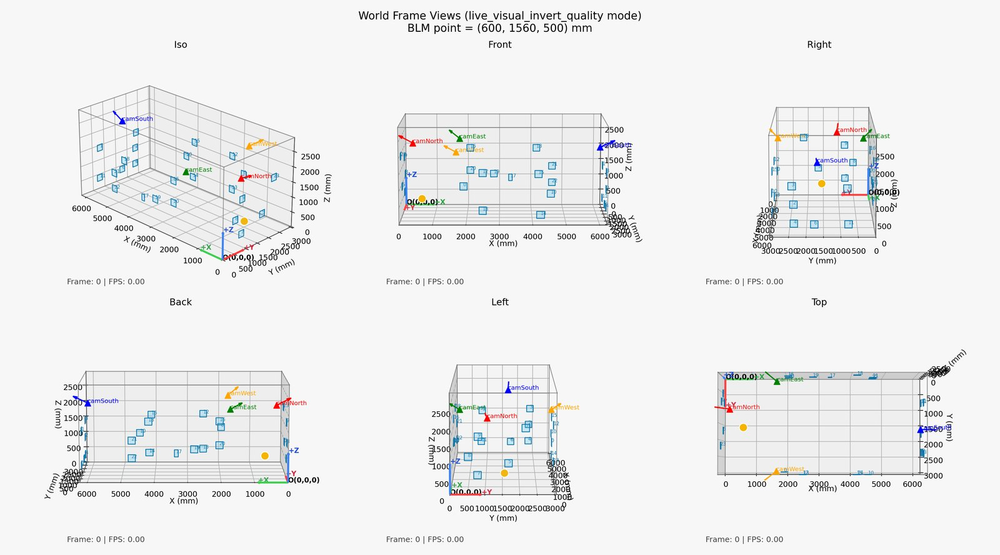
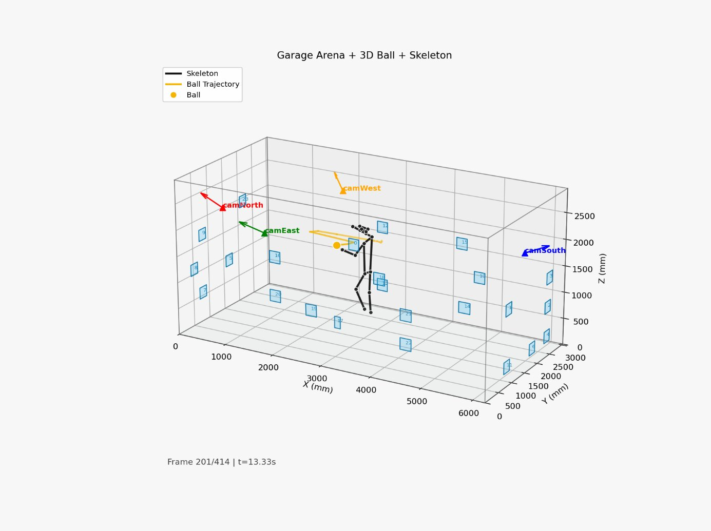
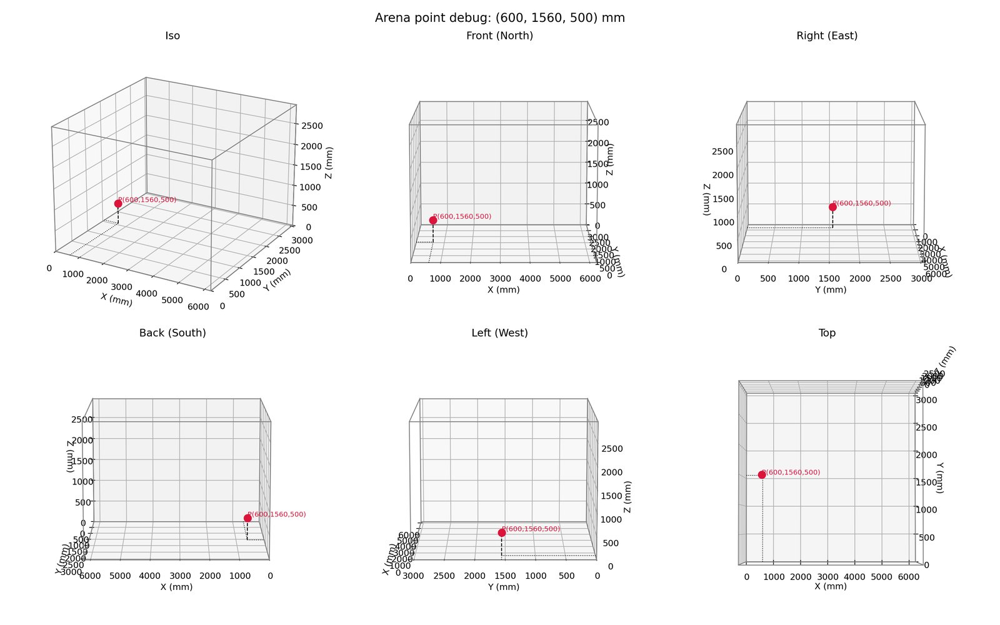
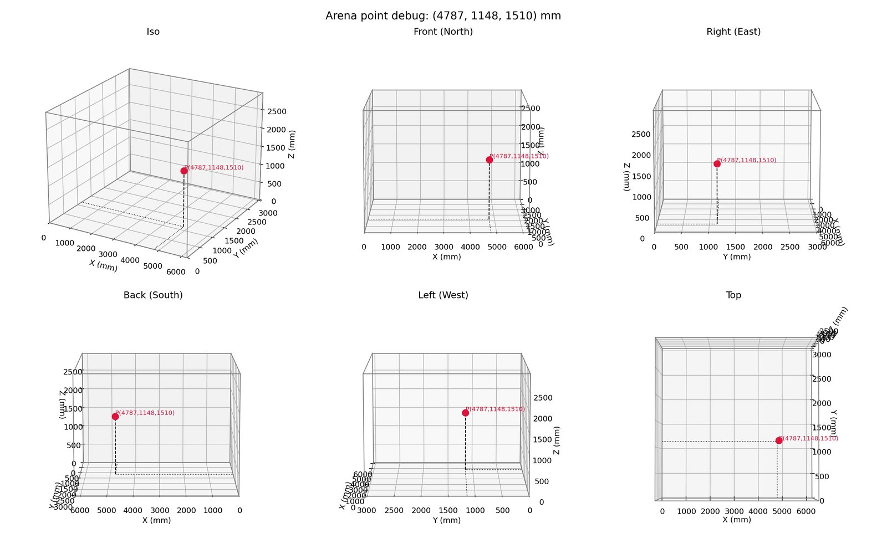
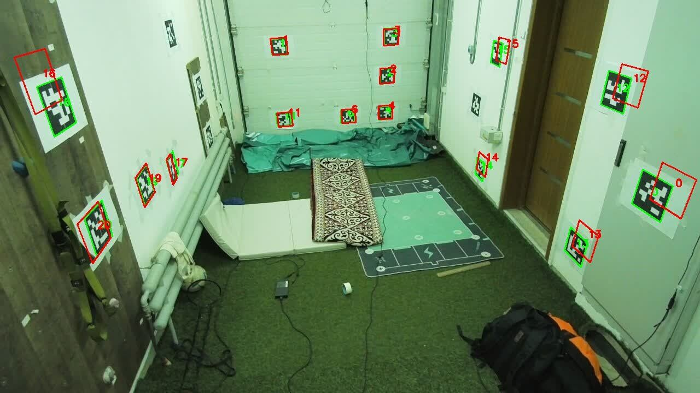
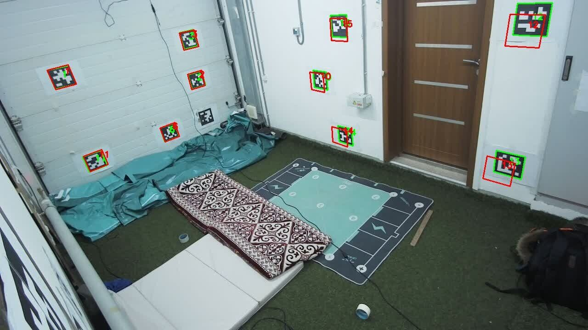
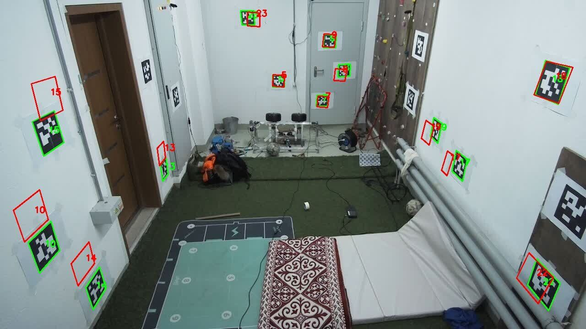
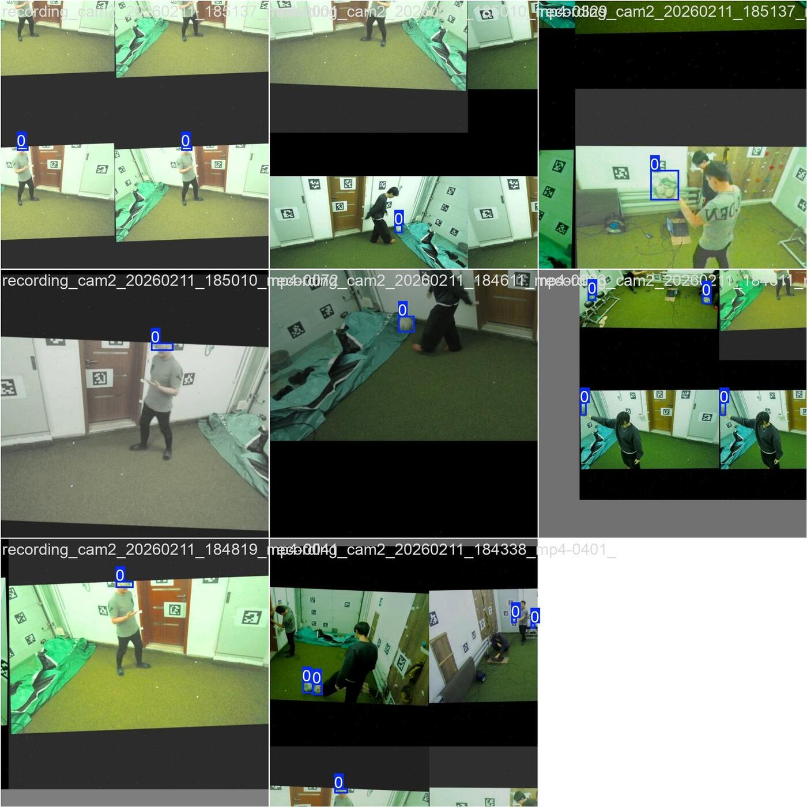
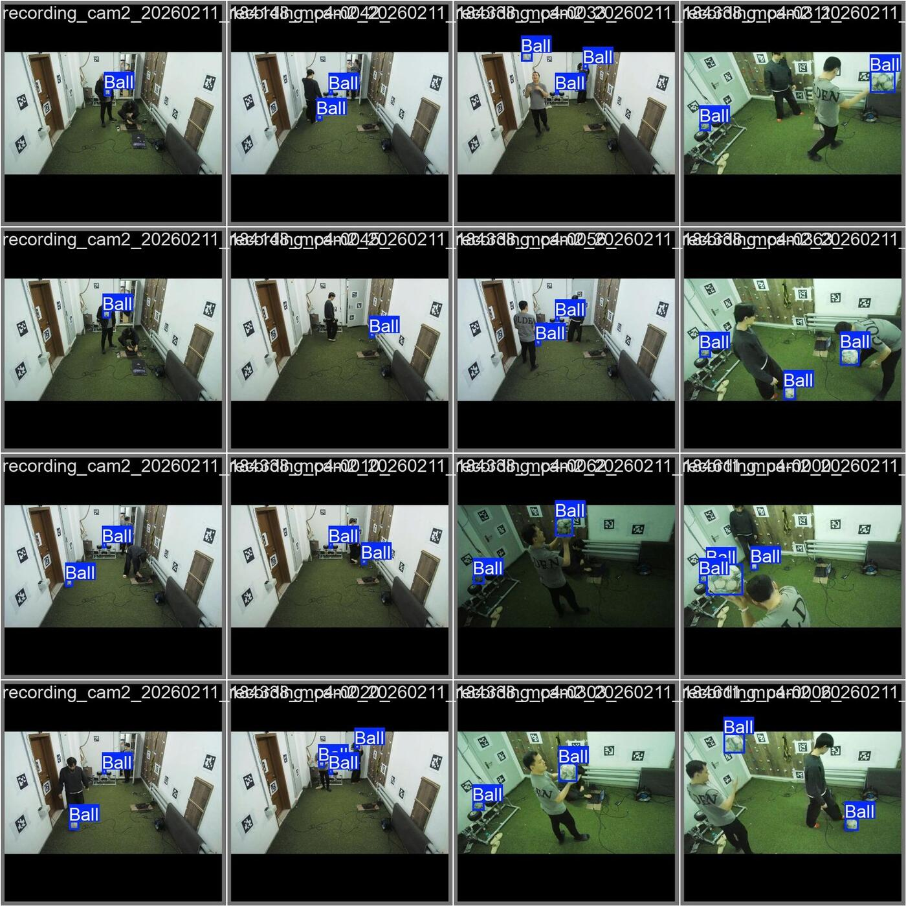

# Pose Guided Predictive Ballistics for Body Part-Targeted Football Training

**Arlen Smagulov**

Submitted in fulfilment of the requirements for the degree of Master of Science in Electrical and Computer Engineering

School of Engineering and Digital Sciences  
Department of Electrical and Computer Engineering  
Nazarbayev University

Supervisor: Prof. Sultangali Arzykulov  
Co-supervisor: Prof. Mohammad Hashmi

March 2026

\newpage

I hereby declare that this manuscript, entitled "Pose Guided Predictive
Ballistics for Body Part--Targeted Football Training", is the result of
my own work except for quotations and citations that have been duly
acknowledged. I also declare that, to the best of my knowledge and
belief, it has not been previously or concurrently submitted, in whole
or in part, for any other degree or diploma at Nazarbayev University or
any other national or international institution.

Signature(s): []{.underline}\
Name: Arlen Smagulov\
Date: 2026

The author gratefully acknowledges the guidance and constructive
feedback of the thesis supervisory committee throughout this project.
The author also thanks the Department of Electrical and Computer
Engineering at Nazarbayev University for providing the academic
framework in which this research was conducted. The open-source
communities supporting OpenCV, Ultralytics YOLO, MMPose, and the broader
Python scientific computing ecosystem made the technical implementation
possible.

Automated ball-launching machines are widely used in sports training,
but most practical systems operate in open-loop mode: the trainer
configures a fixed angle, speed, and interval, and the machine repeats
that program without measuring the athlete's current body position. This
thesis presents the design, implementation, and partial validation of a
vision-guided ball-launching system that estimates selected human body
joints (right knee, right hip, and left shoulder) in three dimensions
and computes corresponding aim parameters for a Ball Launching Machine
(BLM) in a domestic garage arena. The current work validates the
perception, calibration, targeting, and safety-gated integration
components, but it does not claim a completed full closed-loop
moving-target firing demonstration.

The system uses four fixed commodity USB cameras calibrated with ChArUco
boards for intrinsic parameters and AprilTag fiducial markers for
extrinsic world-frame registration. Ball detection is performed with a
YOLO-based detector, and human pose estimation is performed with an
open-source pose-estimation backend using the COCO 17-keypoint skeleton
convention. Multi-view triangulation converts synchronized
two-dimensional observations into three-dimensional world-frame
coordinates in millimetres. A ballistic solver computes pitch, yaw, and
wheel-speed commands from the selected target joint, while low-level
actuation is handled by an ESP32-based controller. A staged safety
protocol, including E-STOP handling, command gating, and structured
decision logging, is used to restrict actuation during integration.

Quantitative evaluation is based on a 36-point static ball ground-truth
dataset and an 81-trial joint-touch dataset. Under the current
repository calibration bundle, the raw static ball evaluation gives a
mean 3D error of 156.90 mm and a P95 error of 288.34 mm, with high
temporal precision (3.09 mm mean standard-deviation norm). The
joint-touch evaluation gives a mean 3D error of 178.98 mm and a P95
error of 243.77 mm over 62 valid trials. These results show that the
system provides a repeatable and practically useful perception backbone,
while also revealing systematic calibration bias, occlusion sensitivity,
and the need for further closed-loop validation. The thesis therefore
positions the work as a strong but incomplete step toward affordable
pose-reactive ball delivery, with moving-target firing and independent
validation left as future work.

  **Abbreviation / Symbol**            **Definition**
  ------------------------------------ ------------------------------------------------------------
  BLM                                  Ball Launching Machine
  COCO                                 Common Objects in Context (keypoint dataset format)
  DLT                                  Direct Linear Transform
  EMA                                  Exponential Moving Average
  ESP32                                Espressif Systems ESP32 microcontroller
  FPS                                  Frames Per Second
  GT                                   Ground Truth
  MMPose                               OpenMMLab Pose Estimation Framework
  P90 / P95                            90th / 95th percentile of error distribution
  PnP                                  Perspective-n-Point (camera pose estimation algorithm)
  RMSE                                 Root Mean Square Error
  RPM                                  Revolutions Per Minute
  SVD                                  Singular Value Decomposition
  UDP                                  User Datagram Protocol
  YOLO                                 You Only Look Once (object detection architecture)
  K                                    Camera intrinsic matrix
  R, T                                 Rotation matrix, Translation vector (extrinsic parameters)
  $\theta$                             Angle (pitch or yaw, degrees)
  $\Delta X$, $\Delta Y$, $\Delta Z$   Component differences of targeting vector (mm)

Introduction
============

Motivation and Problem Statement
--------------------------------

Sports training depends on repetition, precision, and adaptation. An
athlete practising reception, reaction, or rehabilitation exercises
benefits most when a delivery system can challenge the correct body
region at the correct time. Conventional ball-launching machines provide
repetition, but they generally do not perceive the athlete and therefore
cannot adapt their delivery to the athlete's current pose.

Most commercial ball launchers operate in an open-loop mode. A coach or
athlete sets a fixed launch angle, wheel speed, spin setting, and timing
pattern. The machine then repeats this program regardless of whether the
athlete is standing, crouching, moving laterally, or temporarily outside
the intended target region. This architecture is useful for repetitive
drills, but it cannot target a named body joint such as the right knee,
right hip, or left shoulder in response to the athlete's current
position.

The gap is not simply a lack of accurate sensing. At one end of the
spectrum are commercial open-loop launchers such as tennis,
table-tennis, and football training machines. They are relatively
accessible, but they do not close the perception-to-actuation loop. At
the other end are professional motion-capture systems such as OptiTrack
[1], Vicon [2], and PhaseSpace [3]. These systems can
reconstruct human motion with high precision, but they require expensive
infrastructure, calibrated studio environments, and, in many cases,
reflective markers. They observe motion but are not integrated with a
low-cost projectile-delivery machine for ordinary training environments.

This thesis investigates a middle path: a low-cost, markerless,
multi-camera system that estimates selected body joints in
three-dimensional space and computes the aim parameters required by a
physical Ball Launching Machine (BLM). The system uses four calibrated
cameras, open-source detection and pose-estimation software, multi-view
triangulation, a ballistic solver, and a staged safety architecture. The
intended long-term capability is pose-reactive ball delivery. The
present thesis validates the perception and targeting pipeline and
documents partial integration, but it does not claim that full
autonomous closed-loop firing at a moving human target has been
completed.

The selected joints--right knee, right hip, and left shoulder--cover
low, mid-body, and upper-body target regions. They also expose different
technical difficulties: the knee is often visible from several cameras,
the hip is partly occluded by the torso, and the shoulder is near the
upper portion of the camera volume and is frequently affected by
self-occlusion. These three joints therefore provide a useful set of
body-part targets for evaluating whether a low-cost multi-camera system
can support pose-guided aiming.

Research Objectives
-------------------

This work is guided by three research questions:

**RQ1:** Can a four-camera multi-view triangulation pipeline achieve a
mean 3D localisation error below 120 mm for a stationary ball in a
domestic garage arena?

**RQ2:** Can a human pose-estimation and triangulation pipeline achieve
a mean 3D joint localisation error below 180 mm for the right knee,
right hip, and left shoulder under a controlled joint-touch protocol?

**RQ3:** Can the perception-to-actuation pipeline be integrated with a
real Ball Launching Machine using a reproducible staged safety
methodology, while clearly separating verified static and aim-only tests
from future moving-target closed-loop firing?

Chapter 4 defines the evaluation protocols used to answer these
questions, and Chapter 5 reports the corresponding quantitative results.
The answer to each question is intentionally framed with its
limitations: the current evaluation is a partial validation of the
system, not a complete demonstration of autonomous moving-target
training.

Scope and Constraints
---------------------

The scope of the thesis is defined as follows.

**Physical environment:** The experimental arena is a domestic garage
measuring 6230 mm (X) $\times$ 3050 mm (Y) $\times$ 2950 mm (Z). Four
cameras are mounted near the perimeter at elevated positions. All
reported coordinates use the arena world frame in millimetres.

**Hardware:** The perception system uses four Hikvision DS-E12 USB
cameras. The actuation platform is a custom Ball Launching Machine with
stepper-driven pan/tilt axes, wheel-motor ball projection, and
ESP32-based low-level control. The perception hardware cost is
approximately USD 200.

**Software:** The implementation uses Python 3.10 with OpenCV [4],
Ultralytics YOLO [5], an open-source human pose-estimation backend
based on the COCO 17-keypoint convention [6, 7], NumPy
[8], and SciPy [9]. The repository also contains
performance-oriented runtime paths and calibration manifests; the thesis
reports only results supported by the documented ground-truth
evaluations.

**Subject configuration:** The evaluation is limited to a single-person
setting. Multi-person tracking and target identity assignment are
outside the scope of the present thesis.

**Stage of integration:** The system has been evaluated through static
ball localisation, static joint-touch localisation, live tracking clips,
aim-only launcher tests, and controlled static firing/logging stages. A
full closed-loop validation in which the launcher autonomously fires at
a moving human target has not been completed and is treated as future
work.

**Lighting and deployment conditions:** Experiments were conducted
indoors under controlled lighting. Outdoor conditions, strong
natural-light variation, and broader deployment environments are not
evaluated.

Statement of Novelty and Contributions
--------------------------------------

The thesis makes three contributions. Each contribution is stated in a
conservative form consistent with the current evidence.

**Contribution 1: Pose-Reactive Aiming Architecture.** The work
integrates multi-camera 3D pose estimation with a ballistic targeting
module for a physical BLM. Unlike an open-loop launcher, the system
computes aim parameters from a live or recorded 3D target joint rather
than from a fixed pre-programmed drill. The demonstrated contribution is
the architecture and partial integration of this pose-to-aim loop; full
autonomous moving-target firing remains future work.

**Contribution 2: Low-Cost Multi-Camera Perception Pipeline.** The
thesis demonstrates a low-cost four-camera perception pipeline using
commodity USB cameras, ChArUco intrinsic calibration, AprilTag extrinsic
calibration, YOLO-based ball detection, human pose estimation, and
DLT/SVD triangulation. Under the current repository calibration bundle,
the system achieves high repeatability in static holds and a global
valid-trial joint mean error just below 180 mm. The results are
promising but show systematic calibration bias, particularly in the
vertical direction; therefore, they should be interpreted as partial
validation of the perception backbone rather than final proof of
ball-delivery accuracy.

**Contribution 3: Safety-Gated Integration Methodology.** The thesis
formalises a staged BLM integration protocol covering calibration
checks, serial communication, aim-only tests, safety gating, controlled
firing, and future full-cycle reliability tests. The protocol requires
explicit pass criteria and structured JSONL decision logs containing
fields such as timestamp, target joint, 3D world coordinate, computed
pitch and yaw, and decision state. This provides a reproducible
engineering procedure for progressing from perception experiments to
physically actuated tests in a domestic environment.

Thesis Structure
----------------

Chapter 2 reviews multi-camera reconstruction, calibration, detection,
human pose estimation, ballistic modelling, and safety, with emphasis on
how this thesis differs from the closest commercial, motion-capture, and
research systems.

Chapter 3 describes the system design and methodology, including the
arena frame, hardware architecture, calibration workflow, triangulation,
ballistic solver, and safety architecture.

Chapter 4 defines the ground-truth evaluation protocols for static ball
localisation, joint-touch localisation, dynamic validation clips, and
error metrics.

Chapter 5 reports the quantitative results and interprets them as
partial validation. It explicitly distinguishes static perception
accuracy from uncompleted full closed-loop moving-target validation.

Chapter 6 summarises the contributions, evaluates each research
objective, identifies limitations, and outlines the future work required
for full autonomous moving-target firing.

Literature Review and Background Theory
=======================================

Multi-Camera 3D Reconstruction
------------------------------

Recovering the three-dimensional position of an object from
two-dimensional image observations is a classical problem in computer
vision. The theoretical foundation is the pinhole camera model, which
maps a 3D point $\mathbf{P} = (X, Y, Z)$ to an image point
$\mathbf{p} = (u, v)$ as

$$s \cdot [u, v, 1]^T = K \cdot [R | T] \cdot [X, Y, Z, 1]^T ,
\label{eq:2_1}$$

where $K$ is the $3 \times 3$ intrinsic matrix containing focal lengths
and principal point, $R$ is the $3 \times 3$ rotation matrix, $T$ is the
$3 \times 1$ translation vector, and $s$ is the scalar projection depth
[10].

When the same object is observed by two or more calibrated cameras, its
3D position can be recovered by triangulation. In the ideal noise-free
case, the projection rays from the cameras intersect at the true 3D
point. In practice, image noise, detector error, and calibration error
prevent exact intersection. The Direct Linear Transform (DLT) formulates
triangulation as a homogeneous linear least-squares problem and solves
it with Singular Value Decomposition (SVD), selecting the right singular
vector associated with the smallest singular value [10, 11].

Triangulation accuracy depends mainly on calibration quality, camera
baseline, image measurement noise, and the number of valid views. One
camera cannot triangulate depth. Two cameras provide the minimum
geometric constraint, but the solution is sensitive to baseline and
calibration error [12]. Three or more views provide redundancy and
allow the system to reject inconsistent observations. This is why the
present work requires at least two cameras for ball localisation and
generally requires three cameras for human joint localisation, where 2D
keypoint estimates are less stable than ball-centre detections.

Multi-camera reconstruction is widely used in sports science for ball
tracking in tennis [13], football [14], cricket [15], and
full-body motion capture [2]. However, many such systems assume
controlled installations, carefully synchronised cameras, professional
calibration procedures, or expensive equipment. The present thesis uses
the same geometric principles but applies them in a domestic arena with
low-cost cameras, so the central research issue is not whether
triangulation is theoretically possible, but whether its practical
accuracy is sufficient under inexpensive and imperfect conditions.

Camera Calibration Techniques
-----------------------------

### Intrinsic Calibration

Camera intrinsic calibration estimates the parameters of the image
formation model: focal lengths ($f_x$, $f_y$), principal point ($c_x$,
$c_y$), and lens distortion coefficients. Zhang's planar-pattern method
[16] is widely used because it obtains these parameters from multiple
views of a flat calibration target and then refines them by minimising
reprojection error.

This work uses a ChArUco calibration board, which combines a chessboard
pattern with embedded ArUco markers. Compared with a plain chessboard, a
ChArUco board provides robust corner identification under partial
visibility and reduces corner-order ambiguity through marker IDs
[17]. These properties are important in a garage setup where camera
placement, board handling, and coverage cannot match a laboratory
calibration rig. The tradeoff is that calibration accuracy still depends
on sufficient pose diversity and on capturing the board across the full
image area; poor coverage near image edges can propagate into systematic
triangulation bias.

### Extrinsic Calibration

Extrinsic calibration estimates each camera's position and orientation
in a shared world frame. This step is essential for multi-view
triangulation because projection rays from different cameras can only be
intersected if they are expressed in the same coordinate system.

AprilTag fiducials [18] are used for this purpose. Each tag encodes
a unique ID and provides four known corners. Given the camera intrinsics
and the known world positions of several tag corners,
Perspective-n-Point (PnP) estimation recovers the camera pose. Robust
estimation methods, including RANSAC-style rejection and sigma-clipping
of large residuals, reduce the influence of incorrect detections or
measurement errors in tag placement [19].

The limitation of this approach is that AprilTags constrain camera pose
only as well as the physical measurement of the tag grid and the
visibility of tags from each camera. In the current repository state,
the dominant remaining error is systematic bias, especially in the X and
Z axes. This indicates that calibration repeatability and physical tag
measurement, rather than random detector noise, are the primary
constraints on final 3D accuracy.

Object Detection for Sports Applications
----------------------------------------

Real-time object detection has been transformed by the YOLO family of
architectures [20], which formulate detection as a single-pass
prediction problem. Later versions such as YOLOv5, YOLOv8, and YOLO11
improve the accuracy-speed tradeoff enough to support real-time use on
commodity GPU hardware [5].

Sports ball detection is more difficult than generic object detection.
Balls occupy few pixels, are often blurred by fast motion, may be partly
occluded by the athlete, and can resemble background objects. Earlier
sports-tracking systems used background subtraction, colour filtering,
or hand-engineered motion models, while modern systems increasingly use
deep detectors [13, 14]. The present work uses a YOLO-based
detector because it is fast enough for multi-camera processing and can
be retrained or replaced without changing the geometry and actuation
layers. This modularity is a design choice: the thesis does not depend
on a novel detector architecture, but on integrating a practical
detector into a calibrated 3D and actuation pipeline.

Human Pose Estimation
---------------------

Human pose estimation estimates anatomical landmarks from image data. In
the common keypoint formulation, a model predicts image coordinates and
confidence values for a fixed set of body landmarks [21]. The COCO
convention defines 17 keypoints, including shoulders, hips, knees,
ankles, elbows, and wrists [6]. This convention is suitable for the
present thesis because the selected BLM targets--right knee, right hip,
and left shoulder--are included directly in the model output.

Top-down pose-estimation methods first detect the person and then
estimate keypoints inside the detected person region. They usually
provide better per-person keypoint quality than bottom-up methods in
single-person scenes. MMPose [7] provides such models and was used
in the evaluation pipeline. The local repository also includes faster
YOLO-Pose/TensorRT runtime paths for live operation, but the thesis
treats backend choice conservatively: the reported localisation results
are tied to the documented ground-truth evaluation scripts and
calibration bundle rather than to an unreported model comparison.

Multi-view 3D pose estimation extends 2D keypoint detection by
triangulating corresponding keypoints across cameras. Its accuracy is
limited by 2D keypoint quality, camera calibration, synchronisation, and
visibility. Unlike a rigid ball, a human joint is an appearance-based
estimate of an anatomical point, not a physically marked point.
Clothing, body orientation, self-occlusion, and ambiguous shoulder/hip
appearance therefore introduce errors that cannot be eliminated by
triangulation alone.

Ballistic Modelling and Actuator Control
----------------------------------------

A ball launched with initial speed $v_0$, pitch angle $\theta$, and yaw
angle $\phi$ follows a parabolic trajectory under the first-order
assumption of negligible air resistance:

$$x(t) = v_0 \cdot \cos(\theta) \cdot \cos(\phi) \cdot t ,
\label{eq:2_2}$$

$$y(t) = v_0 \cdot \cos(\theta) \cdot \sin(\phi) \cdot t ,
\label{eq:2_3}$$

$$z(t) = v_0 \cdot \sin(\theta) \cdot t - \frac{1}{2} \cdot g \cdot t^2 ,
\label{eq:2_4}$$

where $g = 9810$ mm/s$^2$. Given a target point $(T_x, T_y, T_z)$ and
launcher origin $(B_x, B_y, B_z)$, these equations can be solved for the
required launch direction and speed. For many target positions, two
pitch solutions exist: a low trajectory and a high trajectory. The
lower-angle solution is preferred because it reduces flight time and
therefore reduces the distance the athlete can move before the ball
arrives [22].

The model is intentionally simple. It does not fully capture aerodynamic
drag, ball spin, wheel slip, ball compression, or mechanical variation
in launch speed. For this reason, the ballistic solver should be
interpreted as an aiming model that requires empirical calibration
before final delivery accuracy can be claimed. Stepper motors are
appropriate for pan/tilt positioning because their step-counting
behaviour provides predictable angular commands and holding torque
[23], but open-loop steppers still require periodic zeroing or
mechanical feedback for long-term repeatability.

Safety in Autonomous Actuated Systems
-------------------------------------

A system that combines computer vision decisions with physical actuation
must treat safety as a design requirement rather than an optional
feature. Machine-safety standards such as IEC 62061 [24], ISO 12100
[25], and ISO 10218 [26] emphasise safe states, risk reduction,
and reliable interruption of hazardous motion.

An Emergency Stop (E-STOP) function should stop hazardous motion and
remain latched until a deliberate reset is performed [25]. In a
domestic ball-launching setting, the system also requires software gates
for target confidence, zone limits, link status, and operator
permission. The thesis uses a staged validation protocol because
integrated perception-to-actuation systems can fail in ways that are not
visible when testing perception or firmware alone. Incremental
validation is standard practice in safety-critical embedded development
[27], and here it is adapted to the BLM integration workflow.

Critical Comparison with Closest Systems
----------------------------------------

Table [2.1](#tab:2_1){reference-type="ref" reference="tab:2_1"}
summarises the closest system categories and the specific design
implication for this thesis.

::: {#tab:2_1}
  **Category**                                **Examples**                                                **Strength**                                     **Limitation**                                                                                         **Design implication for this thesis**
  ------------------------------------------- ----------------------------------------------------------- ------------------------------------------------ ------------------------------------------------------------------------------------------------------ ----------------------------------------------------------------------------------------
  Commercial open-loop launchers              Tennis, football, table-tennis launchers                    Affordable and practical for repetitive drills   No sensing, no pose awareness, no target-joint adaptation                                              Keep affordability, but add markerless sensing and computed aim parameters
  Professional optical motion capture         OptiTrack [1], Vicon [2], PhaseSpace [3]      Very high motion accuracy in controlled spaces   Expensive, marker-dependent or infrastructure-heavy, not integrated with a low-cost launcher           Use commodity cameras and accept lower accuracy in exchange for deployability
  Depth-camera systems                        Intel RealSense-class sensors [28]                      Direct metric depth at short range               Limited range/field coverage, depth noise, occlusion sensitivity, higher dependence on a single view   Prefer multi-camera triangulation so multiple viewpoints can compensate for occlusion
  Robotic ball-striking or serving research   Robot table-tennis and ping-pong systems [29, 30]   Demonstrates fast vision-to-actuation control    Usually targets a ball or fixed zone, not a named human joint in a domestic training arena             Target anatomical landmarks and document safety constraints for human-facing actuation

  : Critical comparison of related system categories
:::

Commercial open-loop launchers are closest to the intended application,
but weakest technically because they cannot perceive or adapt.
Motion-capture systems are closest in measurement capability, but their
cost and operational demands conflict with the thesis goal of affordable
training. Robotic table-tennis and similar systems are closest in
closed-loop actuation, but their task formulation is different: they
typically track a ball or target a fixed spatial zone, whereas this
thesis targets a selected human joint.

The research gap is therefore narrower and more defensible than a
general claim of inventing vision-guided launching. The specific gap
addressed here is the integration of low-cost multi-camera 3D
reconstruction, markerless human joint localisation, ballistic aim
computation, and safety-gated BLM control in a domestic arena. The
present work provides partial validation of that integrated pipeline. It
does not yet provide complete evidence for autonomous firing at a moving
human target, which remains the key future validation step.

System Design and Methodology
=============================

Arena Setup and Coordinate System
---------------------------------

The experimental arena is a domestic garage measuring 6230 mm in the X
direction, 3050 mm in the Y direction, and 2950 mm in the Z direction.
The world-frame origin is defined at the North-East floor corner. The
**X-axis** points from the North wall toward the South wall, the
**Y-axis** points from the East wall toward the West wall, and the
**Z-axis** points vertically upward.

All coordinates in this thesis are reported in millimetres. The main
operating volume for the athlete lies approximately between X = 2500 mm
and X = 5000 mm, where the four camera frusta overlap most reliably.

::: {#tab:3_1}
   **Camera**   **X (mm)**   **Y (mm)**   **Z (mm)**  **Description**
  ------------ ------------ ------------ ------------ ----------------------------
    CamNorth        50          1100         2260     North wall, central height
    CamEast        1620          50          2120     East wall, near North end
    CamWest        1600         2970         2170     West wall, near North end
    CamSouth       6180         1530         2270     South wall, central

  : Camera positions in world-frame coordinates (mm)
:::

The cameras are mounted near the ceiling and perimeter walls to maximise
overlapping views of the central volume. The intended operating
condition is that at least three cameras observe the athlete's target
joint. The repository's current geometry is represented by the
`arena_fixed` calibration bundle, which fixes the world-frame convention
and binds the active intrinsics, extrinsics, arena dimensions,
correction models, and evaluation reports.

Twenty-four AprilTag markers (IDs 0--23; 21.5 cm $\times$ 21.5 cm) are
attached to the arena walls at measured world-frame positions. These
markers support extrinsic calibration as described in Section 3.5.

Hardware Architecture
---------------------

### Cameras

The vision system uses four Hikvision DS-E12 USB webcams at 1280
$\times$ 720 px and a target capture rate of 15 FPS. These are
fixed-focus commodity cameras without hardware synchronisation. Their
low cost is central to the thesis objective, but it also imposes
constraints: rolling capture timing, lens distortion, and limited optics
increase the importance of calibration and robust filtering.

### Ball Launching Machine

The BLM consists of two counter-rotating wheel motors for ball
projection, two stepper-driven axes for pitch and yaw, and a ball feed
mechanism controlled by `shoot` and `reload` commands. Wheel speed
determines the approximate launch speed; differential wheel speed can
introduce spin. The pitch and yaw steppers orient the launcher toward
the selected target.

The launch origin is modelled as a fixed world-frame point,
$B = (600, 1560, 500)$ mm, near the North side of the arena and centred
in Y. The launcher reference direction points along the positive X-axis
toward the athlete region.

### ESP32 Microcontroller

An ESP32 microcontroller receives serial commands from the host PC and
translates them into motor-control actions. The low-level command set is
shown in Table [3.2](#tab:3_2){reference-type="ref"
reference="tab:3_2"}.

::: {#tab:3_2}
  **Command**   **Syntax**        **Effect**
  ------------- ----------------- -----------------------------------------------------------------------------------------
  set           `set V H WL WR`   Set vertical angle V, horizontal angle H, left wheel speed WL, and right wheel speed WR
  shoot         `shoot`           Trigger one ball ejection cycle
  reload        `reload`          Retract the ball feed mechanism for the next cycle
  center        `center`          Return the pitch and yaw axes to logical zero
  stop          `stop`            Stop motor activity immediately
  setzero       `setzero`         Register the current mechanical pose as logical zero

  : BLM low-level serial command set
:::

### PC--ESP32 Architecture Split

High-level computation runs on the host PC: camera capture, detection,
pose estimation, triangulation, filtering, ballistic solving, safety
gating, and decision logging. The ESP32 executes only low-level motor
commands. This split keeps GPU-heavy perception on the PC, simplifies
firmware, and allows targeting logic to be modified without reflashing
the controller.

Software Architecture and Pipeline Overview
-------------------------------------------

The pipeline proceeds through seven stages. Stage 1 is **multi-camera
capture**, where the four camera frames are acquired at the configured
resolution. Stage 2 is **ball detection**, where a YOLO-based detector
returns ball bounding boxes and confidence scores. Stage 3 is **human
pose estimation**, where a COCO-format pose backend returns 17 keypoints
and per-keypoint confidences. Stage 4 is **3D triangulation**, where
valid 2D observations are combined through the DLT/SVD solver to
estimate ball and joint coordinates in the world frame. Stage 5 is
**filtering**, where outlier rejection and smoothing are applied. Stage
6 is **ballistic solving**, where the selected target joint is converted
into pitch, yaw, and wheel-speed commands. Stage 7 is **actuation or
logging**, where commands are either sent to the ESP32 under enabled
safety conditions or written to a JSONL log during dry-run tests.

The implementation uses Python 3.10. Key libraries include OpenCV
[4] for camera I/O and calibration, Ultralytics YOLO [5] for
ball detection, an open-source pose-estimation backend [7] for
COCO-format keypoints, NumPy [8] and SciPy [9] for numerical
computation, and Matplotlib/OpenCV-based utilities for visualisation.
The local repository contains both evaluation scripts and
performance-oriented runtime scripts; this thesis reports only the
evaluation results documented in the ground-truth folders.

{#fig:3_3 width="90%"}

Intrinsic Calibration Pipeline
------------------------------

### Board Specification and Detection

A ChArUco board with 5 columns and 7 rows is used for intrinsic
calibration. The embedded ArUco markers provide identifiable corners
even when the board is only partly visible. The auto-capture script
monitors all four camera streams and saves calibration frames when
enough ChArUco corners are detected stably. This reduces operator timing
error and helps collect a more consistent calibration set.

### Calibration Procedure

Each camera is calibrated independently at the same 1280 $\times$ 720
resolution used during operation. OpenCV [4] estimates the
intrinsic matrix $K$ and distortion coefficients ($k_1$, $k_2$, $p_1$,
$p_2$, $k_3$) by minimising reprojection error over the collected
calibration frames. Approximately 30 valid frames per camera are
targeted, and frames with insufficient corner detections are discarded.

Calibrating at the operating resolution is important because resizing
images after calibration requires corresponding rescaling of focal
lengths and principal point. Avoiding this extra transformation reduces
one source of systematic triangulation error.

### Output and Validation

The calibration outputs are stored as JSON files in . Per-camera
reprojection error is used as a quality indicator. The values are
sufficient for prototype-level triangulation, but they are not the only
determinant of 3D accuracy; extrinsic calibration, camera geometry, and
keypoint quality remain dominant error sources.

Extrinsic Calibration Pipeline
------------------------------

### AprilTag Detection

The AprilTag wall grid provides known 3D corner points. The robust
extrinsic calibration script detects visible tags in captured frames and
constructs 2D--3D correspondences between image tag corners and measured
world-frame tag positions.

### Robust PnP Optimisation

For each camera, the pose $(R, T)$ is estimated using PnP with iterative
refinement. A sigma-clipping stage removes tag-corner observations whose
reprojection residuals are inconsistent with the rest of the detected
set. The resulting rotation and translation define the camera pose in
the shared world frame.

### Overlay Validation

Extrinsic quality is checked visually by reprojecting known AprilTag
corners into each camera image using the estimated $(K, R, T)$
parameters. When reprojected corners align with detected corners across
the camera views, the calibration is accepted for the session. This
visual check is necessary because a low average reprojection error can
still hide a wrong world-frame convention or a physically inconsistent
tag measurement.

Multi-Camera Synchronisation
----------------------------

The Hikvision cameras do not provide hardware synchronisation. For
recorded sessions, software synchronisation is performed using a
flashlight marker: a brief brightness spike is created at the beginning
of the recording and detected in all camera streams. Frames are then
aligned by the spike index.

For static ground-truth holds of 3--4 seconds, synchronisation error of
a few frames is acceptable because the target is stationary during the
measurement window. For dynamic motion, temporal offset directly affects
triangulation: if camera frames correspond to different physical
instants, the reconstructed point can be displaced along the direction
of motion. This limitation is one reason why the dynamic clips in
Chapter 5 are interpreted as qualitative tracking checks rather than
complete closed-loop moving-target validation.

3D Triangulation
----------------

### Ball Triangulation

For each frame in which the ball is detected in at least two cameras
with confidence above the configured threshold, the centre of each 2D
bounding box is combined with the corresponding camera projection
matrix. The DLT method constructs a matrix $A$ such that the homogeneous
3D point $P$ satisfies $A \cdot P = 0$ in the least-squares sense. SVD
returns the estimated $P$ as the right singular vector corresponding to
the smallest singular value [10].

### Pose Joint Triangulation

For each COCO keypoint, the same triangulation method is applied to 2D
joint detections whose confidence exceeds the threshold. A higher
camera-count requirement is used for joints than for the ball because
human keypoints are more sensitive to appearance ambiguity and
self-occlusion. The right knee, right hip, and left shoulder are then
extracted as target candidates for the BLM.

### Quality Filtering

Two quality filters are applied after triangulation.

**Reprojection error check:** The estimated 3D point is projected back
into each contributing camera. If the pixel error between the projected
point and the original 2D observation exceeds the configured threshold,
that estimate is rejected as an outlier.

**EMA smoothing:** Accepted 3D points are smoothed using an Exponential
Moving Average filter. This reduces frame-to-frame jitter while
preserving the slower motion relevant to aiming. The filtered coordinate
is passed to the ballistic solver.

Ballistic Solver and Targeting Logic
------------------------------------

### Target Vector Computation

The ballistic solver receives the current target joint position
$T = (T_x, T_y, T_z)$ and the fixed launcher origin
$B = (B_x, B_y, B_z) = (600, 1560, 500)$ mm. The target vector is

$$\Delta X = T_x - B_x ,
\label{eq:3_1}$$

$$\Delta Y = T_y - B_y ,
\label{eq:3_2}$$

$$\Delta Z = T_z - B_z .
\label{eq:3_3}$$

The horizontal distance is

$$D_{\text{horiz}} = \sqrt{\Delta X^2 + \Delta Y^2}.
\label{eq:3_4}$$

### Yaw Angle Computation

The yaw command is computed from the horizontal target vector:

$$\theta_{\text{yaw}} = \text{atan2}(\Delta Y, \Delta X).
\label{eq:3_5}$$

The result is converted to degrees and adjusted by a configurable yaw
trim to account for mechanical zero offset.

### Pitch Angle Computation

The pitch angle follows from the projectile equation. For horizontal
distance $D_{\text{horiz}}$ and vertical displacement $\Delta Z$, the
pitch angle $\theta_{\text{pitch}}$ for launch speed $v_0$ satisfies

$$\Delta Z = D_{\text{horiz}} \cdot \tan(\theta_{\text{pitch}}) - \frac{g \cdot D_{\text{horiz}}^2}{2 \cdot v_0^2 \cdot \cos^2(\theta_{\text{pitch}})} .
\label{eq:3_6}$$

The lower-angle physical solution is selected to reduce flight time. A
pitch trim is then applied to compensate for mechanical zero error.

### Wheel RPM Computation

Wheel RPM is mapped to approximate launch speed. The current solver
treats this mapping as an empirical calibration parameter rather than a
fully validated ballistic model. A more complete RPM-to-exit-velocity
calibration is identified as future work because delivery accuracy
cannot be claimed without it.

### Why This Is Non-Trivial

The targeting computation is not a fixed lookup table. The target
coordinate can change every frame; the solver must produce commands
within the real-time loop; gravity couples pitch, speed, and range; the
mechanical range of the stepper axes is limited; and the launcher's
logical zero must remain aligned with the world frame. These factors
make the perception-to-aim loop a coupled mechatronic problem rather
than a simple computer-vision display task.

### Dynamic Target Tracking Behaviour

The runtime is organised as a state machine. In the **ACQUIRING** state,
too few cameras observe the target or the filtered coordinate has not
stabilised. In the **LOW\_CONFIDENCE** state, confidence, visibility, or
stability gates fail and no new actuation command is allowed. In the
**READY** state, the target passes camera-count, confidence, zone, and
stability checks, so the ballistic solve may be executed if actuation is
enabled.

The system must not fire unless the E-STOP is cleared, the operator has
enabled the appropriate mode, the target is valid, and the firing gate
is explicitly active. In the present thesis, this logic is treated as an
integration and safety contribution, while full autonomous moving-target
firing remains future work.

Safety Architecture
-------------------

### E-STOP Latch

The launcher runtime includes an E-STOP mechanism that blocks further
commands after a stop event until the operator deliberately clears the
latch. The repository documentation also treats physical power
interruption and motor-stop behaviour as part of the safety path. The
thesis does not claim third-party safety certification; instead, it
documents an ISO-informed engineering approach suitable for staged
research validation.

### Multi-Level Gating

Before actuation, the system checks E-STOP status, camera count,
confidence, safe operating zone, target stability, and link health. If
any check fails, the command is rejected and the reason is logged.
Typical decision outcomes include `OK`, `OUT_OF_RANGE`,
`LOW_CONFIDENCE`, and `ESTOP`.

### Six-Stage Integration Checklist

Integration follows a staged protocol. **Preflight** verifies cameras,
calibration files, and serial connectivity. **ESP32 Only** verifies
low-level motor commands. **Runtime Without Cameras** injects synthetic
targets to test solver and safety gates. **Live Aim-Only** runs the full
perception pipeline while preventing projectile firing. **Safety
Verification** tests E-STOP, latch, link-loss, and zone-rejection
behaviour. **Controlled Firing** allows single-shot tests under strict
operator control. Full repeated autonomous cycles and moving-target
firing are deliberately left as later validation stages.

Each stage has pass criteria and should be supported by logs, videos, or
JSONL records. This staged methodology is essential because the central
risk of the project is not one isolated algorithm, but the interaction
of perception uncertainty with a physical launcher.

Ground-Truth Evaluation Protocols
=================================

Ball Static Ground-Truth Dataset
--------------------------------

### Dataset Design

A 36-point static dataset evaluates ball localisation across a
representative volume of the garage arena. The current repository trial
definition uses X positions of 3000, 4000, and 5000 mm; Y positions of
2300, 1600, and 1000 mm; and Z levels of 200, 750, 1300, and 1800 mm.
This produces

$$3 \times 3 \times 4 = 36$$

trials labelled B001--B036.

{#fig:4_1_ball_static_grid
width="80%"}

::: {#table:4_1_ball_static_grid}
   **X (mm)**   **Y (mm)**    **Z levels (mm)**         **Trial IDs**
  ------------ ------------ ---------------------- ------------------------
      3000         2300      200, 750, 1300, 1800   B001, B010, B019, B028
      4000         2300      200, 750, 1300, 1800   B002, B011, B020, B029
      5000         2300      200, 750, 1300, 1800   B003, B012, B021, B030
      3000         1600      200, 750, 1300, 1800   B004, B013, B022, B031
      4000         1600      200, 750, 1300, 1800   B005, B014, B023, B032
      5000         1600      200, 750, 1300, 1800   B006, B015, B024, B033
      3000         1000      200, 750, 1300, 1800   B007, B016, B025, B034
      4000         1000      200, 750, 1300, 1800   B008, B017, B026, B035
      5000         1000      200, 750, 1300, 1800   B009, B018, B027, B036

  : Ball static ground-truth grid definition
:::

### Capture Protocol

For each trial, the ball centre is positioned at the target coordinate
using a rigid holder. The scene is held static for 3--4 seconds while
all four cameras record. Trial ID, placement notes, and anomalies are
recorded in the session log. The physical ball-centre position is
measured against the arena coordinate frame with an estimated placement
uncertainty of approximately $\pm 5$ mm.

### Processing

Each four-camera clip is processed by the ball ground-truth evaluator.
The script extracts YOLO detections, triangulates the ball from valid
camera observations, rejects estimates with high reprojection error, and
computes the mean 3D position over the stable hold window. The stable
window is defined as the middle portion of the clip, excluding the
beginning and end to avoid placement and removal transients.

Joint-Touch Ground-Truth Dataset
--------------------------------

### Dataset Design

The joint-touch dataset evaluates 3D localisation of three target joints
under a controlled physical reference condition. The subject touches a
known physical target with the designated joint while holding a static
pose.

The current trial grid uses nine XY positions:

::: {#table:4_2_joint_touch_xy}
   **XY Position Index**   **X (mm)**   **Y (mm)**
  ----------------------- ------------ ------------
             1                2600         1100
             2                3600         1100
             3                4600         1100
             4                2600         1600
             5                3600         1600
             6                4600         1600
             7                2600         2100
             8                3600         2100
             9                4600         2100

  : Joint-touch trial design: XY grid positions (mm)
:::

The evaluated joints are `right_knee`, `right_hip`, and `left_shoulder`.
Platform/base Z levels are 0, 400, and 640 mm. The nominal joint target
heights are defined as base + 500 mm for the right knee, base + 1000 mm
for the right hip, and base + 1560 mm for the left shoulder. The total
dataset is therefore

$$9 \text{ positions} \times 3 \text{ height levels} \times 3 \text{ joints} = 81$$

trials, labelled J001--J081.

{#fig:4_2_joint_touch_grid
width="80%"}

::: {#table:4_2b_joint_heights}
   **Platform Level**   **Z base (mm)**   **right\_knee Z**   **right\_hip Z**   **left\_shoulder Z**
  -------------------- ----------------- ------------------- ------------------ ----------------------
         Floor                 0                 500                1000                 1560
       Platform 1             400                900                1400                 1960
       Platform 2             640               1140                1640                 2200

  : Joint-touch platform and joint heights
:::

### Capture Protocol

For each trial, the subject stands in the arena and touches the physical
target marker with the specified body joint. The pose is held for 3--4
seconds. Capture begins from a neutral non-touching pose and includes
the transition into the hold, but only the stable hold window is
evaluated.

A trial is valid if the joint is detected in enough cameras during the
hold window, the detection ratio meets the configured threshold, and no
physical placement error is recorded. In the current evaluation, 62 of
81 trials are valid. The missing or invalid trials are primarily
associated with occlusion and high target positions, especially shoulder
trials at the highest platform level.

### Processing

The evaluator triangulates each target joint from valid 2D keypoint
observations and computes the mean 3D joint position over the stable
hold window. This estimate is compared with the measured physical
reference position. The joint-touch protocol is stricter than visual
inspection because it assigns a numerical 3D error to each valid trial
and records missing or failed trials explicitly.

Dynamic Validation Clips
------------------------

Dynamic clips were recorded to observe tracking behaviour under
non-static conditions. The `ball_slow` clip includes gentle hand-guided
motion, the `ball_fast` clip includes faster throws, and the `no_ball`
clip checks false positives when no ball is present. These clips are
useful for identifying dropouts, motion-blur sensitivity, and
implausible trajectory jumps.

They are not, however, a full closed-loop moving-target validation. They
do not measure final ball impact against a moving human joint, and they
do not provide an independent ground-truth trajectory for every frame.
For this reason, Chapter 5 interprets them as qualitative or partial
dynamic evidence rather than as proof that the final autonomous training
loop is complete.

Error Metrics and Bias Correction Model
---------------------------------------

### Primary Metrics

For each valid trial, the 3D Euclidean error is computed as

$$e = \sqrt{(x_{\text{est}} - x_{\text{gt}})^2 + (y_{\text{est}} - y_{\text{gt}})^2 + (z_{\text{est}} - z_{\text{gt}})^2},
\label{eqn:4_1_euclidean_error}$$

where $(x_{\text{est}}, y_{\text{est}}, z_{\text{est}})$ is the mean
estimated 3D position over the hold window and
$(x_{\text{gt}}, y_{\text{gt}}, z_{\text{gt}})$ is the measured
ground-truth position. The reported summary statistics are mean error,
median error, RMSE, 90th percentile (P90), 95th percentile (P95), and
maximum error.

Temporal precision is reported separately as the standard-deviation norm
of repeated estimates during the static hold. This distinction matters:
high precision with high absolute error indicates a repeatable but
biased system, whereas low precision indicates random instability.

### Axis Bias and Correction Model

Per-axis bias is computed as

$$\text{bias}_X = \text{mean}(x_{\text{est}} - x_{\text{gt}}),
\label{eqn:4_2_bias_x}$$

$$\text{bias}_Y = \text{mean}(y_{\text{est}} - y_{\text{gt}}),
\label{eqn:4_3_bias_y}$$

$$\text{bias}_Z = \text{mean}(z_{\text{est}} - z_{\text{gt}}).
\label{eqn:4_4_bias_z}$$

The repository includes linear correction models that estimate a scale
and offset per axis, for example

$$x_{\text{corr}} = a_X x_{\text{est}} + b_X .
\label{eqn:4_5_x_correction}$$

Analogous expressions apply for Y and Z. In this revised thesis, the
current raw ground-truth metrics are reported as the primary evidence
because they are the most conservative representation of the present
calibration bundle. The correction models are discussed as diagnostic
and runtime compensation tools, not as independent proof of generalised
accuracy. Because the correction parameters are fitted from measured
ground-truth trials, a separate held-out validation set is required
before corrected metrics can be treated as final performance claims.

Results and Analysis
====================

This chapter reports the quantitative results as partial validation of
the system. The current repository calibration bundle is used as the
primary source for the results in this revised thesis. The results
validate static ball localisation, static joint-touch localisation, and
qualitative dynamic tracking behaviour. They do not constitute full
closed-loop validation with a moving human target and live autonomous
firing.

Intrinsic Calibration Results
-----------------------------

Intrinsic calibration was performed at 1280 $\times$ 720 resolution for
all four cameras using the ChArUco auto-capture procedure. Approximately
30--40 valid frames per camera were collected, and frames with
insufficient corner coverage were excluded before calibration.

The resulting reprojection errors are acceptable for a low-cost
prototype, but they should not be interpreted as guaranteeing final 3D
accuracy. In this system, small errors in the intrinsic model interact
with extrinsic calibration, tag placement, and camera geometry. The
final accuracy must therefore be judged from the ground-truth 3D
evaluations rather than from reprojection error alone.

Extrinsic Calibration Results
-----------------------------

Extrinsic calibration uses the 24-tag AprilTag wall grid and robust PnP
optimisation. The current repository state stores the active calibration
bundle in the `arena_fixed` structure and binds it through a calibration
manifest. This is important because several earlier extrinsic files
remain in the repository for provenance; the revised thesis refers to
the active fixed bundle and the corresponding ground-truth evaluation
reports.

Visual overlay validation confirms that known tag corners reproject
plausibly into the camera images. However, the quantitative results
below show that the system still contains a systematic 3D bias. This is
an important finding rather than a formatting issue: it means the
perception pipeline is repeatable but calibration-limited.

Ball Static Localisation Results
--------------------------------

Table [5.1](#tab:5_1){reference-type="ref" reference="tab:5_1"} reports
the current raw static ball localisation metrics from the 36-point
ground-truth evaluation.

::: {#tab:5_1}
  **Metric**                           **Value**
  ------------------------------------ ----------------
  Trials valid                         36 / 36 (100%)
  Mean 3D error                        156.90 mm
  Median 3D error                      157.52 mm
  RMSE                                 172.05 mm
  P90                                  236.38 mm
  P95                                  288.34 mm
  Maximum error                        361.83 mm
  Mean reprojection error              5.46 px
  Mean cameras used                    2.74
  Mean detection ratio (hold window)   1.000
  Mean temporal precision (std-norm)   3.09 mm
  P95 temporal precision               11.62 mm

  : Ball static localisation summary metrics, current raw evaluation
:::

The static ball results show a clear distinction between repeatability
and absolute accuracy. The mean temporal precision is 3.09 mm,
indicating that repeated estimates of the same static point are highly
stable during the hold window. However, the mean absolute error is
156.90 mm and the P95 is 288.34 mm. Therefore, the current raw system
does not satisfy the original RQ1 target of mean error below 120 mm.
This is a more conservative conclusion than the earlier
corrected-pipeline framing and is better aligned with the current
repository evaluation report.

{#fig:5_1
width="90%"}

The dominant bias components are X = +60.22 mm, Y = +13.06 mm, and Z =
104.34 mm. The negative Z bias is physically plausible because all
cameras are mounted near the ceiling and observe low ball positions
through shallow downward-looking rays. Small camera-height or pitch
errors therefore propagate into vertical triangulation bias.

{#fig:5_2 width="75%"}

The repository includes a linear correction model for this bias. Such a
model is useful for runtime compensation and for diagnosing systematic
calibration error. However, because the correction is fitted from
ground-truth trials, corrected accuracy should not be treated as final
performance unless it is evaluated on an independent held-out dataset.
For this reason, the raw values in
Table [5.1](#tab:5_1){reference-type="ref" reference="tab:5_1"} are used
as the primary evidence in the revised thesis.

Human Pose Joint-Touch Results
------------------------------

Table [5.2](#tab:5_2){reference-type="ref" reference="tab:5_2"} reports
the current joint-touch results. Of 81 planned trials, 62 are valid and
19 are missing or failed. The invalid trials are part of the result
because they reflect real visibility and occlusion constraints in the
camera setup.

::: {#tab:5_2}
  **Metric**                           **Value**
  ------------------------------------ -----------------
  Trials valid                         62 / 81 (76.5%)
  Mean 3D error                        178.98 mm
  Median 3D error                      181.17 mm
  RMSE                                 183.69 mm
  P90                                  227.35 mm
  P95                                  243.77 mm
  Maximum error                        271.13 mm
  Mean temporal precision (std-norm)   4.39 mm
  P95 temporal precision               9.17 mm

  : Joint-touch 3D ground-truth summary metrics, current evaluation
:::

The global mean joint error is 178.98 mm, which is just below the 180 mm
target in RQ2. This result should be interpreted carefully. It supports
the feasibility of the low-cost multi-camera joint-localisation approach
for valid static holds, but the margin is narrow and the result excludes
19 invalid or missing trials. The P95 of 243.77 mm remains below the 280
mm global acceptance threshold defined for joint-touch evaluation.

::: {#tab:5_3}
  **Joint**        **Valid trials**   **Mean error (mm)**   **P95 (mm)**
  ---------------- ------------------ --------------------- --------------
  right\_knee      17                 148.44                213.40
  right\_hip       27                 182.15                218.12
  left\_shoulder   18                 203.09                246.42

  : Per-joint error breakdown, current evaluation
:::

The per-joint breakdown shows the expected hierarchy. The right knee has
the lowest mean error because it is often visible from multiple views
and lies in a favourable portion of the camera volume. The right hip has
higher error because it is affected by torso occlusion and because the
anatomical keypoint is harder to observe consistently. The left shoulder
has the highest mean error, particularly because shoulder trials occur
at greater heights and are more likely to be affected by self-occlusion
and elevated-camera geometry.

{#fig:5_3
width="82%"}

The mean temporal precision for valid joint holds is 4.39 mm, with a P95
precision of 9.17 mm. As with the ball results, this indicates that the
pipeline is repeatable over short static windows. The dominant
limitation is not random jitter but systematic spatial error and
visibility failure. This distinction matters for future work: improving
calibration and camera placement should reduce mean error, whereas
increasing frame-level smoothing alone will not eliminate a fixed
spatial bias.

{#fig:5_4
width="82%"}

Dynamic Detection Results
-------------------------

{#fig:5_5 width="80%"}

The dynamic clips show that the system can maintain plausible 3D
trajectories under moderate movement and can suppress short-term jitter
with smoothing. The *no\_ball* control clip is used to check that the
detector does not produce sustained false trajectories when the ball is
absent. The *ball\_fast* clip is more challenging because motion blur
and rapid acceleration reduce detection confidence and increase the
likelihood of outliers.

These dynamic results are useful as stress tests of the tracking
pipeline, but they are not a complete validation of the thesis's
long-term goal. A complete demonstration would require an independently
measured moving target, a fired ball, a recorded impact or interception
point, and a comparison between intended and achieved target location.
That experiment has not yet been completed. Therefore, the present
results should be stated as partial validation: static localisation is
quantified, dynamic tracking is qualitatively demonstrated, and
closed-loop moving-target firing remains future work.

Conclusions and Future Work
===========================

Summary of Contributions
------------------------

This thesis presented a low-cost, multi-camera, pose-guided BLM system
and evaluated its main perception and integration components. The work
should be understood as a partial validation of an integrated
architecture rather than as a completed demonstration of autonomous
moving-target firing.

**Contribution 1, Pose-Reactive Aiming Architecture:** The thesis
integrates markerless multi-camera 3D joint localisation with ballistic
aim computation for a physical BLM. The system can compute pitch, yaw,
and wheel-speed commands from selected 3D target joints instead of
relying on a fixed pre-programmed trajectory. The current evidence
supports the architecture and static/aim-only integration, but not yet
full autonomous firing at a moving human target.

**Contribution 2, Low-Cost Multi-Camera Perception Pipeline:** The
perception system uses four commodity USB cameras, ChArUco intrinsic
calibration, AprilTag extrinsic calibration, YOLO-based ball detection,
pose estimation, and DLT/SVD triangulation. Under the current
calibration bundle, the raw ball static evaluation gives a mean error of
156.90 mm, and the joint-touch evaluation gives a mean error of 178.98
mm over valid trials. These values are not motion-capture-grade, but
they show that a low-cost system can produce repeatable 3D measurements
in a domestic arena.

**Contribution 3, Safety-Gated Integration Protocol:** The thesis
defines and applies a staged validation methodology for progressing from
perception tests to physically actuated BLM operation. The methodology
includes preflight checks, ESP32 command tests, synthetic-target runtime
tests, live aim-only operation, safety verification, controlled firing,
and future full-cycle tests. Structured decision logging provides
traceability for each actuation decision.

Objectives Achievement
----------------------

This section revisits the research questions from Section 1.2 using the
results in Chapter 5.

**RQ1: Ball 3D Localisation Accuracy.** The target was a mean static
ball localisation error below 120 mm. The current raw evaluation over 36
static ball trials gives a mean error of 156.90 mm, RMSE of 172.05 mm,
and P95 of 288.34 mm. Therefore, RQ1 is not fully satisfied under the
current raw evaluation. The low temporal precision value (3.09 mm mean
standard-deviation norm) indicates that the system is repeatable, but a
systematic calibration bias remains.

**RQ2: Human Pose Joint Localisation Accuracy.** The target was a mean
joint localisation error below 180 mm. The current joint-touch
evaluation gives a mean error of 178.98 mm over 62 valid trials,
narrowly satisfying the global mean criterion for valid static holds.
However, 19 of 81 planned trials are missing or failed, and the left
shoulder and right hip have higher mean errors than the right knee. RQ2
is therefore satisfied only with important qualifications.

**RQ3: Safe Staged Integration.** The target was to integrate the
perception-to-actuation pipeline using a reproducible safety
methodology. The staged checklist, safety gates, E-STOP/latch behaviour,
and JSONL logging structure are implemented and documented. However,
full closed-loop firing at a moving subject has not been completed. RQ3
is therefore partially satisfied.

::: {#tab:6_1}
  **Research Question**        **Target**                                     **Current Result**                                                      **Status**
  ---------------------------- ---------------------------------------------- ----------------------------------------------------------------------- ----------------------------
  RQ1: Ball 3D localisation    Mean error $<$ 120 mm                          156.90 mm raw mean                                                      Not fully satisfied
  RQ2: Joint 3D localisation   Mean error $<$ 180 mm                          178.98 mm over 62 valid trials                                          Satisfied with limitations
  RQ3: Safe integration        Staged safety validation and BLM integration   Safety-gated partial integration; no moving-target closed-loop firing   Partial

  : Research question achievement summary
:::

Limitations
-----------

**No full moving-target closed-loop validation.** The most important
limitation is that the system has not been validated in a complete
autonomous loop with a moving human target and measured projectile
outcome. The current evaluation supports perception and partial
integration, not final training-system performance.

**Systematic calibration bias.** The current raw results show
substantial axis bias, especially in the vertical direction.
Bias-correction models exist in the repository, but independent held-out
validation is needed before corrected results can be claimed as final
accuracy.

**Visibility and occlusion.** Joint localisation requires enough camera
views of the target joint. The 19 missing or failed joint-touch trials
show that self-occlusion and high target positions remain practical
limitations. This issue is especially relevant for shoulder-level
targeting.

**Joint-touch ground-truth uncertainty.** The physical contact protocol
approximates the anatomical joint centre. The contact point, clothing,
body pose, and target marker geometry can introduce errors that are not
purely vision-system errors.

**Ballistic model not fully calibrated.** The solver uses a simplified
projectile model and an empirical wheel-speed mapping. Drag, spin, ball
compression, and wheel slip are not fully modelled. Final projectile
delivery accuracy requires a dedicated RPM-to-exit-velocity and
impact-position calibration campaign.

**Single-person, single-arena evaluation.** The experiments were
conducted in one domestic arena and under controlled indoor lighting.
Generalisation to different subjects, different camera layouts, outdoor
lighting, and multi-person scenes remains untested.

**Safety certification not claimed.** The safety architecture is
ISO-informed and suitable for staged research validation, but it has not
undergone third-party certification. Any deployment beyond a supervised
research environment would require additional hazard analysis and formal
review.

Future Work
-----------

### Closed-Loop Autonomous Firing and Moving-Target Prediction

The immediate next step is a controlled validation campaign for full
closed-loop operation. This should begin with static human-subject
firing under strict safety controls, then progress to slow moving-target
trials, and only then to realistic training motion. The key missing
measurement is the relationship between the selected target joint, the
predicted future joint position, the fired ball trajectory, and the
actual impact or crossing point.

Moving-target firing also requires prediction. The system must estimate
where the target joint will be when the ball arrives, not only where it
is at the current video frame. The repository contains runtime paths for
filtering and prediction, but moving-target prediction must be validated
against measured trajectories before it is used for final performance
claims.

### Independent Calibration and Bias-Correction Validation

The current bias-correction models should be evaluated on held-out
trials or a newly collected validation grid. A suitable protocol would
fit correction parameters on one subset of measured positions and report
accuracy on a separate subset. This would determine whether the
correction generalises within the working volume or only improves the
fitting set.

### Empirical Ballistic Calibration Map

The BLM requires an empirical calibration map relating wheel RPM, pitch,
yaw, and measured ball trajectory. A radar chronograph or photogate
setup could estimate exit speed, while the existing multi-camera system
could record the 3D trajectory and impact/crossing point. This would
allow the solver to compensate for drag, spin, wheel slip, and
mechanical offsets.

### Camera Placement and Self-Recalibration

The current elevated camera geometry contributes to Z-axis sensitivity.
Future work should test alternative mounting heights and wider
baselines, especially to improve shoulder-level visibility. A SLAM-based
or tag-monitoring approach [31] could also detect calibration drift
automatically by monitoring reprojection error over time.

### Multi-Person Tracking and Joint Assignment

The current system assumes one person in the arena. Multi-person
operation would require identity tracking across cameras and across
time, along with an operator interface for selecting the intended target
person. Algorithms such as ByteTrack [32] and StrongSORT [33]
are possible starting points, but they must be adapted to multi-view
skeleton association.

### Virtual 3D Goal for Impact Measurement

A software-defined Virtual 3D Goal could turn the perception system into
a measurement tool for projectile outcome. A plane or volume would be
defined in the arena frame near the intended target. When the tracked
ball crosses that plane, the system would record crossing point,
velocity, time, and offset from the intended joint. This idea is
inspired by instrumented training systems such as Footbot [34], but
would use the existing low-cost camera infrastructure rather than
physical goal sensors.

Professional and Ethical Considerations
---------------------------------------

**Physical safety:** A ball launcher can cause injury, especially if
aimed at the face, head, or bystanders. Live firing must remain
supervised, with a clear exclusion zone, protective equipment when
appropriate, and a verified E-STOP path. The staged validation protocol
should be treated as mandatory, not optional.

**Video data and privacy:** The evaluation involves video recordings of
a human subject. Data should remain local unless explicit consent is
obtained, and public figures should avoid identifying participants
unnecessarily.

**Open-source reproducibility:** The project repository is valuable
because it records calibration files, evaluation scripts, runtime
scripts, and ground-truth reports. Future releases should preserve this
traceability so that reported metrics can be checked against the exact
calibration bundle and dataset.

**Dual-use risk:** A system that tracks human body parts and directs a
projectile toward them has possible misuse outside sports training. Any
future deployment should preserve operator control, explicit target
selection, bounded operating zones, and fail-safe interruption paths.

Final Conclusion
----------------

The thesis demonstrates that an affordable four-camera system can
estimate selected human joints and static ball positions in 3D, compute
BLM aim commands, and support staged safety-gated integration. The
strongest evidence is the repeatability of the perception pipeline and
the near-threshold joint-touch performance in a real domestic arena. The
main unresolved issue is not the absence of a pipeline, but the
remaining gap between partial validation and complete closed-loop proof.
A full submission-ready conclusion must therefore be careful: this work
establishes a credible perception-to-aim foundation for pose-reactive
ball delivery, while autonomous moving-target firing and independently
validated projectile accuracy remain future work.

BLM Integration Test Checklist
==============================

The following table is the six-stage integration checklist used to
govern safe deployment of the Ball Launching Machine. Each row defines a
test ID, stage, test description, and pass criteria. The checklist is a
staged validation protocol; completion of later firing and full-cycle
stages is future work unless separate evidence is recorded for a
specific test session.

::: {#tab:app_a_checklist}
  **ID**   **Stage**    **Test**                        **Pass Criteria**
  -------- ------------ ------------------------------- ----------------------------------------------------------------
  **ID**   **Stage**    **Test**                        **Pass Criteria**
  S0.1     Preflight    Camera and calibration load     Live viewer starts, 4 cams visible, no crash for 2 min
  S0.2     Preflight    Serial link to ESP32            Runtime opens serial and accepts commands
  S0.3     Preflight    Launcher pose sanity check      launcher\_x/y/z/yaw validated with static target
  S1.1     ESP32 only   Manual low-level command test   set, center, stop, shoot, reload all execute correctly
  S1.2     ESP32 only   Angle clamp test                Commands beyond $\pm 30$ deg safely clamped
  S1.3     ESP32 only   RPM telemetry test              L: ... R: ... received while wheels run
  S2.1     Runtime      Synthetic UDP target feed       Runtime computes command and sends set without error
  S2.2     Runtime      Zone rejection test             Out-of-zone targets logged as OUT\_OF\_RANGE
  S2.3     Runtime      Stability gating test           Noisy targets logged as LOW\_CONFIDENCE
  S3.1     Aim-only     Target acquire per joint        Each joint gets stable lock within timeout
  S3.2     Aim-only     Sequence behaviour              right\_knee $\to$ right\_hip $\to$ left\_shoulder $\to$ repeat
  S3.3     Aim-only     Return to zero                  After each aim, launcher returns to centre
  S4.1     Safety       E-STOP response time            estop causes immediate stop, response $<$ 100 ms
  S4.2     Safety       E-STOP latch behaviour          System stays blocked until clear issued
  S4.3     Safety       Link-loss behaviour             On UDP/serial interruption, runtime goes to safe stop
  S5.1     Fire         Single shot on one joint        1 commanded shot after aim and RPM gate
  S5.2     Fire         No unintended extra shots       Exactly one shoot per trigger event
  S5.3     Fire         Post-shot safe state            Returns to centre and waits for next valid target
  S6.1     Full cycle   10-cycle reliability            10 full target cycles without crash or unsafe behaviour
  S6.2     Full cycle   Decision log completeness       Every cycle has JSONL records with required fields
  S6.3     Full cycle   Report-ready outputs            Logs and summary plots generated

  : BLM six-stage integration test checklist
:::

Required JSONL decision log fields per event are: `timestamp`,
`input_joint_name`, `raw_world_xyz_mm`, `transformed_launcher_xyz`,
`calculated_pitch_yaw_v`, `decision`
(OK / OUT\_OF\_RANGE / LOW\_CONFIDENCE / ESTOP), and
`execution_time_ms`.

Key Script Listings
===================

B.1 Live 4-Camera Arena View with UDP Target Streaming {#b.1-live-4-camera-arena-view-with-udp-target-streaming .unnumbered}
------------------------------------------------------

Canonical live visual command using the active fixed arena calibration
bundle:

``` {#lst:live4cam .bash language="bash" caption="Live 4-camera arena view command" label="lst:live4cam"}
cd /home/hanush/Desktop/Project_Cam
./venv/bin/python garage_lab_combined/scripts/live_4cam_arena_view.py \
--config garage_lab_combined/config/cameras.yaml \
--intrinsics-dir garage_lab_combined/cal/intrinsics \
--extrinsics arena_fixed/cal/extrinsics/extrinsics_fixed.json \
--dimensions arena_fixed/cal/extrinsics/Dimensions_fixed.txt \
--no-world-y-mirror \
--ball-device cuda:0 \
--pose-device cpu \
--show-3d
```

B.2 Launcher Runtime Controller (UDP to Serial) {#b.2-launcher-runtime-controller-udp-to-serial .unnumbered}
-----------------------------------------------

``` {#lst:launcherruntime .bash language="bash" caption="Launcher runtime controller invocation" label="lst:launcherruntime"}
./venv/bin/python garage_lab_combined/scripts/launcher_runtime_from_udp.py \
--serial-port /dev/ttyUSB0 \
--launcher-x-mm 600 \
--launcher-y-mm 1560 \
--launcher-z-mm 500 \
--launcher-yaw-deg 0 \
--targets right_knee,right_hip,left_shoulder \
--no-shoot-enabled \
--dry-run-log-jsonl garage_lab_combined/output/blm_logs/aim_decisions.jsonl
```

B.3 Ball Static Ground-Truth Evaluation {#b.3-ball-static-ground-truth-evaluation .unnumbered}
---------------------------------------

``` {#lst:ballgt .bash language="bash" caption="Ball static ground-truth evaluation" label="lst:ballgt"}
./venv/bin/python garage_lab_combined/scripts/evaluate_ball_static_gt.py \
--session-dir garage_lab_combined/gt_eval/reeval_arena_fixed_20260406 \
--intrinsics-dir garage_lab_combined/cal/intrinsics \
--extrinsics arena_fixed/cal/extrinsics/extrinsics_fixed.json \
--conf 0.45 \
--ball-min-cams 2 \
--ball-max-reproj-px 14 \
--ball-ema-alpha 0.25
```

B.4 Joint-Touch Ground-Truth Evaluation {#b.4-joint-touch-ground-truth-evaluation .unnumbered}
---------------------------------------

``` {#lst:jointgt .bash language="bash" caption="Joint-touch ground-truth evaluation" label="lst:jointgt"}
./venv/bin/python garage_lab_combined/scripts/evaluate_pose_joint_touch_gt.py \
--session-dir garage_lab_combined/gt_eval/reeval_arena_fixed_20260406 \
--intrinsics-dir garage_lab_combined/cal/intrinsics \
--extrinsics arena_fixed/cal/extrinsics/extrinsics_fixed.json \
--conf 0.45 \
--pose-conf 0.35 \
--pose-min-cams 3 \
--ball-ema-alpha 0.25
```

Ground-Truth Data Tables
========================

C.1 Ball Static GT: Full 36-Point Grid {#c.1-ball-static-gt-full-36-point-grid .unnumbered}
--------------------------------------

  **Trial**   **X\_gt (mm)**   **Y\_gt (mm)**   **Z\_gt (mm)**
  ----------- ---------------- ---------------- ----------------
  B001        3000             2300             200
  B002        4000             2300             200
  B003        5000             2300             200
  B004        3000             1600             200
  B005        4000             1600             200
  B006        5000             1600             200
  B007        3000             1000             200
  B008        4000             1000             200
  B009        5000             1000             200
  B010        3000             2300             750
  B011        4000             2300             750
  B012        5000             2300             750
  B013        3000             1600             750
  B014        4000             1600             750
  B015        5000             1600             750
  B016        3000             1000             750
  B017        4000             1000             750
  B018        5000             1000             750
  B019        3000             2300             1300
  B020        4000             2300             1300
  B021        5000             2300             1300
  B022        3000             1600             1300
  B023        4000             1600             1300
  B024        5000             1600             1300
  B025        3000             1000             1300
  B026        4000             1000             1300
  B027        5000             1000             1300
  B028        3000             2300             1800
  B029        4000             2300             1800
  B030        5000             2300             1800
  B031        3000             1600             1800
  B032        4000             1600             1800
  B033        5000             1600             1800
  B034        3000             1000             1800
  B035        4000             1000             1800
  B036        5000             1000             1800

C.2 Joint-Touch GT: XY Grid and Height Levels {#c.2-joint-touch-gt-xy-grid-and-height-levels .unnumbered}
---------------------------------------------

  **XY Position Index**   **X (mm)**   **Y (mm)**
  ----------------------- ------------ ------------
  1                       2600         1100
  2                       3600         1100
  3                       4600         1100
  4                       2600         1600
  5                       3600         1600
  6                       4600         1600
  7                       2600         2100
  8                       3600         2100
  9                       4600         2100

  **Platform Level**   **Z base (mm)**   **right\_knee Z**   **right\_hip Z**   **left\_shoulder Z**
  -------------------- ----------------- ------------------- ------------------ ----------------------
  Floor                0                 500                 1000               1560
  Platform 1           400               900                 1400               1960
  Platform 2           640               1140                1640               2200

Arena Calibration Figures
=========================

{#fig:d1 width="90%"}

{width="\\textwidth"}

{width="\\textwidth"}

\

{width="\\textwidth"}

{width="\\textwidth"}

{width="\\textwidth"}

{width="\\textwidth"}

{width="\\textwidth"}

{#fig:d4 width="60%"}

{#fig:d5
width="75%"}

{#fig:d6 width="75%"}

YOLO Ball Detector Training Results
===================================

{#fig:e1
width="90%"}

{#fig:e2
width="75%"}

{#fig:e3 width="75%"}

{#fig:e4 width="90%"}

{width="\\textwidth"}

{width="\\textwidth"}

System Qualitative Results
==========================

{#fig:f1 width="90%"}

{#fig:f2 width="90%"}

{#fig:f3 width="90%"}


## References

[1] NaturalPoint Inc. OptiTrack Motion Capture Systems. NaturalPoint Inc. 2024. URL: https://optitrack.com.

[2] M. Windolf; N. Götzen; M. Morlock. Systematic accuracy and precision analysis of video motion capturing systems - exemplified on the Vicon-460 system. Journal of Biomechanics, 41(12): 2776-2780. 2008.

[3] PhaseSpace Inc. PhaseSpace Impulse X2E Motion Capture System. PhaseSpace Inc. 2024. URL: https://phasespace.com.

[4] G. Bradski. The OpenCV library. Dr. Dobb's Journal of Software Tools, 25(11): 120-125. 2000.

[5] G. Jocher; A. Chaurasia; J. Qiu. Ultralytics YOLOv26. Ultralytics Inc. 2025. URL: https://github.com/ultralytics/ultralytics.

[6] T. Y. Lin; M. Maire; S. Belongie; J. Hays; P. Perona; D. Ramanan; P. Dollár; C. L. Zitnick. Microsoft COCO: common objects in context. Proceedings of European Conference on Computer Vision (ECCV): 740-755. 2014.

[7] Contributors, MMPose. OpenMMLab Pose Estimation Toolbox and Benchmark. 2020.

[8] C. R. Harris; K. J. Millman; S. J. van der Walt; R. Gommers; P. Virtanen; D. Cournapeau; E. Wieser; J. Taylor; S. Berg; N. J. Smith; R. Kern; M. Picus; S. Hoyer; M. H. van Krevelen; M. Brett; A. Haldane; J. F. del Río; M. Wiebe; P. Peterson; P. Gérard-Marchant; K. Sheppard; T. Reddy; W. Weckesser; H. Abbasi; C. Gohlke; T. E. Oliphant. Array programming with NumPy. Nature, 585(7825): 357-362. 2020.

[9] P. Virtanen; R. Gommers; T. E. Oliphant; M. Haberland; T. Reddy; D. Cournapeau; E. Burovski; P. Peterson; W. Weckesser; J. Bright; S. J. van der Walt; M. Brett; J. Wilson; K. J. Millman; N. Mayorov; A. R. J. Nelson; E. Jones; R. Kern; E. Larson; C. J. Carey; İ. Polat; Y. Feng; E. W. Moore; J. VanderPlas; D. Laxalde; J. Perktold; R. Cimrman; I. Henriksen; E. A. Quintero; C. R. Harris; A. M. Archibald; A. H. Ribeiro; F. Pedregosa; P. van Mulbregt. SciPy 1.0: fundamental algorithms for scientific computing in Python. Nature Methods, 17(3): 261-272. 2020.

[10] R. Hartley; A. Zisserman. Multiple View Geometry in Computer Vision. Cambridge University Press. 2004.

[11] H. C. Longuet-Higgins. A computer algorithm for reconstructing a scene from two projections. Nature, 293: 133-135. 1981.

[12] T. Kanade; M. Okutomi. A stereo matching algorithm with an adaptive window: theory and experiment. IEEE Transactions on Pattern Analysis and Machine Intelligence, 16(9): 920-932. 1994.

[13] G. Pingali; Y. Jean; I. Carlbom. Real time tracking for enhanced tennis broadcasts. Proceedings of IEEE Conference on Computer Vision and Pattern Recognition (CVPR): 260-265. 1998.

[14] P. R. Kamble; A. G. Keskar; K. M. Bhurchandi. Ball tracking in sports: a survey. Artificial Intelligence Review, 52(3): 1655-1705. 2019.

[15] Hawk-Eye Innovations Ltd. Hawk-Eye Ball Tracking Technology, Technical Overview Document. 2023.

[16] Z. Zhang. A flexible new technique for camera calibration. IEEE Transactions on Pattern Analysis and Machine Intelligence, 22(11): 1330-1334. 2000.

[17] S. Garrido-Jurado; R. Muñoz-Salinas; F. J. Madrid-Cuevas; M. J. Marín-Jiménez. Automatic generation and detection of highly reliable fiducial markers under occlusion. Pattern Recognition, 47(6): 2280-2292. 2014.

[18] E. Olson. AprilTag: A robust and flexible visual fiducial system. Proceedings of IEEE International Conference on Robotics and Automation (ICRA): 3400-3407. 2011.

[19] M. A. Fischler; R. C. Bolles. Random sample consensus: a paradigm for model fitting with applications to image analysis and automated cartography. Communications of the ACM, 24(6): 381-395. 1981.

[20] J. Redmon; S. Divvala; R. Girshick; A. Farhadi. You only look once: unified, real-time object detection. Proceedings of IEEE Conference on Computer Vision and Pattern Recognition (CVPR): 779-788. 2016.

[21] Z. Cao; G. Hidalgo; T. Simon; S. E. Wei; Y. Sheikh. OpenPose: realtime multi-person 2D pose estimation using part affinity fields. IEEE Transactions on Pattern Analysis and Machine Intelligence, 43(1): 172-186. 2021.

[22] J. L. Meriam; L. G. Kraige. Engineering Mechanics: Dynamics. Wiley. 2012.

[23] M. T. Jones. Embedded Systems Design with the Atmel AVR Microcontroller. Cengage Learning. 2016.

[24] International Electrotechnical Commission. IEC 62061: Safety of Machinery - Functional Safety of Safety-Related Control Systems. IEC. 2021.

[25] International Organization for Standardization. ISO 12100: Safety of Machinery - General Principles for Design. ISO. 2011.

[26] International Organization for Standardization. ISO 10218-1: Robots and Robotic Devices - Safety Requirements for Industrial Robots - Part 1: Robots. ISO. 2011.

[27] I. Sommerville. Software Engineering. Pearson. 2016.

[28] Intel Corporation. Intel RealSense Depth Camera D435 Datasheet. Intel Corporation. 2023. URL: https://www.intelrealsense.com/depth-camera-d435/.

[29] K. Muelling; J. Kober; O. Kroemer; J. Peters. Learning to select and generalise striking movements in robot table tennis. International Journal of Robotics Research, 32(3): 263-279. 2013.

[30] H. Fässler; H. A. Beyer; J. T. Wen. A robot ping pong player: optimized mechanics, high performance 3D vision and intelligent sensor control. Robotersysteme, 6: 161-170. 1990.

[31] C. Cadena; L. Carlone; H. Carrillo; Y. Latif; D. Scaramuzza; J. Neira; I. Reid; J. J. Leonard. Past, present, and future of simultaneous localization and mapping: toward the robust-perception age. IEEE Transactions on Robotics, 32(6): 1309-1332. 2016.

[32] Y. Zhang; P. Sun; Y. Jiang; D. Yu; F. Weng; Z. Yuan; P. Luo; W. Liu; X. Wang. ByteTrack: multi-object tracking by associating every detection box. Proceedings of European Conference on Computer Vision (ECCV): 1-21. 2022.

[33] Y. Du; Z. Zhao; Y. Song; Y. Zhao; F. Su; T. Gong; H. Meng. StrongSORT: make DeepSORT great again. IEEE Transactions on Multimedia, 25: 8725-8737. 2023.

[34] Footbot Ltd. Footbot Interactive Football Training System, Technical Product Description. 2024. URL: https://www.footbot.io.
